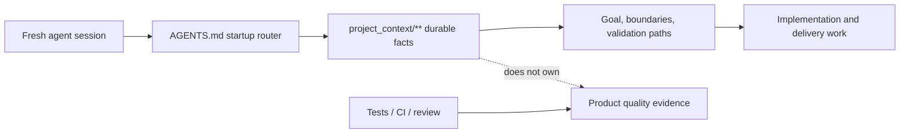

# Project Tiny Context Harness

[](https://www.npmjs.com/package/project-tiny-context-harness)
[](https://github.com/Seven128/project-tiny-context-harness/actions/workflows/package.yml)
[](https://securityscorecards.dev/viewer/?uri=github.com/Seven128/project-tiny-context-harness)
[](LICENSE)
[](https://codespaces.new/Seven128/project-tiny-context-harness)

Translations: [Chinese (Simplified)](README.zh-CN.md)

Project Tiny Context Harness is repo-native project memory for AI coding agents, plus a narrow delivery harness for trustworthy long-task completion. The product principle is: keep the memory, drop the ceremony. It adds durable project memory behind `AGENTS.md` without becoming an agent scheduler or Git orchestrator.

Public launch surfaces are English-first; localized documents are secondary entry points.

Best for:

- repositories where coding agents repeatedly rediscover project intent;
- teams using multiple agents or frequent fresh chats;
- maintainers who want durable Context and explicit long-task evidence.

Not for:

- replacing project tests, review, CI or human acceptance;
- autonomous Tiny Context execution;
- codebase semantic indexing or external docs retrieval.

Concrete shift:

```text
Before: ask a fresh agent to read the repo and tell you what matters.
After: ask it to read AGENTS.md and project_context/** first, then summarize goal, non-goals, architecture boundaries and validation paths before proposing code.
```

What gets added:




The demo shows the core loop: initialize `AGENTS.md` and `project_context/**`, run `validate-context`, then ask a fresh agent to recover intent before proposing code. Use the npm install path below, or inspect the no-install previews first.

Install:

```sh
npm install -D project-tiny-context-harness@latest
npx --yes --package project-tiny-context-harness@latest ty-context init
```

No-install preview:

- Read the [fresh-agent recovery walkthrough](docs/examples/fresh-agent-recovery.md).
- Inspect the [Minimal Context sample guide](docs/examples/minimal-context-sample.md).
- Browse the tiny generated repository at [examples/minimal-context-sample/](examples/minimal-context-sample/).

## Why It Exists

Coding agents need two different kinds of help:

- durable facts that survive sessions without loading the whole repository;
- trustworthy completion checks when a task spans many edits or context compactions.

Tiny Context keeps those concerns narrow. `project_context/**` records durable ownership, architecture, contracts and repeatable verification. The default Workflow Contract guides ordinary work. The explicit Long-Task Workflow adds one machine-checked Delivery Contract, rolling repair verification, a same-snapshot Final Gate and Stop freshness.

It does not launch models, spawn agents, create branches or worktrees, merge, push, open pull requests, deploy, or claim to replace project tests and human acceptance.

## Capability Model

1. **Minimal Context** — small, role-aware durable facts under `project_context/**`.
2. **Workflow Contract** — Context-first default engineering behavior using the platform's internal plan; no required plan artifact.
3. **Long-Task Workflow** — explicit Single-Goal Rolling Delivery with `long-task-delivery-v2`, compiled Claim Coverage and a verifier-owned Live Final Gate.

The opt-in long-task profile also provides `/source-plan-authoring`, an upstream Source-quality helper rather than another authority layer.

Default profiles are `core-portable` and `workflow-default`. Enable the opt-in profile with:

```powershell
ty-context enable long-task
```

This installs `/source-plan-authoring`, `/long-task-workflow` and the completion Hook. It does not install an agent runtime, model worker, scheduler, or Git orchestration assets.

## Try It In 60 Seconds

```sh
mkdir project-tiny-context-harness-demo
cd project-tiny-context-harness-demo
git init
npm init -y
npm install -D project-tiny-context-harness@latest
npx --yes --package project-tiny-context-harness@latest ty-context init
make validate-context
```

Then open `AGENTS.md`, `project_context/global.md` and `project_context/architecture.md`.

Expected result:

```text
AGENTS.md
project_context/
  context.toml
  global.md
  architecture.md
  areas/main.md
  areas/main/verification.md
```

Fresh-agent test prompt:

```text
Read AGENTS.md and project_context/** first. Summarize the project goal, non-goals, architecture boundaries, validation entry points and next safe action before proposing code changes.
```

For an existing repository, use `npx --yes --package project-tiny-context-harness@latest ty-context init --adopt`.

### Source checkout preview:

Open <https://codespaces.new/Seven128/project-tiny-context-harness>, or run locally:

```sh
git clone https://github.com/Seven128/project-tiny-context-harness.git
cd project-tiny-context-harness
npm ci
npm run smoke:quickstart
npm run preview:pack
```

The smoke packs the local workspace, installs it into a disposable repo and validates the generated Minimal Context files. Use this path for package development, source-preview testing or private review.

```sh
cd /path/to/your/test-repo
npm install -D /path/to/project-tiny-context-harness/tmp/ty-context/source-preview/package/project-tiny-context-harness-0.6.0.tgz
npx --no-install ty-context init --adopt
make validate-context
```

If it fails, open a [Source preview report](https://github.com/Seven128/project-tiny-context-harness/issues/new?template=source_preview_report.yml).

## Positioning

| Adjacent tool type | Use it for | Harness stance |
|---|---|---|
| Spec-first kits | Turning a feature idea into structured specs and plans. | Complementary; Harness keeps durable repo facts beyond one feature spec. |
| BMAD-style workflows and full Tiny Context processes | Role/process ceremony for selected work. | Lighter default; ordinary work stays Context-first. |
| Task Master-style planners | Backlog decomposition and task state. | Complementary; Harness does not own backlog state. |
| Context7/Serena-style retrieval | External docs, symbols or repository retrieval. | Complementary; Harness owns local intended boundaries. |

## Minimal Context

The default read path is:

```text
project_context/global.md
project_context/architecture.md
project_context/context.toml
minimum graph-relevant area/role Context
```

Typical roles are area/domain, contract, foundation, decision-rationale, implementation-index, verification and deployment. Context owns durable intended boundaries; code owns current implementation; tests, CI, browser/runtime evidence and people own behavior and product acceptance.

Every engineering handoff reports one Context result:

```text
Context: updated <files/reason>
# or
Context: no durable fact change
```

## Default Workflow Contract

Ordinary tasks stay lightweight:

1. read minimum relevant Context;
2. decide `Context Delta: none|required`;
3. update owning Context first when durable semantics change;
4. use the platform's internal plan;
5. implement and run project-owned verification;
6. perform Contract Conformance and Context drift checks.

The default workflow creates no required `plan.md`, matrix, verdict, evidence ledger or second execution plan. Task length, file count and complexity never auto-enable long-task state.

Plan Validator commands no longer exist; existing plan, matrix or verdict files remain ordinary user files.

### Architecture And Modularity Guidance

Technical architecture support is a Minimal Context capability. For high-risk work, `Architecture Context Hit`, `Decision Rationale Hit: existing|required|none` and `Modularity Check: none|required|exception` are internal routing questions inside the platform's internal plan. No Task Contract or fixed `plan.md` is required. Do not invent rationale: store stable reasons, rejected alternatives or tradeoffs only in the smallest durable Context surface, and remember that architecture Context does not prove product quality.

`ty-context check-modularity` audits selected handwritten source. `validate-code-modularity` and `validate-harness` enforce it separately from `validate-context`.

#### Modularity Policy

Newly generated Harness configs default to `strict_except_generated`. Generated/build files remain excluded; `strict_except_generated` rejects configured `modularity.waivers`. Projects with bounded legacy exceptions may opt into `scoped_waivers`, whose entries require `path`, `category`, `owner`, `introduced_at`, `reason`, `tracking_issue` and `expiry_condition`.

### Product Surface Contract

`context_surface_contract` compiles durable screen/page/CLI responsibility using the existing `contract`, area/subdomain and verification roles; `product-surface-contract.md` is the package template. Product Surface Contract authoring uses Source-to-Context judgment and Contract Conformance; it must not add a new product-surface Context role or claim product-quality proof.

### Optional Source Plan Authoring

Use `/source-plan-authoring` only when explicitly asking for an initial plan, Source Plan, source draft, or an audit/refinement of such a plan for later implementation or Contract authoring.

It outputs one self-contained Markdown Source Plan that:

- preserves direct requirements and their qualifiers;
- marks necessary derivations and cites what they derive from;
- turns unsupported product choices into `DEC`/`decision_required`;
- splits Outcomes only by independently decidable observable results;
- uses stable semantic keys and explicit anchors for important Source items;
- separates mandatory `OBL` obligations from advisory `HINT` suggestions;
- writes observable acceptance scenarios without hiding new requirements in AC text.

It does not update project Context, bind real repository owners/paths/runners, generate Delivery Contract YAML, run implementation, create workflow state or claim completion. Its structure is an authoring fast path, not a required input protocol; ordinary prose plans remain valid Long-Task Source.

## Single-Goal Rolling Delivery

Use `/long-task-workflow` only when explicitly requested or when the current worktree already has an active long task. It uses:

- one platform-native continuing Goal;
- one user-selected repository/worktree;
- one complete selected delivery, one Contract and one Final Gate;
- Outcome dependencies as acceptance readiness, not worker scheduling;
- a rolling internal implementation Frontier;
- targeted repair checks that never accept;
- a complete Final Gate on one current snapshot;
- a Stop Hook that rejects stale completion.

Long-Task Contract authoring preserves stable Source keys and anchors where practical. Meaning-preserving structural decomposition and evidence-backed repository binding may continue; new business rules, defaults, recovery behavior, permissions or scope become `decision_required` instead of being silently added. Missing recommended Source Plan structure never blocks authoring, but the marker-only Material Source Item enumeration required for activation does.

The platform owns physical Goal/session lifecycle. A later session runs `resume` to reconstruct semantic state; Tiny Context does not recreate the prior physical Turn.

### CLI

```text
ty-context long-task init <workdir>
ty-context long-task preflight <workdir>
ty-context long-task compile <workdir>
ty-context long-task compile <workdir> --revise
ty-context long-task approve-authority-revision <workdir> --revision <sha>
ty-context long-task explain <workdir>
ty-context long-task verify <workdir> [--outcome <key>] [--check <key>]
ty-context long-task status <workdir>
ty-context long-task resume <workdir>
ty-context long-task doctor <workdir>
ty-context long-task final-gate <workdir>
ty-context long-task stop-check <workdir> [--message <text>]
ty-context long-task close <workdir>
ty-context long-task abandon <workdir> [--force-corrupt-state]
```

- `init` creates one Compact inline-Outcome Contract template.
- `preflight` applies Compact defaults and reports all discoverable Source/REQ/CTRL/OBL/AC, Context, risk, path/binding, runner/input and proof diagnostics. It is read-only: no Authority Lock, marker, cache, progress, Receipt, pending revision, state lock or project Check.
- `compile` generates Global plus Outcome Result/Requirement/Control-field/Non-completing/Technical Claims, rejects uncovered Claims, preserves an immutable first baseline and makes the first successful formal Compile the Authority Lock. Every later revision compares against active authority regardless of progress, Receipt/cache deletion or implementation restoration. It freezes Source/Context/Product/Acceptance/Global/verifier materials, owner/binding authority, resolved runners and verification inputs in the complete common-dir Active Authority V3 snapshot.
- `verify` writes scoped per-Check Progress Records only after rechecking active task/revision/compiled/worktree identity. A concurrent revision returns `active_authority_changed_during_verify` and writes no stale progress.
- `status` reports each Outcome as `unverified`, `progress_passing`, `progress_failing`, `progress_stale` or `blocked_external`. It reads the common-dir authority snapshot and reports a missing or mismatched workdir cache as a repairable diagnostic.
- `resume` is read-only and reports task identity, risk, relevant Context, Git state, ready Outcomes, findings and the next safe action from the common-dir authority snapshot.
- `final-gate` requires a clean candidate commit, recompiles source authority, reruns every required Check on one Git-tree snapshot and rechecks active identity before acceptance.
- `stop-check` and `close` run that Live Final Gate themselves. They never trust status, progress, a Receipt or compiled cache for acceptance; success clears only the accepted identity through CAS.
- `abandon` is explicit non-success cleanup. `--force-corrupt-state` is reserved for invalid/mismatched/legacy-unrecoverable state or a stale active lock and removes only deterministic local active state plus `<workdir>/.ty-context/**`; Contract, Source, Context and Git content are preserved.

### Delivery Contract

`long-task-delivery-v2` keeps Product Authority, Technical Boundary Authority and Acceptance Authority as logical sections of one file. Compact YAML omits only deterministic defaults; the normalized Contract and all hashes are identical to the expanded form. The compiler derives machine Claims for observable results, atomic Requirements, control fields including location, non-completing outcomes, technical obligations and forbidden shortcuts:

```yaml
schema_version: long-task-delivery-v2
task:
  id: example-task
  title: Example task
  goal: Complete observable delivery goal
  source_paths: [plans/example.md]
  context_refs: [project_context/areas/main.md]
source_claims:
  - key: observable-requirement
    source_ref: plans/example.md#observable-requirement
    statement: The outcome is observable.
    disposition:
      type: claim
      refs: [observable-outcome.requirement.observable]
risk:
  facts: {}
global: {}
outcomes:
  - key: observable-outcome
    title: Observable outcome
    product:
      observable_result: What a user or system can observe
      owner:
        label: Owning product or module boundary
        context_refs: [project_context/areas/main.md]
        path_globs: ["src/**", "tests/**"]
      requirements:
        - key: observable
          statement: The outcome is observable.
          required_proof_surfaces: [runtime_behavior]
    technical:
      expected_change_paths: ["src/**"]
      obligations:
        - key: runtime
          statement: Implement the runtime behavior.
          required_proof_surfaces: [runtime_behavior]
    acceptance:
      checks:
        - key: runtime
          proof_surface: runtime_behavior
          runner:
            type: node_oracle
            target: tests/runtime.mjs
            effect: read_only
          verification_inputs: [tests/runtime.mjs]
          input_paths: ["src/**"]
          positive_assertions:
            - key: observable-ac
              criterion: The declared requirement is observable.
              claims: [result, requirement.observable, obligation.runtime]
              observation: result
              operator: equals
              expected: true
```

Authors provide task, Outcome, control and Check keys. The compiler generates `OUT.<outcome-key>` and `CHECK.<outcome-key>.<check-key>` identities. It rejects unknown/duplicate keys, YAML aliases/tags/merges, dependency cycles, unsafe paths, missing Context/source/runner files, missing package scripts, unverifiable Outcomes, and UI Outcomes without browser proof.

Global non-goals, constraints and forbidden shortcuts generate `GLOBAL.non_goal.<key>`, `GLOBAL.constraint.<key>` and `GLOBAL.forbidden_shortcut.<key>`. They must be covered by Global Check Assertions using local refs. Non-goals and forbidden shortcuts require negative proof; constraints accept either polarity. Outcome and Global Checks cannot cross Claim scope. Global forbidden paths do not generate Claims because the changed-path boundary enforces them statically.

Supported runners are `package_script`, `project_binary`, `node_oracle` and `playwright_test`. Supported proof surfaces are `ui_browser`, `runtime_behavior`, `api_contract`, `data_state`, `security_boundary`, `population_coverage` and `implementation_structure`.

### One Contract And Source Claims

Every complete delivery selected by the user remains one Contract and one Final Gate, even when Outcomes are weakly related. Outcome boundaries exist only for independently decidable, target-verifiable results and never for output length, YAML/file size, frontend/backend layers, module count, parallelism or Agent capacity. New authoring uses inline Outcomes. Existing `outcome_files` remains parser compatibility for physical file organization only and creates no semantic, state or completion boundary.

V2 authoring requires at least one real `source_path` and one `source_claim`. During authoring, every Material Source Item in the original Markdown is wrapped without rewriting it:

```markdown
<!-- ty-source-item:start key=save-failure kind=requirement -->
Saving failure preserves the user's input and shows the reason.
<!-- ty-source-item:end -->
```

Supported kinds are `outcome_result`, `requirement`, `acceptance`, `technical_obligation`, `non_goal`, `forbidden_shortcut`, `risk_fact`, `external_confirmation` and `decision`. Every declared Source file contains at least one Material Item; background-only references stay outside Source Authority. Marker keys and Source Claim keys must be set-equal and globally unique across all Source files. Nested, overlapping, unclosed, empty or invalid markers fail Compile. Each `source_claim.statement` must match the marked text after only line-ending, surrounding-blank-line and trailing-space normalization.

Typed dispositions keep overall results, non-Result Claims, one named Acceptance Assertion, Global constraints/non-goals, declared risk facts, external confirmations and genuine decisions distinct. A Source acceptance item maps to exactly one `<outcome>.<check>.<assertion>` whose criterion is text-identical and which proves at least one non-Result Claim. `out_of_scope` is retired: an explicit Source non-goal needs covered negative proof, while excluding an in-scope item requires `decision_required`. Ordinary prose and Source Plans remain valid after marker-only enumeration; Compiler coverage is honest about being unable to discover unmarked natural-language requirements.

Delivery Set orchestration and top-level Contract splitting within one selected delivery are retired. `ty-context delivery-set ...` returns a fixed non-executing tombstone.

Every Contract-authority, Source hash/file-set, Context topology/file-set/hash, Product/Global semantic or verifier-content change requires `--revise`; ordinary compile cannot silently refreeze it. After Authority Lock, reductions and Product Claim additions require approval of an exact revision identity bound to previous/next materials and verifier projections. Pure verifier package root/version relocation auto-revises, while bundle/schema/hook byte changes require user approval. Every Contract and Check execution field has a compile-time policy classification. Only mechanical proof additions, pure verifier relocation and machine-proven scope/input/output tightening revise automatically.

Every path-bearing field uses one canonical grammar before hashing and matching. Windows separators and one leading `./` normalize to `/`; runner `cwd` alone may be `.`. Internal `.`/`..`, controls, empty segments, absolute/drive/UNC paths, brackets, braces, parentheses/extglob and non-segment `**` are rejected. Pattern matching, subset and overlap/disjoint use the same AST, and unknown relations fail closed.

### Deterministic Risk

- **L0**: local, reversible, directly testable work stays on the default workflow.
- **L1 standard**: multiple observable Outcomes or cross-session recovery, with reliable executable checks.
- **L2 strict**: public API/schema, persistent data, migration, security/permission boundary, irreversible external effect, full-population operation, or a critical path with weak observability. Proof is bound to the affected Outcome; multi-repository delivery is unsupported.

An explicit user request can raise the level to strict. Explicit `standard` below the computed floor fails with `risk_level_below_required`. Strict negative, counterfactual, population, security, environment and rollback/recovery obligations are compiler-enforced as applicable. Changed paths outside the declared envelope return a `scope_escape` Finding and require the same Goal to review risk/ownership, revise and recompile the Contract.

### Evidence And Authority

Final acceptance is computed from executable current evidence, not agent prose. Evidence adapters derive from runner kind: `playwright_test` produces `playwright_json_v1` and is the only adapter allowed for `ui_browser`; package scripts, project binaries and Node oracles produce `structured_json_v2` for all non-browser surfaces. The adapter is part of acceptance, raw-execution, compiled, progress and Receipt identity.

Every Outcome has at least one non-Result atomic Claim, and a Claim is covered only when all `required_proof_surfaces` are covered. Claim-bearing assertions use explicit expected-value comparisons; unary `truthy`/`falsy` are forbidden, and `exists` is limited to `implementation_structure` obligations. Across all Checks sharing one Raw Execution identity, one claim-bearing Observation belongs to one Assertion. Playwright Claim proof has one canonical form: `playwright.case.<ac-key>.passed equals true`. Missing, skipped, flaky, unexpected, failed or duplicate-within-project ACs fail closed; the same AC across distinct Playwright projects aggregates only when every instance passes. Decoder diagnostic fields such as aggregate pass, executed, skipped, status and counts cannot prove Claims.

Counterfactuals bind a named Outcome implementation Binding and may mutate only a proven subset of its carriers. They succeed only on completed, exit-zero execution where every failure is an expected `assertion_value_mismatch`; missing/type-invalid observations, missing/skipped ACs, artifact/population/infrastructure failures and extra Assertion failures invalidate them. Weakly observable Outcomes and otherwise weak custom structured Result checks require a bounded sensitivity Counterfactual. Claim and Population proofs are emitted only after the complete Check status is `passed`.

Raw Execution identity binds frozen runner identity plus canonical declared Environment Requirements, never actual environment values. Findings from checks, Counterfactuals, Population, scope/binding, Source mapping, adapter, proof-surface and sensitivity validation carry Source, Claim, AC/criterion, Observation, expected/actual and owner paths into Explain/Status/Resume. `explain` traces Source Item → disposition → Claim or Assertion → required surfaces → Check → adapter → Observation. Global hard failure yields `needs_work`; otherwise any Global or Outcome environment block yields `blocked_external`. Contract, source, relevant Context, Oracle/runner, verifier or workspace drift invalidates previous results.

The workdir `.ty-context/compiled-contract.json` is only a rebuildable cache projection. Previous authority, the immutable initial base, risk floor and Final Gate identity come only from the common-dir snapshot. Commit, verifier migration, clear and abandon share one active-state lock; Final/Verify recheck identity and Stop/close use accepted-identity CAS. Development-period V2 Active Authority, Progress and Receipts are not migrated: doctor reports `manual_required`, the operator upgrades the Contract, and a new Authority Lock is formed. Corrupt continuity is recovered explicitly with `abandon --force-corrupt-state`.

Final Gate may run only Contract-declared verification commands and never production mutation/deployment/payment/migration execution. Retry defaults to none and is allowed once only for `transient_once` + idempotent + read-only/test-sandbox runners. Runners receive a minimal system environment whitelist plus only explicitly declared `env_var` requirements; undeclared secrets are not inherited. Protected authority/proof inputs reject symlinks and detectable hardlinks. Network isolation remains external. Counterfactual V2 accepts only exact designated Assertion failures with no artifact, population or other finding, and Population V2 proves exact entity coverage. Receipts are audit-only (`reusable_for_acceptance: false`). Every Outcome has an executable Check; human, CI, deployment and product confirmation live only in `external_confirmations`. A machine pass with pending confirmations reports `machine_accepted_external_pending`.

## Compatibility And Migration

Version 0.6.0 retires the V1 schema/runtime and repo-local Hook. Enable, disable and upgrade remove only exact Tiny Context managed Hook entries. Relocated package-owned absolute commands are recognized only when the known managed status and a known `node_modules`, pnpm or workspace-package layout both match; no-status and similar-name user Hooks remain. A command is never deleted merely because it contains `composite`. Upgrade reports unfinished V1 active state as `manual_required` and never imports V1 progress or Receipts into V2 authority. Delivery Set, `composite-campaign` and `composite-long-task` commands are non-executing tombstones.

Version 0.6.0 defines the first public V2 semantics while retaining the `long-task-delivery-v2` schema name and physical `outcome_files` parser form; it does not promise activation compatibility for development-period Drafts. Old Drafts receive explicit diagnostics for missing Source markers, result-compressed Source mappings, missing criteria, retired `out_of_scope`, non-Playwright browser proof and incomplete required surfaces. Optional Source Plan authoring adds no Schema, CLI, Preflight, Compile, Validator, Receipt, Authority or state. Preflight and direct Compile use one activation-safety kernel, so readable `criterion` text and every other completion-safety rule are mandatory even when Preflight is skipped.

`/normal-long-task` is also a retirement pointer to `/long-task-workflow`; it creates no checklist, prompt, audit, matrix, verdict or second authority.

### Package update modes

After updating the package, run `ty-context upgrade`. Use `ty-context upgrade --check` first when you need a read-only plan.

Release metadata declares one update mode: `sync-only`, `upgrade-required` or `manual-required`. Upgrade plans report steps as `safe_pending`, `manual_required` or `blocked`. A `sync-only` release may use `sync`; `sync` does not run migrations. An `upgrade-required` release must run upgrade, while `manual-required` includes an explicit operator step.

## Development And Verification

```powershell
npm install
npm run format:check
npm run typecheck --workspace project-tiny-context-harness
npm run build --workspace project-tiny-context-harness
node --test --test-concurrency=1 tests/ty-context/source-plan-authoring-skill.test.mjs tests/ty-context/sync-init-doctor.test.mjs tests/ty-context/workflow-contract-routing.test.mjs
npm run test:delivery-contract --workspace project-tiny-context-harness
npm run test:long-task-workflow --workspace project-tiny-context-harness
npm run test:long-task-performance --workspace project-tiny-context-harness
npm test
npm run smoke:quickstart
npm run preview:pack
npm run launch:check
node packages/ty-context/dist/cli.js package check-source
make validate-harness
```

The modularity gate is `ty-context check-modularity`. Scoped waivers require `owner`, `introduced_at`, `reason`, `tracking_issue` and `expiry_condition`.

`npm run preview:pack` produces a local preview named `project-tiny-context-harness-0.6.0.tgz` under the preview output directory.

## Community And Further Reading

Feedback from real repositories is especially useful. Open an [adoption report](https://github.com/Seven128/project-tiny-context-harness/issues/new?template=adoption_report.yml) with the recovery problem and what remained unclear.

Early feedback and starter issues:

- Report a [Context recovery gap](https://github.com/Seven128/project-tiny-context-harness/issues/new?template=context_gap.yml) through `context_gap.yml`.
- Share results in the pinned [adoption reports issue](https://github.com/Seven128/project-tiny-context-harness/issues/4).
- Pick a starter issue: [demo](https://github.com/Seven128/project-tiny-context-harness/issues/5), [sample walkthrough](https://github.com/Seven128/project-tiny-context-harness/issues/6), [benchmark rerun](https://github.com/Seven128/project-tiny-context-harness/issues/7) or [launch FAQ](https://github.com/Seven128/project-tiny-context-harness/issues/8).
- Keep claims narrow: recovery evidence is useful; benchmark speedup claims need fresh Minimal Context benchmark runs.

Read the [roadmap](docs/roadmap.md), [Benchmarking And Evidence](docs/benchmarking.md), [comparison guide](docs/comparison.md), [adoption guide](docs/adopt-existing-repo.md), [agent surface recipes](docs/agent-surface-recipes.md) and [FAQ](docs/faq.md).

For concrete examples, see the [fresh-agent recovery walkthrough](docs/examples/fresh-agent-recovery.md), [Minimal Context sample guide](docs/examples/minimal-context-sample.md) and [browseable sample repository](examples/minimal-context-sample/). The longer argument is [Fresh coding-agent sessions need project memory, not more ceremony](docs/articles/fresh-agent-project-memory.md).

## Honest Limits

- Tiny Context does not create or restore a platform Goal or physical session.
- It cannot prove that a user declared every real requirement.
- Core long-task execution intentionally provides no parallel mutation runtime.
- It does not observe platform token counts or model-call counts.
- Network policy is declared to runners and proxy variables are restricted, but this is not an OS sandbox.
- Same-user/admin filesystem tampering and Hook bypass are outside its security boundary.
- Git/PR/CI, deployment and human product confirmation remain external responsibilities.

## License

MIT
