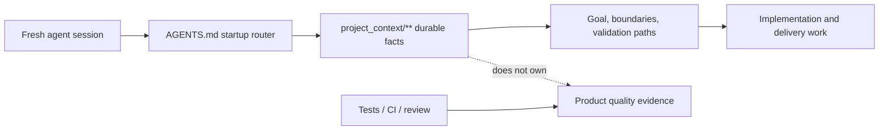

# Project Tiny Context Harness

[](https://www.npmjs.com/package/project-tiny-context-harness)
[](https://github.com/Seven128/project-tiny-context-harness/actions/workflows/package.yml)
[](https://securityscorecards.dev/viewer/?uri=github.com/Seven128/project-tiny-context-harness)
[](LICENSE)
[](https://codespaces.new/Seven128/project-tiny-context-harness)

Translations: [Chinese (Simplified)](README.zh-CN.md)

Project Tiny Context Harness is repo-native project memory for AI coding agents, plus a narrow delivery harness for trustworthy long-task completion. The product principle is: keep the memory, drop the ceremony. It adds durable project memory behind `AGENTS.md` without becoming an agent scheduler or Git orchestrator.

Public launch surfaces are English-first; localized documents are secondary entry points.

Best for:

- repositories where coding agents repeatedly rediscover project intent;
- teams using multiple agents or frequent fresh chats;
- maintainers who want durable Context and explicit long-task evidence.

Not for:

- replacing project tests, review, CI or human acceptance;
- autonomous Tiny Context execution;
- codebase semantic indexing or external docs retrieval.

Concrete shift:

```text
Before: ask a fresh agent to read the repo and tell you what matters.
After: ask it to read AGENTS.md and project_context/** first, then summarize goal, non-goals, architecture boundaries and validation paths before proposing code.
```

What gets added:




The demo shows the core loop: initialize `AGENTS.md` and `project_context/**`, run `validate-context`, then ask a fresh agent to recover intent before proposing code. Use the npm install path below, or inspect the no-install previews first.

Install:

```sh
npm install -D project-tiny-context-harness@latest
npx --yes --package project-tiny-context-harness@latest ty-context init
```

No-install preview:

- Read the [fresh-agent recovery walkthrough](docs/examples/fresh-agent-recovery.md).
- Inspect the [Minimal Context sample guide](docs/examples/minimal-context-sample.md).
- Browse the tiny generated repository at [examples/minimal-context-sample/](examples/minimal-context-sample/).

## Why It Exists

Coding agents need two different kinds of help:

- durable facts that survive sessions without loading the whole repository;
- trustworthy completion checks when a task spans many edits or context compactions.

Tiny Context keeps those concerns narrow. `project_context/**` records durable ownership, architecture, contracts and repeatable verification. Both implementation routes share one visible, risk-proportional Architecture Deliberation before implementation and one current-candidate Architecture Conformance after project verification. The default Workflow Contract combines manifest routing with one bounded Context search before `Context Delta`; the explicit Long-Task Workflow adds one machine-checked Delivery Contract, a one-time post-Authority-Lock model choice, rolling repair verification, a same-snapshot Final Gate and Stop freshness.

It does not launch or switch models, spawn agents, create branches or worktrees, merge, push, open pull requests, deploy, or claim to replace project tests and human acceptance.

## Capability Model

1. **Minimal Context** — small, role-aware durable facts under `project_context/**`.
2. **Workflow Contract** — Context-first default engineering behavior using the platform's internal plan; no required plan artifact.
3. **Long-Task Workflow** — explicit Single-Goal Rolling Delivery with `long-task-delivery-v2`, compiled Claim Coverage and a verifier-owned Live Final Gate.

The base managed set also provides two explicitly triggered Open Design adapters: `/design-system-authoring` generates/selects/adopts project Design Authority at cold start, while `/design-resource-authoring` commissions task-local resources. The opt-in long-task profile provides `/long-task-workflow`; `/source-plan-authoring` remains only as a retired compatibility pointer because Source-quality authoring now occurs inside the Long-Task lifecycle.

Default profiles are `core-portable` and `workflow-default`. Enable the opt-in profile with:

```powershell
ty-context enable long-task
```

This additionally installs `/long-task-workflow`, the `/source-plan-authoring` compatibility pointer and the completion Hook. `/design-system-authoring` and `/design-resource-authoring` are already in the base managed set. Tiny Context does not install Open Design, an agent runtime, model worker, scheduler, Git orchestration assets or another design-generation runtime.

## Recommended Usage

Start from an initial proposal: either a concise product intent or a detailed proposal authored elsewhere, including Web GPT. For UI work that needs standalone design resources:

- **Long delivery:** initial proposal → explicitly initialize/adopt a design system with `/design-system-authoring` when the project has none → `/design-resource-authoring` generates/selects resources and reconciles accepted decisions into the initial proposal once → pass the revised proposal plus selected immutable resources to `/long-task-workflow`. Its integrated Source authoring and Contract Draft authoring continue in the same native Goal.
- **Non-long delivery:** the same initial-proposal/design-resource sequence → give the revised proposal plus selected immutable resources directly to Codex's current native Goal under the default Workflow Contract.

The design-system step is user-invoked, normally at project cold start; no command or downstream Skill runs it automatically. `/design-resource-authoring` gates only style-bearing work when Design Authority is unconfigured. Low-fidelity structure, IA/flow and semantics-only state studies remain available without that gate. A legacy Source Plan is accepted as ordinary input, but it is no longer a recommended intermediate service.

## Try It In 60 Seconds

```sh
mkdir project-tiny-context-harness-demo
cd project-tiny-context-harness-demo
git init
npm init -y
npm install -D project-tiny-context-harness@latest
npx --yes --package project-tiny-context-harness@latest ty-context init
make validate-context
```

Then open `AGENTS.md`, `project_context/global.md` and `project_context/architecture.md`.

Expected result:

```text
AGENTS.md
project_context/
  context.toml
  global.md
  architecture.md
  areas/main.md
  areas/main/verification.md
```

Fresh-agent test prompt:

```text
Read AGENTS.md and project_context/** first. Summarize the project goal, non-goals, architecture boundaries, validation entry points and next safe action before proposing code changes.
```

For an existing repository, use `npx --yes --package project-tiny-context-harness@latest ty-context init --adopt`.

### Source checkout preview:

Open <https://codespaces.new/Seven128/project-tiny-context-harness>, or run locally:

```sh
git clone https://github.com/Seven128/project-tiny-context-harness.git
cd project-tiny-context-harness
npm ci
npm run smoke:quickstart
npm run preview:pack
```

The smoke packs the local workspace, installs it into a disposable repo and validates the generated Minimal Context files. Use this path for package development, source-preview testing or private review.

```sh
cd /path/to/your/test-repo
npm install -D /path/to/project-tiny-context-harness/tmp/ty-context/source-preview/package/project-tiny-context-harness-0.7.9.tgz
npx --no-install ty-context init --adopt
make validate-context
```

If it fails, open a [Source preview report](https://github.com/Seven128/project-tiny-context-harness/issues/new?template=source_preview_report.yml).

## Positioning

| Adjacent tool type | Use it for | Harness stance |
|---|---|---|
| Spec-first kits | Turning a feature idea into structured specs and plans. | Complementary; Harness keeps durable repo facts beyond one feature spec. |
| BMAD-style workflows and full Tiny Context processes | Role/process ceremony for selected work. | Lighter default; ordinary work stays Context-first. |
| Task Master-style planners | Backlog decomposition and task state. | Complementary; Harness does not own backlog state. |
| Context7/Serena-style retrieval | External docs, symbols or repository retrieval. | Complementary; Harness owns local intended boundaries. |

## Minimal Context

The default read path is:

```text
project_context/global.md
project_context/architecture.md
project_context/context.toml
minimum graph-relevant area/role Context
```

Only near-universal recovery facts should use `read_policy = "default"`; specialized architecture, contract, deployment and historical detail should be task-triggered `on-demand` Context. Before deciding `Context Delta`, the Agent also runs one bounded text search over `project_context/**` using a small set of high-signal task terms such as explicit area/module names and API/schema/state/security/verification/deployment language. Matching files are merged with manifest candidates and filtered by semantic relevance. This is not a vector or persistent retrieval system and creates no index, cache, registry, search state or authority.

`ty-context doctor` reports the deterministic default read footprint, per-file/total soft-budget overages, byte-identical default files and `DESIGN.md` authority status. These are advisory maintenance signals, not a new validation gate or workflow state.

Typical roles are area/domain, contract, foundation, decision-rationale, implementation-index, verification and deployment. Context owns durable intended boundaries; code owns current implementation; tests, CI, browser/runtime evidence and people own behavior and product acceptance.

Every engineering handoff reports one Context result:

```text
Context: updated <files/reason>
# or
Context: no durable fact change
```

## Default Workflow Contract

Ordinary tasks stay lightweight:

1. read core/default Context and collect manifest candidates;
2. run one bounded Context search over `project_context/**` and read only relevant matches;
3. surface one concise, repository-bound Architecture Deliberation;
4. decide `Context Delta: none|required` and update the owning Context first when durable semantics change;
5. use the platform's internal plan;
6. implement and run project-owned verification;
7. perform Contract Conformance, including Architecture Conformance on the current candidate;
8. perform the separate Context drift check and hand off.

The default workflow creates no required `plan.md`, matrix, verdict, evidence ledger, persistent Context-search index or second execution plan. Task length, file count and complexity never auto-enable long-task state.

Plan Validator commands no longer exist; existing plan, matrix or verdict files remain ordinary user files.

### Architecture And Modularity Guidance

Technical architecture support is a shared Workflow obligation. Every implementation delivery visibly completes `Architecture Deliberation` before its first implementation edit. Risk changes depth, not occurrence. A small change names the concrete owner/current extension point, confirms durable boundaries remain unchanged and explains why it adds or worsens no debt. Material work additionally covers the unique source of truth, dependency and interface/state/lifecycle boundaries, failure/recovery/compatibility, selected and rejected alternatives, one plausible future change and its extension point, touched technical debt, forbidden shortcuts and project-owned executable checks. `Architecture Context Hit`, `Decision Rationale Hit: existing|required|none` and `Modularity Check: none|required|exception` remain internal routing questions; no Task Contract or fixed `plan.md` is required.

After implementation and project verification, `Architecture Conformance` checks the current candidate for scope/path escape, owner or dependency-direction violations, service/facade bypass, duplicate authority or a second source of truth, undeclared API/schema/state/persistence change, missing architecture checks and new or worsened debt. A changed candidate invalidates the result. Default work embeds this closure in Contract Conformance; Long-Task work encodes material invariants with existing obligations/constraints/forbidden shortcuts, owners/paths/Bindings and executable Checks and lets Final Gate be the sole closure owner. The two closures never both run for one candidate.

Contract Conformance asks whether current Source and Context reached implementation and verification; the separately named Context drift check asks whether implementation or a new decision made durable Context stale. New or worsened debt blocks handoff unless the project has an explicit bounded exception with owner, rationale, tracking and a removal condition. Unrelated legacy debt does not automatically expand task scope, but debt touched, relied on or worsened by the change cannot remain hidden.

The visible checkpoint proves that architecture consideration occurred; it does not expose private chain-of-thought, guarantee the best design or anticipate every unknowable future request. Store stable reasons, rejected alternatives or tradeoffs only in the smallest durable Context surface. Harness may route repository-native lint/AST/dependency/contract checks, but it does not become a language-generic architecture analyzer or add an architecture artifact/state.

`ty-context check-modularity` audits selected handwritten source and identifies the highest-risk function and line for statement/branch findings. `validate-code-modularity` and `validate-harness` enforce it separately from `validate-context`.

#### Modularity Policy

Newly generated Harness configs default to `strict_except_generated`. Generated/build files remain excluded; `strict_except_generated` rejects configured `modularity.waivers`. Projects with bounded legacy exceptions may opt into `scoped_waivers`, whose entries require `path`, `category`, `owner`, `introduced_at`, `reason`, `tracking_issue` and `expiry_condition`.

### Product Surface Contract

`context_surface_contract` compiles durable screen/page/CLI responsibility using existing `contract`, area/subdomain and verification roles. `product-surface-contract.md` owns cross-surface/main-versus-drilldown responsibility; optional on-demand `screen-contract.md` goes deeper for one screen's entry/exit/shared state, information hierarchy, semantic regions, navigation/variants, material controls and target/verification references. This workflow must not add a new Context role or claim product-quality proof, and local style fixes do not require a Screen Contract.

For material UI, **UI Authority Closure** reconciles each stable surface/control/target key as covered by existing Context, requiring a Context update, task-local, explicitly out of scope or genuinely decision-required. Product Surface Context owns cross-surface responsibility, Screen/interaction Context owns durable hierarchy and behavior, `DESIGN.md` owns visual-system/reference semantics, authored targets own concrete declared composition and the Delivery Contract only binds/proves this delivery. Conflicts fail closed; current code, timestamps, YAML or implementation screenshots do not silently win.

### Visual Delivery Guidance

The default Workflow now performs UI Authority Closure and a conditional Design Authority Check before material production UI: new/redesigned screens, primary layout/navigation/theme/component-system work, high-fidelity implementation and substantial visual polish. It reads the owning Surface/Screen/Control Context, `DESIGN.md`, one authored exact token source/generation direction and selected design references. Each reference is `exact-target`, `constraint` or `inspiration`; an unconfigured starter, candidate, style-only prose or inspiration does not authorize invented production layout. A configured project visual system is not a claim that every page is implementation-ready. Explicit project design-system initialization/adoption routes to `/design-system-authoring`; explicit standalone resource generation routes to `/design-resource-authoring`, which commissions external Open Design capabilities without adopting authority. The consuming workflow and `context_uiux_design` still own UI Authority Closure and later durable repairs outside design-system cold-start/adoption. Ordinary implementation with sufficient authority, local style fixes and throwaway prototypes remain lightweight.

For material work, `context_uiux_design` keeps a task-local risk-proportional Visual Coverage Set across production surfaces/components, viewports, themes/modes, states, content stress and accessibility/motion conditions. Durable surface/interaction facts remain in `project_context/**`; durable visual semantics and the design-reference registry remain in `DESIGN.md`; versioned targets stay at project-native paths. `context_development_engineer` binds that intent to production routes and reports only combinations actually rendered and checked. An implementation screenshot cannot become its own target.

An explicit Long-Task resolves missing/conflicting UI authority before Compile, then preserves every applicable Control field through the existing projection: surface, region/location, type/label, user task, visibility/availability, trigger/input/validation/default, interaction/navigation, loading/empty/success/failure/recovery/permission/feedback and accessibility. Each non-empty field is an independent Source-backed Control Claim and protected product semantic; omitted fields create no Claim. Existing Requirement, Control, Assertion, Stage, Binding, proof-surface, verification-input, revision and `external_confirmation` mechanisms remain the only lifecycle.

Combined design-and-implementation work may author candidates in ordinary Outcomes/Stages, but a candidate or planned target cannot authorize fidelity implementation. The selection must become real marked Source plus the owning registry/target input and, after Authority Lock, an adopted protected revision. Browser visual ACs use `ui_browser`; a browser proxy cannot prove a native target that can fail independently, so native target proof remains a project-owned current-execution Check when representable or an external confirmation. Frozen screenshot baselines are verifier inputs, generated screenshots/diffs are review artifacts, and subjective approval remains external. This adds no `uiux_delivery` block, visual Claim type, risk level, lifecycle state, Gate, required design directory or universal pixel threshold.

`ty-context doctor` keeps its compatible `missing | unconfigured | configured` project-level status and adds advisory Design Authority Index, token-source and classified-reference signals. It explicitly does not infer surface implementation readiness; that requires the owning Screen/Control meaning, selected target/constraints and project-owned verification.

### Explicit Design System Authoring

Use `/design-system-authoring` only when the user explicitly asks to initialize, generate, select, adopt, replace or repair the project design system/design style. Installation makes the cold-start capability available but never runs it automatically. The Skill discovers live Open Design MCP resources/tools, feature-detects design-system lifecycle methods and, when the current MCP exposes design systems only as resources, uses the same installed Open Design daemon's official generation/revision/accept API. It never copies provider prompts or pretends daemon generation is an MCP tool.

Generation produces candidates. Explicit human selection—or explicit delegated selection with known criteria—precedes adoption. The selected system is reconciled into canonical project `DESIGN.md`, exactly one authored exact-value token source/generation direction and only the owning durable surface/interaction Context. Open Design provider ID/revision/digest and project binding are synchronization provenance, not a second authority. Provider success, artifact readiness, selection, authority adoption and `get_project.designSystemId` binding verification are reported separately.

### Optional Design Resource Authoring

Use `/design-resource-authoring` only when explicitly asking to generate, iterate or prepare standalone design resources, prepare the design resources for a named development scope, or use Open Design. Inputs may be raw notes or an initial proposal, product/technical plans, a specialized visual brief, screenshots, existing resources or a legacy Source Plan. A standalone Source Plan is not a prerequisite or recommended middle stage.

The Skill fixes the requested output or development content as a hard scope ceiling. A partial feature includes only the surrounding context needed to place it; broad background never expands generation to the rest of the page or product. For an implementation handoff, the Skill accounts for material UI/UX meaning from surface/flow structure through relevant regions and controls: visual/content treatment, component anatomy and variants, static/dynamic states, interaction/feedback/recovery/motion, responsive/platform/input behavior, accessibility and necessary assets. It subtracts only coverage explicitly supplied by selected existing Source, then discovers current Open Design agents/models, functional skills, rendering templates, design systems, plugins and export routes and gives every considered resource a reasoned `selected`, `optional`, `not-needed`, `unavailable` or `decision-required` disposition.

It first classifies the commission. High-fidelity/branded output, visual direction, typography/color/density, component visual treatment and production-style prototypes are style-bearing: if `DESIGN.md` is unconfigured or lacks one authored token source/direction, the Skill stops before provider project/run creation and tells the user to explicitly invoke `/design-system-authoring`; it never initializes authority itself. Low-fidelity structure, IA/flow topology and semantics-only behavior/state studies remain non-fidelity. For style-bearing work, the Open Design MCP project is created or checked with `create_project.designSystem`, and `get_project.designSystemId` must match the adopted provider ID.

It commissions only the smallest sufficient set through structured MCP, with bounded CLI/daemon and UI fallback. One page/prototype or component-family workbench may cover many items when its conditions are addressable and inspectable; repeated controls map to shared variants, while unique or complex uncovered controls may need dedicated state/interaction studies. A static/default frame never silently covers unseen state, interaction, motion, responsiveness or accessibility. A prototype, low/high-fidelity pair, component board, Figma handoff, one-file-per-control rule, variant count or directory is never universally required, and Tiny Context never copies Open Design prompts/templates or vendors a provider catalogue. Designs may express user-visible interaction semantics and the presentation of product rules, but business/data/permission/algorithmic rules remain owned by product/technical Source.

Exploration returns the requested visible candidate after minimal sanity review. An implementation handoff adds project/run/capability/design-system provenance, explicit entry, declared coverage, known limitations and a concise stable-key mapping from each material in-scope surface/flow/region/component/control condition to existing/generated Source or a non-applicable/excluded/unresolved disposition. The mapping is not a required pack, registry or acceptance result. During iteration, accepted/rejected/unresolved effects remain in a task-local delta buffer. After explicit or delegated final selection, the Skill performs one consolidated idempotent reconciliation of accepted decisions into the writable initial proposal—or returns the complete revised proposal when conversation-only—while excluding rejected/unresolved choices. It never edits a Source Plan, `project_context/**`, `DESIGN.md`, production code or a Delivery Contract.

The actual generation remains with configured Open Design/Product Design, Figma, image-generation, prototype or human systems. Their outputs enter the default Workflow or Long-Task as ordinary external Source. Candidates and inspiration authorize no fidelity. A selected exact target controls only its declared surface/viewport/mode/state/content conditions and needs stable immutable identity before it can affect a `verification_input`. `context_uiux_design` performs downstream UI Authority Closure and adopts only durable facts into Context/`DESIGN.md`; implementation renders and diffs remain evidence artifacts rather than self-authorizing targets.

Maintainers may set `TY_CONTEXT_OPEN_DESIGN_MCP_COMMAND` plus optional `TY_CONTEXT_OPEN_DESIGN_MCP_ARGS_JSON` and run `npm run smoke:open-design` for an opt-in, read-only discovery smoke. Normal tests use a local mock MCP and never require Open Design, login, paid access or nondeterministic design output.

### Retired Source Plan Compatibility

`/source-plan-authoring` remains installed with the long-task profile only as a compatibility pointer. `/long-task-workflow` now performs complete input inventory, mixed-input synthesis/refinement, stable-key and control-level authoring, preference/research/delegation traceability and acceptance/risk completeness directly in the same Goal before Contract mapping. A legacy Source Plan remains valid ordinary Source, but no separate Source Plan handoff, schema, gate, state or second plan is created.

## Single-Goal Rolling Delivery

Use `/long-task-workflow` only when explicitly requested or when the current worktree already has an active long task. It uses:

- one platform-native continuing Goal;
- one user-selected repository/worktree;
- one complete selected delivery, one Contract and one Final Gate;
- Outcome dependencies as acceptance readiness, not worker scheduling;
- one user model-choice checkpoint after first Authority Lock and before implementation;
- a rolling internal implementation Frontier;
- targeted repair checks that never accept;
- stateless scope-only revision diagnosis before one exact approval;
- a complete Final Gate on one current snapshot;
- a Stop Hook that rejects stale completion.

Long-Task first makes raw/revised proposals, selected design resources and mixed attachments self-contained in real Source: complete input inventory, stable keys, control-level meaning, acceptance/risk coverage and direct/derived/delegated/evidence-backed provenance now belong inside this workflow. If an unknown preference could materially change comparative research or selection, it asks before proceeding. Once criteria are clear, a defensible recommendation is written into real Source with its delegation, preference/evidence basis and exact meaning before Contract mapping; it is never hidden only in YAML. High-risk action remains an external confirmation. Legacy Source Plan structure never blocks authoring, but marker-only Material Source Item enumeration does.

Before the first successful formal Compile, `delivery-contract.yaml` is one non-authoritative Contract Draft. `/long-task-workflow` keeps revising that same Draft across repository/Context reads and Preflight repair rounds; it does not require one response to produce a complete Contract. Draft authoring is integrated because repository bindings and verification inputs need real evidence, Preflight findings must feed back into the same object, and a separate handoff would risk lost meaning or a second plan/authority. No standalone Contract Draft Skill, Draft Receipt or Authoring State exists.

The first successful Compile creates Authority Lock and returns `execution_model_checkpoint.required: true`. Before implementation, the Agent asks the user to `continue_current_model` or switch models and then resume the active Long-Task. A task-specific model strategy already stated explicitly satisfies the checkpoint. Later Compile revisions return `required: false`; Harness does not switch models, persist acknowledgement/model-route state or repeat the pause.

Later revisions are classified into three paths. Formally monotonic evidence strengthening and other proven mechanical-safe changes auto-adopt. A candidate whose only protected reasons are owner, expected-change or allowed-support expansion may be exercised through `diagnose-revision` using existing active Check identities whose runner and verifier are unchanged; safe monotonic strengthening may coexist, and the results remain transient repair diagnostics rather than Progress or acceptance. Product/Source/Acceptance semantic changes, proof weakening, verifier-content or runner changes, and risk increases are preview-only and require the exact revision identity; risk downgrade remains rejected outright. A rolling blocker is not itself an External Confirmation or permission to remove machine-verifiable scope. A real scope change first becomes marked Source. Diagnosis never changes the active Authority or writes pending/approval state, cache, Progress or Receipt, so related edits can accumulate in the same `delivery-contract.yaml` before one `compile --revise` approval request. The pending decision contains a concise hash-bound summary with exact changed semantic fields, Source/Product Claim reductions, proof reductions and external-confirmation keys and is projected by `status`/`resume`. Adoption reports `delivery_completed_by_this_event: false`, invalidates affected evidence and returns to rolling implementation or repair; the complete Final Gate remains mandatory.

The package-managed Long-Task Skill uses progressive disclosure: its main `SKILL.md` keeps the objective, boundaries and phase routing; one-level references are read only for Contract authoring, evidence design or authority lifecycle. This reduces routine instruction load without moving any rule into a second authority. It performs the shared Architecture Deliberation during Source/Contract authoring. When Source or controlling Context declares an architecture invariant, the Contract uses existing technical obligations/global constraints/forbidden shortcuts, owner/path/Binding boundaries and a project-owned executable Check. Functional acceptance cannot substitute when the architecture invariant can fail independently, and Final Gate is the sole Long-Task Architecture Conformance carrier.

A Draft Outcome is simply an Outcome before Authority Lock. Outcomes split independently observable, decidable, vertical and target-verifiable results so the current Goal can keep a smaller dependency-ready working set, target verification, localize failures, resume findings and invalidate stale local results. `depends_on` expresses acceptance readiness. Every Outcome belongs to one ordered Stage; its Stage gate transitively depends on the other Outcomes in that Stage, and later Stages depend on earlier gates. The Rolling Frontier and Stage status are derived from ordinary Outcome Progress and are temporary. An Outcome is not a Worker, scheduler task, queue or parallelism unit, and a Stage owns no Receipt or second Gate. Outcome decomposes execution and diagnosis, not completion authority: targeted passes never replace the one complete Final Gate on the current final snapshot.

The Contract declares one bounded target profile, its non-empty required product target refs and each target's runtime family/root entrypoint. A Web/process proxy cannot satisfy an independently required Native/desktop target. Browser target proof uses Playwright; Native/desktop target proof uses a project binary. Every `critical_user_path` Outcome and Stage gate proves `target_runtime` from every required target's root entrypoint; a multi-Outcome Stage gate also proves at least two distinct surfaces share one runtime state.

When a declared result can pass on a proxy surface while failing in its target runtime, the earliest owning Outcome declares a project-owned Check that exercises the target during the current Check execution. A tracked report, screenshot, binary, log or historical run cannot be the sole runtime proof. Checks declare keyed Given/When scenarios and journey roles; Assertions declare all-of Evidence Capabilities backed by typed current-execution records. Static `presence` cannot prove behavior, degradation cannot replace required success, fixed-input output cannot prove variation and a producer cannot self-attest its own boundary/external effect. After a blocker-driven semantic/proof revision, only affected weak-observability or high-risk behavioral Claims pay causal review. The Goal runs the live Check after the first runnable slice and, after coalescing related edits, before dependent work grows when declared inputs make Progress stale. This reuses targeted verification and Final Gate: it adds no open-ended `platform_impact` flags, per-platform progress state or alternate Gate, requires no full rebuild per Outcome/edit, never accepts early and is rerun by Final Gate.

A separate read-only Global Product Conformance Check is required only for weak-observability work that also has multiple Stages or multiple required product runtime families. It starts at a required root product target, has independent Raw Execution and runs within the existing Final Gate. Single-Stage, single-family work retains the existing same-Check sensitivity path and pays no extra conformance run.

The platform owns physical Goal/session lifecycle. A later session runs `resume` to reconstruct semantic state; Tiny Context does not recreate the prior physical Turn. Machine acceptance covers only `declared_machine_authority` and reports `native_goal_effect: none`. Before completing the platform-native Goal, the Agent performs a veto-only comparison of current Goal/user meaning against accepted marked Source and checks for pending revisions, unresolved blockers or omissions; this guard may block and repair, but it never supplies acceptance proof.

### CLI

```text
ty-context long-task init <workdir>
ty-context long-task preflight <workdir>
ty-context long-task compile <workdir>
ty-context long-task compile <workdir> --revise
ty-context long-task diagnose-revision <workdir> [--outcome <key>] [--check <key>]
ty-context long-task approve-authority-revision <workdir> --revision <sha>
ty-context long-task explain <workdir>
ty-context long-task verify <workdir> [--outcome <key>] [--check <key>]
ty-context long-task status <workdir>
ty-context long-task resume <workdir>
ty-context long-task doctor <workdir>
ty-context long-task final-gate <workdir>
ty-context long-task stop-check <workdir> [--message <text>]
ty-context long-task close <workdir>
ty-context long-task abandon <workdir> [--force-corrupt-state]
```

- `init` creates one Compact inline-Outcome Contract template.
- `preflight` applies Compact defaults and reports all discoverable Source/REQ/CTRL/OBL/AC, Stage closure, required-target/root/runner, scenario/journey, capability, external-impact, Product Conformance, Context, risk, path/binding, runner/input and proof diagnostics. Exact duplicate diagnostics are merged with `occurrences`; known problems may include stable `refs` and a safe `repair_hint` that never weakens authority or invents product semantics. It is read-only: no Authority Lock, marker, cache, progress, Receipt, pending revision, state lock or project Check.
- `compile` generates Global plus Outcome Result/Requirement/Control-field/Non-completing/Technical Claims, rejects uncovered Claims, preserves an immutable first baseline and makes the first successful formal Compile the Authority Lock. Every result includes a lifecycle event, `delivery_completed_by_this_event: false`, `native_goal_effect: none` and a next action. The first result also includes `execution_model_checkpoint.required: true`; later Compile results return `required: false`. Every revision compares against active authority regardless of progress, Receipt/cache deletion or implementation restoration. Source/Context/Product/Acceptance/Global/verifier materials, owner/binding authority, resolved runners and verification inputs are frozen in the common-dir Active Authority V3 snapshot; the model-choice result is not stored as Authority state.
- `diagnose-revision` performs a side-effect-free candidate Compile. Only a scope-only candidate may run existing active Check identities with unchanged runner/verifier authority; semantic changes, proof weakening, runner or verifier-content changes, and risk increases are summarized without runner execution, while risk downgrade is rejected. Output always has `acceptance_authorized: false`, `progress_written: false` and `pending_revision_written: false`.
- `compile --revise` auto-adopts proven-safe revisions. Protected revisions return `authority_revision_pending` on stdout plus the exact decision id and deterministic material approval summary, then fail closed until `approve-authority-revision` approves that exact id. Candidate edits produce a new id and invalidate the old approval. Adoption emits `authority_revision_adopted` and returns to rolling execution; it never means delivery completion.
- `verify` writes scoped per-Check Progress Records only after rechecking active task/revision/compiled/worktree identity. A concurrent revision returns `active_authority_changed_during_verify` and writes no stale progress.
- `status` reports each Outcome as `unverified`, `progress_passing`, `progress_failing`, `progress_stale` or `blocked_external`. It derives `stages`, `ready_stages` and the stage-constrained Outcome frontier from current Progress without persisting Stage completion. It also reports the fresh Final Receipt as `final_workflow_status` (or `null` after drift), target profile/state, the active Contract's complete `external_confirmations` and the single `pending_authority_revision` decision when present. `progress_passing` is targeted repair evidence rather than “Outcome complete”; `progress_stale` is not a current pass, and `final_workflow_status: null` means unfinished. It reads the common-dir authority snapshot and reports a missing or mismatched workdir cache as a repairable diagnostic.
- `resume` is read-only and reports task identity, risk, relevant Context, Git state, the same Final/target/Stage/external/pending decision surfaces, ready Outcomes, findings and the next safe action from the common-dir authority snapshot.
- `final-gate` requires a clean candidate commit, recompiles source authority, reruns every required Check on one Git-tree snapshot and rechecks active identity before acceptance. Its Receipt derives each Stage as `passed`, `failed`, `blocked_external` or `blocked_dependency`, and derives `target_state` as `not_accepted`, `blocked_external` or the Contract's exact `implementation_complete`, `target_profile_usable` or `production_release_ready` qualification.
- `stop-check` and `close` run that Live Final Gate themselves. They never trust status, progress, a Receipt or compiled cache for acceptance; success clears only the accepted identity through CAS. Every accepted Stop emits one non-blocking terminal-scope `systemMessage`; external-pending results additionally name all confirmations. Final/Stop/close report `acceptance_scope: declared_machine_authority` and `native_goal_effect: none`; close also reports `closed_scope: machine_authority`. `status: closed` means only that machine Authority was cleared, not that the native Goal or complete external delivery finished.
- `abandon` is explicit non-success cleanup. `--force-corrupt-state` is reserved for invalid/mismatched/legacy-unrecoverable state or a stale active lock and removes only deterministic local active state plus `<workdir>/.ty-context/**`; Contract, Source, Context and Git content are preserved.

### Delivery Contract

`long-task-delivery-v2` keeps Product Authority, Technical Boundary Authority and Acceptance Authority as logical sections of one file. Compact YAML omits only deterministic defaults; the normalized Contract and all hashes are identical to the expanded form. The compiler derives machine Claims for observable results, atomic Requirements, control fields including location, non-completing outcomes, technical obligations and forbidden shortcuts:

<!-- long-task-public-contract-example:start -->
```yaml
schema_version: long-task-delivery-v2
task:
  id: example-task
  title: Example task
  goal: Complete observable delivery goal
  target_profile:
    key: personal-trial
    description: The example is usable from its declared runtime root.
    required_state: target_profile_usable
    required_target_refs: [example-runtime]
  execution_targets:
    - key: example-runtime
      description: Example product runtime
      role: product
      runtime_family: process
      root_entrypoint: tests/runtime.mjs
  source_paths: [plans/example.md]
  context_refs: [project_context/areas/main.md]
source_claims:
  - key: observable-requirement
    source_ref: plans/example.md#observable-requirement
    statement: The outcome is observable.
    disposition:
      type: claim
      refs: [observable-outcome.requirement.observable]
stages:
  - key: delivery
    title: Delivery
    depends_on: []
    gate_outcome: observable-outcome
risk:
  facts: {}
global: {}
outcomes:
  - key: observable-outcome
    title: Observable outcome
    stage: delivery
    product:
      observable_result: What a user or system can observe
      success_path_required: true
      degradation_path_required: false
      owner:
        label: Owning product or module boundary
        context_refs: [project_context/areas/main.md]
        path_globs: ["src/**", "tests/**"]
      requirements:
        - key: observable
          statement: The outcome is observable.
          required_proof_surfaces: [runtime_behavior]
    technical:
      expected_change_paths: ["src/**"]
      bindings:
        - key: observable-carrier
          kind: file
          target: src/observable.ts
          carrier_paths: [src/observable.ts]
          existence: planned
    acceptance:
      checks:
        - key: runtime
          journey_roles: [success, stage_gate]
          execution_target: {target_ref: example-runtime, entrypoint: root}
          scenario:
            given: [{key: source-ready, statement: The planned source carrier is available.}]
            when: [{key: inspect-result, statement: Inspect the result through the declared runtime.}]
          proof_surface: runtime_behavior
          runner:
            type: node_oracle
            target: tests/runtime.mjs
            effect: read_only
          verification_inputs: [tests/runtime.mjs]
          input_paths: [src/observable.ts]
          expected_output_paths: [src/observable.ts]
          positive_assertions:
            - key: observable-ac
              criterion: The declared requirement is observable.
              claims: [result, requirement.observable]
              observation: result
              evidence_capabilities: [state_delta, target_runtime]
              operator: equals
              expected: true
      counterfactual_controls:
        - key: remove-observable-carrier
          binding_key: observable-carrier
          claims: [result, requirement.observable]
          check_key: runtime
          mutation:
            type: remove_paths
            paths: [src/observable.ts]
          expected_assertion_failures: [observable-ac]
```
<!-- long-task-public-contract-example:end -->

Authors provide task, Outcome, control and Check keys. The compiler generates `OUT.<outcome-key>` and `CHECK.<outcome-key>.<check-key>` identities. It rejects unknown/duplicate keys, YAML aliases/tags/merges, dependency cycles, unsafe paths, missing Context/source/runner files, missing package scripts, unverifiable Outcomes, and UI Outcomes without browser proof.

Global non-goals, constraints and forbidden shortcuts generate `GLOBAL.non_goal.<key>`, `GLOBAL.constraint.<key>` and `GLOBAL.forbidden_shortcut.<key>`. They must be covered by Global Check Assertions using local refs. Non-goals and forbidden shortcuts require negative proof; constraints accept either polarity. Outcome and Global Checks cannot cross Claim scope. Global forbidden paths do not generate Claims because the changed-path boundary enforces them statically.

Claim-bearing structured Global Checks also declare `global.acceptance.counterfactual_controls`. Each control uses `binding_ref: <outcome-key>.<binding-key>` to reuse an Outcome-owned implementation carrier; no separate Global Binding layer exists. An `existing` mutation target must exist at Preflight/Compile, while a `planned` target may be absent until implementation but must exist at Final Gate and participates in Progress freshness.

Supported runners are `package_script`, `project_binary`, `node_oracle` and `playwright_test`. Supported proof surfaces are `ui_browser`, `runtime_behavior`, `api_contract`, `data_state`, `security_boundary`, `population_coverage` and `implementation_structure`. Execution-target runtime families are the bounded `browser`, `native`, `desktop`, `service`, `process` and `external` set; target roles are `product`, `support` and `observer`. Required target refs resolve only to product targets. Browser target proof requires `playwright_test`; Native/desktop target proof requires `project_binary`.

### One Contract And Source Claims

Every complete delivery selected by the user remains one Contract and one Final Gate, even when Outcomes are weakly related. Outcome boundaries exist only for independently decidable, target-verifiable results and never for output length, YAML/file size, frontend/backend layers, module count, parallelism or Agent capacity. New authoring uses inline Outcomes. Existing `outcome_files` remains parser compatibility for physical file organization only and creates no semantic, state or completion boundary.

V2 authoring requires at least one real `source_path` and one `source_claim`. During authoring, every Material Source Item in the original Markdown is wrapped without rewriting it:

```markdown
<!-- ty-source-item:start key=save-failure kind=requirement -->
Saving failure preserves the user's input and shows the reason.
<!-- ty-source-item:end -->
```

Supported kinds are `outcome_result`, `requirement`, `control`, `acceptance`, `technical_obligation`, `non_completing`, `non_goal`, `forbidden_shortcut`, `risk_fact`, `external_confirmation` and `decision`. A risk marker additionally carries its exact pair, for example `<!-- ty-source-item:start key=permission-risk kind=risk_fact fact=permission_boundary_change outcome=observable-outcome -->`. Every declared Source file contains at least one Material Item; background-only references stay outside Source Authority. Marker keys and Source Claim keys must be set-equal and globally unique across all Source files. Nested, overlapping, unclosed, empty or invalid markers fail Compile. Each `source_claim.statement` must match the marked text after only line-ending, surrounding-blank-line and trailing-space normalization.

Typed dispositions keep overall results, Requirement/Control/Obligation/Non-completing Claims, one named Acceptance Assertion, Global constraints/non-goals, declared Fact/Affected-Outcome risk pairs, external confirmations and genuine decisions distinct. Risk marker metadata must exactly equal its disposition and declared risk fact, and each Fact/Outcome pair has one Source owner. Source Plan and Runtime use the same ten Fact names: data migration is `data_migration`, a weakly observable critical path is two independent `critical_user_path` and `weak_observability` items, and `multi_repository_change` stays in Source until Compiler rejection. Every other non-decision Source item owns exactly one canonical target of the same kind and normalized text, and no target may have two Source owners. An Outcome Source acceptance maps to one `<outcome>.<check>.<assertion>` whose criterion is text-identical and which proves an independently Source-backed non-Result Claim. A Global Source acceptance maps to `GLOBAL.<check>.<assertion>`, is also criterion-identical, proves no Outcome Claim and includes at least one independently Source-backed Global non-goal, constraint or forbidden-shortcut Claim. `out_of_scope` is retired: an explicit Source non-goal needs covered negative proof, while excluding an in-scope item requires `decision_required`. Ordinary prose and Source Plans remain valid after marker-only enumeration; Compiler coverage is honest about being unable to discover unmarked natural-language requirements.

Delivery Set orchestration and top-level Contract splitting within one selected delivery are retired. `ty-context delivery-set ...` returns a fixed non-executing tombstone.

Every Contract-authority, Source hash/file-set, selected Context authority structure/file-set/hash, Product/Global semantic or verifier-content change requires `--revise`; ordinary Compile cannot silently refreeze it. Retrieval-only `context.toml` changes do not revise active Authority, while selected ownership, role/dependency and content changes remain protected. After Authority Lock, reductions and Product Claim additions require approval of an exact revision identity. Pure verifier relocation and proven tightening may revise automatically.

Every path-bearing field uses one canonical grammar before hashing and matching. Windows separators and one leading `./` normalize to `/`; runner `cwd` alone may be `.`. Internal `.`/`..`, controls, empty segments, absolute/drive/UNC paths, brackets, braces, parentheses/extglob and non-segment `**` are rejected. Pattern matching, subset and overlap/disjoint use the same AST, and unknown relations fail closed.

### Deterministic Risk

- **L0**: local, reversible, directly testable work stays on the default workflow.
- **L1 standard**: multiple observable Outcomes or cross-session recovery, with reliable executable checks.
- **L2 strict**: the same Long-Task workflow and Outcome model, with stronger proof on affected public API/schema, persistent data, migration, security/permission, irreversible, full-population or weak-observability critical-path Outcomes. Multi-repository delivery is unsupported.

An explicit user request can raise the level to strict. Explicit `standard` below the computed floor fails with `risk_level_below_required`. Strict negative, counterfactual, population, security, environment and rollback/recovery obligations are compiler-enforced as applicable. Changed paths outside the declared envelope return a `scope_escape` Finding and require the same Goal to review risk/ownership, revise and recompile the Contract.

### Evidence And Authority

Final acceptance is computed from executable current evidence, not agent prose. Evidence adapters derive from runner kind: `playwright_test` produces `playwright_json_v1` and is the only adapter allowed for `ui_browser`; package scripts, project binaries and Node oracles use the `structured_json_v2` adapter for non-browser surfaces and emit the additive `long-task-check-result-v3` payload when capability records are required. V2 payloads remain decodable only for compatibility and cannot satisfy non-presence capabilities. The adapter is part of acceptance, raw-execution, compiled, progress and Receipt identity.

Every Check declares non-empty keyed `scenario.given` and `scenario.when` steps plus one or more roles from `success`, `degradation`, `recovery`, `stage_gate` and `conformance`. Every Assertion declares an all-of set from `presence`, `interaction_trace`, `state_delta`, `cross_surface_consistency`, `durable_readback`, `boundary_invocation`, `external_side_effect`, `failure_injection`, `visual_render`, `target_runtime` and `input_variation`. Except for static `presence`, each capability requires exactly one typed current-execution record bound to that Assertion. Missing, duplicate, unknown or undeclared records fail closed. Result Claims use success Checks only; success and degradation cannot share one Check. External-boundary evidence runs on an observer target. Input variation proves at least two distinct inputs, two output hashes and a failure case.

Every Outcome has at least one non-Result atomic Claim, and a Claim is covered only when all `required_proof_surfaces` are covered. Claim-bearing assertions use explicit expected-value comparisons; unary `truthy`/`falsy` are forbidden, and `exists` is limited to `implementation_structure` obligations. Across all Checks sharing one Raw Execution identity, one claim-bearing Observation belongs to one Assertion. Playwright Claim proof has one canonical form: `playwright.case.<ac-key>.passed equals true`. Missing, skipped, flaky, unexpected, failed or duplicate-within-project ACs fail closed; the same AC across distinct Playwright projects aggregates only when every instance passes. Decoder diagnostic fields such as aggregate pass, executed, skipped, status and counts cannot prove Claims.

Outcome Counterfactuals bind a local Binding; Global Counterfactuals bind an Outcome-owned `binding_ref`. Both may mutate only a proven subset of carriers. `structured_json_v2` adapter executions require completed exit-zero execution with exactly the expected `assertion_value_mismatch` set. A weak `playwright_json_v1` Counterfactual may accept exit one only under exact, complete unexpected-instance accounting; ordinary Playwright Baseline Checks still require exit zero. Standard frozen Playwright content is trusted verifier input. For a `weak_observability` Outcome, every claim-bearing Playwright AC and related Claim needs same-Check sensitivity. Claim and Population proofs are emitted only after the complete Check status is `passed`.

Raw Execution identity binds frozen runner identity plus canonical declared Environment Requirements, never actual environment values. A Playwright Test uses `[ac:<assertion-key>]`; one Test may bind at most one declared AC. Every Claim-bearing structured Check needs same-Check, Claim-related Counterfactual sensitivity; unrelated Artifacts or another Check do not count. Counterfactual Findings are projected into their owning Check Result before Progress is written, so status/resume recover the Finding without a new Global Outcome state. Explain traces Source Item → canonical target → Claim or Assertion → required surfaces → Check → adapter → Observation.

The workdir `.ty-context/compiled-contract.json` is only a rebuildable cache projection. Previous authority, the immutable initial base, risk floor and Final Gate identity come only from the common-dir snapshot. Commit, verifier migration, clear and abandon share one active-state lock; Final/Verify recheck identity and Stop/close use accepted-identity CAS. Development-period V2 Active Authority, Progress and Receipts are not migrated. Corrupt continuity is recovered explicitly with `abandon --force-corrupt-state`.

Final Gate may run only Contract-declared verification commands and never production mutation/deployment/payment/migration execution. Retry defaults to none and is allowed once only for `transient_once` + idempotent + read-only/test-sandbox runners. Runners receive a minimal environment whitelist plus only declared environment requirements. Protected authority/proof inputs reject symlinks and detectable hardlinks. Network isolation remains external. Receipts are audit-only (`reusable_for_acceptance: false`). Human, CI, deployment and product confirmation live only in `external_confirmations`; a machine pass with pending confirmations reports `machine_accepted_external_pending`.

## Compatibility And Migration

Version 0.6.0 retires the V1 schema/runtime and repo-local Hook. Enable, disable and upgrade remove only exact Tiny Context managed Hook entries. Relocated package-owned absolute commands are recognized only when known managed status and package layout match; similar-name user Hooks remain. Upgrade never imports V1 progress or Receipts into V2 authority. Delivery Set, `composite-campaign` and `composite-long-task` commands are non-executing tombstones.

Version 0.6.0 defined the first public V2 semantics while retaining the `long-task-delivery-v2` schema name and physical `outcome_files` parser form. It introduced the former optional Source Plan helper without adding Schema, CLI, Preflight, Compile, Validator, Receipt, Authority or state. Current releases integrate those Source-authoring semantics into `/long-task-workflow` and retain the old Skill only as a compatibility pointer. Preflight and direct Compile use one activation-safety kernel.

Version 0.7.2 strengthens that same V2 authority with ordered Stages, bounded required targets/root entrypoints, explicit success/degradation journeys and scenarios, typed Evidence Capabilities, typed external impact, risk-proportional Product Conformance and terminal target/Stage projections. An older V2 Contract missing those fields reports the indexed manual migration `long-task-v2-semantic-drift-authority`; re-author the missing meaning from Source. Upgrade never infers those semantics or imports old Progress/Receipts as passing evidence.

`/normal-long-task` is also a retirement pointer to `/long-task-workflow`; it creates no checklist, prompt, audit, matrix, verdict or second authority.

### Package update modes

After updating the package, run `ty-context upgrade`. Use `ty-context upgrade --check` first when you need a read-only plan.

Release metadata declares one update mode: `sync-only`, `upgrade-required` or `manual-required`. Upgrade plans report steps as `safe_pending`, `manual_required` or `blocked`. A `sync-only` release may use `sync`; `sync` does not run migrations. An `upgrade-required` release must run upgrade, while `manual-required` includes an explicit operator step.

## Development And Verification

```powershell
npm install
npm run format:check
npm run typecheck --workspace project-tiny-context-harness
npm run build --workspace project-tiny-context-harness
npm run test:affected:list
npm run test:affected
npm run test:long-task:trust
npm run test:long-task-performance --workspace project-tiny-context-harness
npm test
npm run smoke:quickstart
npm run preview:pack
npm run launch:check
node packages/ty-context/dist/cli.js package check-source
make validate-harness
```

`test:affected` is the edit/fix loop. `test:long-task:trust` is the frozen-candidate high-impact boundary gate used by pull-request CI. `npm test` is the complete release regression retained on `main` and publish; do not rerun it after every small repair. Explicit delivery-contract and complete Long-Task gates remain available as package workspace scripts.

The modularity gate is `ty-context check-modularity`. Scoped waivers require `owner`, `introduced_at`, `reason`, `tracking_issue` and `expiry_condition`.

`npm run preview:pack` produces a local preview named `project-tiny-context-harness-0.7.9.tgz` under the preview output directory.

## Community And Further Reading

Feedback from real repositories is especially useful. Open an [adoption report](https://github.com/Seven128/project-tiny-context-harness/issues/new?template=adoption_report.yml) with the recovery problem and what remained unclear.

Early feedback and starter issues:

- Report a [Context recovery gap](https://github.com/Seven128/project-tiny-context-harness/issues/new?template=context_gap.yml) through `context_gap.yml`.
- Share results in the pinned [adoption reports issue](https://github.com/Seven128/project-tiny-context-harness/issues/4).
- Pick a starter issue: [demo](https://github.com/Seven128/project-tiny-context-harness/issues/5), [sample walkthrough](https://github.com/Seven128/project-tiny-context-harness/issues/6), [benchmark rerun](https://github.com/Seven128/project-tiny-context-harness/issues/7) or [launch FAQ](https://github.com/Seven128/project-tiny-context-harness/issues/8).
- Keep claims narrow: recovery evidence is useful; benchmark speedup claims need fresh Minimal Context benchmark runs.

Read the [roadmap](docs/roadmap.md), [Benchmarking And Evidence](docs/benchmarking.md), [comparison guide](docs/comparison.md), [adoption guide](docs/adopt-existing-repo.md), [agent surface recipes](docs/agent-surface-recipes.md) and [FAQ](docs/faq.md).

For concrete examples, see the [fresh-agent recovery walkthrough](docs/examples/fresh-agent-recovery.md), [Minimal Context sample guide](docs/examples/minimal-context-sample.md) and [browseable sample repository](examples/minimal-context-sample/). The longer argument is [Fresh coding-agent sessions need project memory, not more ceremony](docs/articles/fresh-agent-project-memory.md).

## Honest Limits

- Tiny Context does not create or restore a platform Goal or physical session.
- It cannot prove that a user declared every real requirement.
- Bounded Context keyword search can still miss synonyms or indirect dependencies; it supplements rather than replaces semantic judgment.
- Harness cannot switch the host-selected model; it only asks for the one post-Authority-Lock user choice.
- Core long-task execution intentionally provides no parallel mutation runtime.
- It does not observe platform token counts or model-call counts.
- Network policy is declared to runners and proxy variables are restricted, but this is not an OS sandbox.
- Same-user/admin filesystem tampering and Hook bypass are outside its security boundary.
- Git/PR/CI, deployment and human product confirmation remain external responsibilities.

## License

MIT
