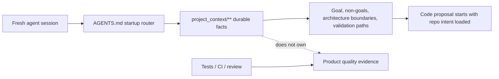

# Project Tiny Context Harness

[](docs/launch/npm-publish-runbook.md)
[](https://github.com/Seven128/project-tiny-context-harness/actions/workflows/package.yml)
[](https://securityscorecards.dev/viewer/?uri=github.com/Seven128/project-tiny-context-harness)
[](LICENSE)
[](https://codespaces.new/Seven128/project-tiny-context-harness)

Translations: [Chinese (Simplified)](README.zh-CN.md)

> Rename publish status: GitHub is already renamed, but npm `project-tiny-context-harness` is still pending registry publication. The install commands below are the post-publish path; until `node tools/launch_readiness_check.mjs --strict-external` no longer reports `npm-fetch`, use the Codespaces or source-preview path in this README. Maintainers can follow [the npm publish runbook](docs/launch/npm-publish-runbook.md).

Project Tiny Context Harness is repo-native project memory for AI coding agents.

`project-tiny-context-harness` ships Project Tiny Context Harness through the `sdlc-harness` CLI. It installs **Minimal Context Harness**: a compact `project_context/**` fact source, a short `AGENTS.md` startup router, role Skills and a `validate-context` gate so fresh agents can recover project intent, boundaries, verification entry points and next safe actions quickly.

It is not another full SDLC ceremony. The Harness maintains context quality; project tests, reviews, CI and human acceptance still own product quality.

Think of it as durable project memory behind `AGENTS.md`, not another agent, process framework or task manager.

Best for:

- repos where coding agents keep rediscovering project intent
- teams using multiple agents or frequent fresh chats
- maintainers who want durable context without a full planning ceremony

Not for:

- replacing tests, review, CI or issue trackers
- autonomous SDLC execution
- codebase semantic indexing or external docs retrieval

Concrete shift:

```text
Before: ask a fresh agent to read the repo and tell you what matters.
After: ask it to read AGENTS.md and project_context/** first, then summarize goal, non-goals, architecture boundaries and validation paths before proposing code.
```

What gets added:




The demo shows the core loop: install the npm package, initialize `AGENTS.md` and `project_context/**`, run `validate-context`, then ask a fresh agent to recover intent before proposing code.

```sh
npm install -D project-tiny-context-harness@latest
npx --yes --package project-tiny-context-harness@latest sdlc-harness init
```

Source preview while npm publish is pending:

Browser preview:

```text
Open https://codespaces.new/Seven128/project-tiny-context-harness
```

When the Codespace finishes `npm ci`, run:

```sh
npm run smoke:quickstart
npm run preview:pack
```

Local preview:

```sh
git clone https://github.com/Seven128/project-tiny-context-harness.git
cd project-tiny-context-harness
npm ci
npm run smoke:quickstart
npm run preview:pack
```

That smoke packs the local workspace, installs it into a disposable repo, runs `sdlc-harness init` and validates the generated Minimal Context files.

To try the unpublished package in a separate test repository:

```sh
npm run preview:pack
cd /path/to/your/test-repo
npm install -D /path/to/project-tiny-context-harness/tmp/sdlc/source-preview/package/project-tiny-context-harness-0.2.39.tgz
npx --no-install sdlc-harness init --adopt
make validate-context
```

Use this tarball path only for source-preview testing while npm publication is pending.

If the source preview path fails, open a [Source preview report](https://github.com/Seven128/project-tiny-context-harness/issues/new?template=source_preview_report.yml) with the command, environment and shortest useful output.

Use it when coding agents repeatedly lose project intent across new chats, handoffs, RFC/debug turns or tool changes. The intended tradeoff is: keep durable intent and recovery paths; leave execution evidence to code, tests and review.

## Why It Exists

Coding agents can move quickly inside one thread and still drift when a new chat, model, tool, reviewer or debugging session loses the project-specific facts that were never encoded anywhere stable.

Most repositories already have README files, specs, tests and issue history, but fresh agents need a small, explicit recovery path: what the project is trying to do, what it must not do, where architecture boundaries live, how to validate changes and what durable facts changed after the last task. Minimal Context Harness makes that recovery path a first-class repo surface without adding a full planning ceremony.

The product lesson is: **keep the memory, drop the ceremony**. Earlier stage-based workflows externalized requirements, design, implementation, review, test and release into explicit phase artifacts. Modern coding agents already internalize much of that ordinary software loop. Project Tiny Context Harness keeps the useful part: the smallest high-density repo context that survives fresh chats without forcing every task through phase transitions, work-product validation or SDLC-stage context splits.

## Positioning

| Adjacent tool type | Use it for | Harness stance |
|---|---|---|
| Spec-first kits | Turning a feature idea into structured specs and implementation plans. | Complementary. Keep final durable project facts in `project_context/**`; do not require spec documents for every task. |
| BMAD-style workflows and full SDLC processes | Coordinated role/process ceremonies on high-risk work. | Lighter default. Preserve context quality without shipping phase gates or work-product trees. |
| Task Master-style planners | Backlog decomposition and task execution state. | Complementary. Harness does not own task state; it owns durable project memory. |
| Context7/Serena-style retrieval or code-intelligence tools | Pulling external docs, symbols or repository facts on demand. | Complementary. Harness keeps the local project truth that should travel with the repo. |
| IDE or agent memory | Tool-specific continuity inside one product surface. | Portable fallback. Harness files are plain repo assets that any agent can read. |

## Try It In 60 Seconds

```sh
mkdir project-tiny-context-harness-demo
cd project-tiny-context-harness-demo
git init
npm init -y
npm install -D project-tiny-context-harness@latest
npx --yes --package project-tiny-context-harness@latest sdlc-harness init
make validate-context
```

Then open `AGENTS.md`, `project_context/global.md` and `project_context/architecture.md`. Those files are the small recovery surface a fresh agent should read before changing the project.

Expected result:

```text
AGENTS.md
project_context/
  context.toml
  global.md
  architecture.md
  areas/main.md
  areas/main/verification.md
```

Fresh-agent test prompt:

```text
Read AGENTS.md and project_context/** first. Summarize the project goal, non-goals, architecture boundaries, validation entry points and next safe action before proposing code changes.
```

If the agent can answer that without rediscovering the repo from scratch, the Harness is doing its job.

A useful first answer should recover the project goal, non-goals, architecture boundaries, validation entry points and next safe action. It should not invent benchmark results or claim tests passed.

Maintainers can verify the local package artifact with the same flow:

```sh
npm run launch:check
npm run smoke:quickstart
```

Copy-ready launch materials live in [docs/launch/README.md](https://github.com/Seven128/project-tiny-context-harness/blob/main/docs/launch/README.md).

For the stable product/design rationale, see [PROJECT_SPEC.md](PROJECT_SPEC.md).

Feedback from real repositories is especially useful right now. If you try the Harness, open an [adoption report](https://github.com/Seven128/project-tiny-context-harness/issues/new?template=adoption_report.yml) with what your agent was forgetting, what Minimal Context made easier and what recovery facts were still missing.

Early feedback and starter issues:

- If the README, sample repo or generated Context leaves a fresh-agent recovery fact unclear, open a [Context recovery gap](https://github.com/Seven128/project-tiny-context-harness/issues/new?template=context_gap.yml).
- Share what worked or failed in the pinned [adoption reports issue](https://github.com/Seven128/project-tiny-context-harness/issues/4).
- Pick a starter issue: [demo](https://github.com/Seven128/project-tiny-context-harness/issues/5), [sample walkthrough](https://github.com/Seven128/project-tiny-context-harness/issues/6), [benchmark rerun](https://github.com/Seven128/project-tiny-context-harness/issues/7) or [launch FAQ](https://github.com/Seven128/project-tiny-context-harness/issues/8).
- Keep claims narrow: recovery evidence is useful; benchmark speedup claims need fresh Minimal Context benchmark runs.

For current priorities and non-goals, see the [roadmap](docs/roadmap.md).

For benchmark boundaries, read [Benchmarking And Evidence](docs/benchmarking.md).

For contribution, support, security, conduct and governance, see [CONTRIBUTING.md](CONTRIBUTING.md), [SUPPORT.md](SUPPORT.md), [SECURITY.md](SECURITY.md), [CODE_OF_CONDUCT.md](CODE_OF_CONDUCT.md) and [GOVERNANCE.md](GOVERNANCE.md).

For concrete examples, read the [fresh-agent recovery walkthrough](docs/examples/fresh-agent-recovery.md), the [Minimal Context sample guide](docs/examples/minimal-context-sample.md) and the [browseable sample repository](examples/minimal-context-sample/).

For the longer technical argument, read [Fresh coding-agent sessions need project memory, not more ceremony](docs/articles/fresh-agent-project-memory.md).

For adjacent-tool fit, read the [comparison guide](docs/comparison.md).

For existing repositories, read the [adoption guide](docs/adopt-existing-repo.md). For Codex, Claude Code, Cursor, Gemini CLI, OpenCode and other tool-specific setup notes, see [agent surface recipes](docs/agent-surface-recipes.md).

For common launch and adoption questions, see the [FAQ](docs/faq.md).

## Repository Scope

This repository is both the source workspace and a reference workspace for `project-tiny-context-harness`. It contains three product areas:

- Harness source code: `packages/sdlc-harness/src/**`, package assets, validators, migrations and source-sync logic.
- npm package release logic: package metadata, build/test scripts and source asset drift checks for `project-tiny-context-harness`.
- Delivery benchmark logic: `examples/delivery-benchmark/**`, used to compare baseline coding against Harness-assisted delivery under the same quality bar.

Earlier stage-based workflow assets have been removed from the current source tree. The historical design and convergence reason are summarized in [PROJECT_SPEC.md](PROJECT_SPEC.md); new package consumers default to `project_context/**`.

## Install

```sh
npm install -D project-tiny-context-harness@latest
npx --yes --package project-tiny-context-harness@latest sdlc-harness init
```

For an existing project:

```sh
npx --yes --package project-tiny-context-harness@latest sdlc-harness init --adopt
```

`init` creates:

- `AGENTS.md`
- `project_context/context.toml`
- `project_context/global.md`
- `project_context/architecture.md`
- `project_context/areas/main.md`
- `project_context/areas/main/verification.md`
- `<harnessRoot>/config.yaml`
- `<harnessRoot>/skills/context_product_plan/SKILL.md`
- `<harnessRoot>/skills/context_uiux_design/SKILL.md`
- `<harnessRoot>/skills/context_development_engineer/SKILL.md`
- `<harnessRoot>/skills/context_full_project_export/SKILL.md`
- `<harnessRoot>/pjsdlc_managed/context_templates/**`
- `<harnessRoot>/pjsdlc_managed/make/sdlc-harness.mk`
- `tools/**`
- a root `Makefile` include block
- `.github/workflows/harness.yml`

The generated workflow runs only the selected Harness gate, `validate-context` or `validate-harness`. Maintainer-only package tests and source-drift checks are intentionally kept out of consumer projects.

`init` does not create lifecycle state, plan state, stage skills or stage work-product trees by default.

## FAQ

**Why not just write a better README?**

README is for humans and broad orientation. Minimal Context is a smaller machine-readable recovery path for fresh agents: durable intent, non-goals, boundaries, validation commands and context drift notes.

**Is this only for Codex?**

No. The generated files are plain repository assets. Codex, Claude Code, Cursor, Gemini CLI, Cline, Roo or a human reviewer can read the same facts.

The support assets can live in a tool-specific harness folder such as `.codex`, `.claude`, `.cursor`, `.cline`, `.roo`, `.gemini` or a custom folder; the durable recovery contract stays in root `AGENTS.md` and `project_context/**`. See [agent surface recipes](docs/agent-surface-recipes.md).

**Is this an English-only or Chinese-only tool?**

Neither. Public docs, npm copy and launch posts are English-first so new visitors can evaluate the project quickly. Generated Skills may include multilingual trigger examples, and export defaults may use local-language filenames; those are compatibility details, not a Chinese-only product boundary.

**Does `validate-context` prove the project works?**

No. It checks that recovery facts exist and avoids fake test-result claims. Product quality still belongs to tests, CI, review and human acceptance.

**Will this create documentation burden?**

It should stay smaller than a full process. Ordinary bug fixes and local refactors do not update Context unless they produce durable product, architecture, API, state or validation facts.

The default Skills are Minimal Context helpers for explicit product-planning, UI/UX-design, development-engineering and full-project-export requests. Product, screen-flow and durable engineering conclusions go to `project_context/**`; visual identity and design tokens go to root `DESIGN.md`. Export artifacts are temporary files under `tmp/sdlc/context-exports/**`, not Context.

Multilingual trigger phrases and local-language export filenames are compatibility details. Public README, npm and launch copy stay English-first; literal non-English examples are documented only where they explain generated Skill matching or default export filenames.

For product, UI/UX and engineering tasks that touch design intent, API/Schema, state/runtime behavior, architecture boundaries or verification design, the default Skills compile a short current-task contract before implementation. The contract starts with `Context Delta: none|required`; `required` preserves context-first behavior, while `none` means the task can proceed against existing Context. The task contract and Contract Conformance are handoff evidence, not new PRD, tech-plan, validator or gate surfaces.

For complex task-contract work, agents may use `plan.md` or an equivalent temporary plan surface as scratch space for `Context Delta`, `Task Contract`, implementation steps and Conformance notes. It is execution cache only: durable facts must be extracted into `project_context/**` or `DESIGN.md`, and temporary plans are not Context, not registered in `context.toml` and not default project assets.

For Web pages, frontend layout, UI/UX, product module boundaries or decisions about where information belongs, agents should run a lightweight page product-positioning check before deciding whether the change is context-first. The check asks what judgment the user needs to make on the page, what information/actions/feedback the product must provide, what should not be persistent, what belongs in downstream consumption, ops, detail or another page, and whether layout and information density match the page task. If ownership is unclear, inspect the relevant pages and Context first. The check is input to change classification: it does not by itself require a Context update, new document chain or validator gate.

The expected Context Priority Ladder is: read Context first, run the page product-positioning check when applicable, classify durable-fact impact or use `Context Delta` inside task-contract scenarios, choose context-first or code-first, then perform Contract Conformance when applicable and Context drift check before handoff. This is prompt-level guidance, not an edit-order validator.

Managed `AGENTS.md` guidance is intentionally a startup router, not a full manual. It should contain fact-source entry points, hard boundaries, key triggers and shortest validation commands; package consumers default long design reasoning to Context unless they already have a local spec/design convention. In this source workspace, `PROJECT_SPEC.md` holds stable Harness workflow rationale. Role procedures belong in Skills and human usage guidance in README. The recommended 40-70 line range is a soft budget, not a validator gate.

The default `context_*` Skills are package-managed generated files. `sync` overwrites them, so project-specific product/design/development rules should live in separate project-local Skills such as `.codex/skills/product_plan/SKILL.md`, `.codex/skills/uiux_design/SKILL.md` or `.codex/skills/development_engineer/SKILL.md`. When a project-local Skill and a default Skill both apply, agents should use the more specific project-local Skill first while keeping durable conclusions in `project_context/**` and `DESIGN.md`. Keep the project-local Skill front matter `description` triggers aligned with the matching default `context_*` Skill and the project `AGENTS.md` role-trigger rule; if a project adds or narrows product/design/development keywords, update both the local Skill and the agent guidance together.

## CLI Entry Safety

The canonical npm package is `project-tiny-context-harness`; `sdlc-harness` is the bin name. Prefer package-qualified `npx` commands for ad hoc use because bare `npx sdlc-harness` can resolve an older package name or a stale local install. After `init`, the managed Makefile wrapper uses the canonical latest CLI by default and can be overridden with `SDLC_HARNESS=...` when a project intentionally pins a local package.

Use `npx --no-install sdlc-harness ...` only when you explicitly want the already installed local package, such as release smoke tests against a packed tarball.

## Core Commands

| Command | Purpose |
|---|---|
| `npx --yes --package project-tiny-context-harness@latest sdlc-harness init` | Non-destructively installs Minimal Context Harness into the current project. |
| `make sdlc-sync` or `npx --yes --package project-tiny-context-harness@latest sdlc-harness sync` | Refreshes managed guidance, default Skills, Makefile include, tools and templates. It does not generate project semantics. |
| `make sdlc-upgrade` or `npx --yes --package project-tiny-context-harness@latest sdlc-harness upgrade` | Runs safe package migrations and `sync`, including Schema v4 Context graph manifest creation when missing. |
| `npx --yes --package project-tiny-context-harness@latest sdlc-harness export-context --all [--check]` | Creates both default temporary exports under `tmp/sdlc/context-exports/**`. |
| `npx --yes --package project-tiny-context-harness@latest sdlc-harness export-context --full [--output tmp/sdlc/context-exports/name.md] [--check]` | Creates a temporary project Context summary Markdown artifact. |
| `npx --yes --package project-tiny-context-harness@latest sdlc-harness export-context --code [--output tmp/sdlc/context-exports/name.md] [--check]` | Creates a temporary single-file code implementation Markdown artifact. |
| `npx --yes --package project-tiny-context-harness@latest sdlc-harness validate-context` | Checks minimum project recovery fields, Context graph metadata, declared paths/roles and fake test-execution claims. |
| `make validate-context` | Makefile wrapper for `validate-context`. |
| `make validate-harness` | Compatibility alias for `validate-context` in vNext projects. |
| `sdlc-harness package sync-source` | Maintainer-only command to sync source workspace assets into `packages/sdlc-harness/assets/**`. |
| `sdlc-harness package check-source` | Maintainer-only drift check for package canonical assets. |

## Minimal Context Files

`project_context/global.md` is the first file a fresh agent should read. It contains:

- project goal
- non-goals / boundaries
- background
- design rationale, including former ADR-level decisions that still matter
- architecture context link
- product / delivery brief for durable product goals, users, flows and acceptance signals
- UX / screen brief for durable screen, interaction, responsive and accessibility facts
- short verification context pointers
- current state
- next safe action
- context index

`project_context/architecture.md` is the restrained architecture document. It contains:

- system boundary
- component map
- data / control flow
- architecture-level design rationale
- constraints and tradeoffs
- verification implications
- open risks

`project_context/context.toml` is the Schema v4 Context graph manifest. `init` creates a default `main` product/domain area for ordinary projects and registers `project_context/areas/main/verification.md` as its default `verification` role Context. `upgrade` creates a conservative baseline manifest for existing projects by registering current `project_context/areas/**/*.md` files as areas, except obvious `verification.md` and `deployment.md` role files. Larger projects can add `[[areas]]` and `[[context]]` entries with role, trigger/read policy, default children and monorepo boundary metadata such as `forbidden_runtime_dependencies`.

`project_context/areas/<unit>.md` contains product/domain ownership context by default. For larger projects, `areas/` may contain nested files such as `areas/<area>/README.md`, `areas/<area>/contracts/*.md`, `areas/<area>/foundation/*.md`, `areas/<area>/verification.md`, `areas/<area>/deployment.md` or other durable context nodes:

- responsibility
- user / system contract
- core data, API or state
- key constraints
- code entry points
- related role context pointers
- open risks

Additional Markdown context files under `project_context/**` can declare `context_role` in front matter or receive a role from `context.toml`. Roles are semantic labels that help agents choose when and how to read context; `validate-context` checks graph structure, paths and field shapes rather than enforcing a writing template for each role:

- `global`: project-level fact source and reading entry point.
- `architecture`: durable system boundary, component relationship and architecture constraints.
- `area`: a primary product/domain ownership context; ordinary projects usually have one `main` area.
- `domain`: a business-oriented area label for product-family or monorepo contexts.
- `subdomain`: a smaller context unit inside an area.
- `contract`: cross-area or cross-subdomain interface, event, API or schema semantics.
- `foundation`: durable theory, vocabulary or conceptual source material.
- `verification`: critical test, smoke, CI, probe or validation repeat-execution paths for an owning area or cross-domain project path.
- `deployment`: critical deploy, CI/CD, cloud/bootstrap, runtime topology, service initialization, health-check or rollback/degradation repeat-execution paths.
- `archive`: historical or external source index that should not be read by default.
- `implementation-index`: code navigation map for owned paths, responsibilities and tests.
- `decision-rationale`: stable reasons behind durable design choices.

When authoring, migrating or cleaning up `project_context/areas/**`, run a soft role placement scan before registering every Markdown file as an `[[areas]]` entry. Keep `area` / `domain` for product ownership, use `subdomain` only for a smaller owned product context, move interface semantics into `contract`, stable theory or vocabulary into `foundation`, repeatable test/deploy execution paths into `verification` / `deployment`, code maps into `implementation-index`, design reasons into `decision-rationale`, and non-default historical or external material into `archive`. This is prompt-level guidance, not a validator gate.

Automatic migration moves legacy `project_context/modules/**/*.md` files into `project_context/areas/**/*.md`, creates a usable graph baseline and does not infer deep semantic roles. If an existing deep area file is really a foundation, contract, archive or implementation index, a later agent should update `context.toml` explicitly. Boundary rules are metadata only; Harness does not scan source imports or build a runtime dependency graph.

## Temporary Project Exports

Use `export-context --all` when you want both one-off project exports for copying into an external tool or discussion:

```sh
npx --yes --package project-tiny-context-harness@latest sdlc-harness export-context --all
npx --yes --package project-tiny-context-harness@latest sdlc-harness export-context --all --check
```

This generates both default artifacts with the same timestamp: `tmp/sdlc/context-exports/full-project-context-<timestamp>.md` and `tmp/sdlc/context-exports/code-level-implementation-<timestamp>/code-level-implementation.md`. `--all` does not accept `--output`; use the single-artifact commands below for custom names.

Use `export-context --full` when you need only the project Context bundle:

```sh
npx --yes --package project-tiny-context-harness@latest sdlc-harness export-context --full
npx --yes --package project-tiny-context-harness@latest sdlc-harness export-context --full --output tmp/sdlc/context-exports/my-export.md
npx --yes --package project-tiny-context-harness@latest sdlc-harness export-context --full --check
```

The default artifact path is `tmp/sdlc/context-exports/full-project-context-<timestamp>.md`. The file title is `# Full Project Context Export`. The file header says `Export artifact. Do not reference from project_context/context.toml.` The export includes Context files, key README / AGENTS / DESIGN documents, managed Skill guidance, Makefile verification-entry summaries, a directory tree summary and Context code-entry indexes.

Use `export-context --code` when an external model needs the current implementation state in one uploadable Markdown file:

```sh
npx --yes --package project-tiny-context-harness@latest sdlc-harness export-context --code
npx --yes --package project-tiny-context-harness@latest sdlc-harness export-context --code --output tmp/sdlc/context-exports/my-code-export.md
npx --yes --package project-tiny-context-harness@latest sdlc-harness export-context --code --check
```

The default code artifact path is `tmp/sdlc/context-exports/code-level-implementation-<timestamp>/code-level-implementation.md`. The file title is `# Code-Level Implementation Export`. It scans main source and engineering configuration files, adds each file path, type, line count, character count, SHA256, a heuristic one-sentence summary and a fenced redacted code block. It does not split output into multiple Markdown files.

Both export modes exclude `.env*` except safe examples such as `.env.example`, secret/token/cookie-oriented files, raw captures, licensed payload dumps, `node_modules`, build output, caches, coverage, test reports, logs and existing export artifacts; obvious sensitive assignment values are redacted and reported as warnings.

Exports are not long-lived fact sources. The CLI refuses `project_context/**` and non-temporary output paths, and `validate-context` rejects obvious export artifact names such as `code-level-implementation`, `full-project-context`, legacy Chinese export names, `project-overview`, `context-bundle`, `context-summary` or `context-export` if someone tries to register them in `project_context/context.toml`.

The Context should be short enough to read at session start and specific enough to prevent fresh-agent drift. It should not copy code, test logs, release ledgers or implementation narration that the code already makes obvious.

Verification and deployment role Context are narrow exceptions for reusable execution knowledge. Do not record one-off test logs, full command output, temporary JSON, CI artifacts, test reports, release ledgers, secrets, tokens, cookies, device ids or raw payloads. When a test, smoke, CI, deployment, bootstrap or runtime path has durable recovery value, record only the special preparation, shortest command/path, expected stage or signal, acceptable warnings and dead ends already ruled out. These paths should live in the owning area's `verification` or `deployment` role Context; use project-level references only for truly cross-domain paths.

`project_context/**` is authoritative for intended responsibility, ownership, product intent, architecture boundaries, integration direction, allowed or forbidden dependencies and verification/deployment entry paths. Source code is authoritative for current implementation state. When code shape, keyword search results or nearby implementations disagree with Context, agents should treat the difference as implementation drift, missing work or stale Context that must be called out, not as evidence that overrides Context-declared ownership or intent.

Before the first code edit, agents should classify the change instead of relying on a fixed timer. Long-term fact changes include product ownership or plans, module responsibilities, information architecture, API / Schema, state-machine or scheduler semantics, cross-area boundaries and verification/deployment entry paths. If a task hits one of these categories, Context-first is the default path and the first update should be the relevant `project_context/**` entry with enough durable context to guide implementation, without a fixed line-count limit:

```text
context -> implementation -> verification -> context drift check
```

Code-first is a controlled exception for ordinary bug fixes, local styling changes, local implementation-drift repairs, test fixes and exploratory spikes; those should not update Context unless they produce a durable fact. Once code discovery produces one, the agent should update Context before final alignment or handoff:

```text
implementation discovery -> context update if long-term fact changed -> implementation alignment -> verification
```

This ordering is guidance, not a new validator gate. `validate-context` checks recoverability and fake verification claims; it does not infer whether Context or code was edited first. Automation may warn about possible context-first drift, but should not block work. Handoffs should report only a lightweight status such as `Context: updated ...` or `Context: no durable fact change`.

Product, UI/UX and development engineer Skills are prompts for keeping that Context sharp. They may help draft a product plan, screen design or implementation plan, but the long-lived asset is still the compact Context.

Projects customize these workflows by adding separate project-local Skills, not by editing package-managed default Skills:

```sh
mkdir -p .codex/skills/uiux_design
$EDITOR .codex/skills/uiux_design/SKILL.md
```

The project-local Skill should mention when it supersedes the package-managed default Skill and should either reuse the default Minimal Context workflow or state the narrower project workflow directly. Its front matter `description` should preserve the same role-trigger intent as `AGENTS.md` and the matching default `context_*` Skill, with any project-specific keyword additions reflected in both places. `sync` does not merge Skill overrides and does not overwrite these separate local Skills. Existing `.codex/pjsdlc_managed/override_skills/*.md` files should be migrated into standalone project-local Skills before running `sync`.

`init` creates root `DESIGN.md` beside Context as the design-system fact source, and `upgrade` creates it for existing Harness projects when missing. It starts as a neutral starter baseline with visual tokens, background/color logic, typography, spacing, component states and do/don't guidance; user-authored design rules take precedence once present. Use `npx @google/design.md lint DESIGN.md` to validate its structure when the file is changed.

Harness installs Impeccable as a default package dependency. For design drafts, redesigns, visual polish, frontend redesign/styling or existing-UI review work, agents should run Impeccable by default when there is a scan target such as UI source, page files, build output or a local/remote URL:

```bash
npx impeccable detect src/
```

Impeccable is a default design-review step when a scan target exists, but it is not a `validate-context` gate. If there is no suitable target or the command cannot run, the agent should say why and continue. Its findings are design-review signals, not a replacement for screenshots, project tests or human review.

## Current Boundary

The former stage-based Harness is no longer shipped as a runnable default, compatibility layer or migration command. Existing users have completed migration, so the package keeps only the current Minimal Context surface.

The design reason is evidence-driven: delivery benchmark pilots showed that full SDLC document chains and frequent workflow gates create real time/token friction on ordinary and medium-complexity tasks, while modern agents already handle much of single-stage product/test work internally. The vNext default keeps the part with the clearest expected return: a minimal durable context for recovery, iteration, debug and requirements changes.

## Delivery Benchmark

`examples/delivery-benchmark/` remains repo-local. It is used to test whether Harness changes improve same-quality lifecycle delivery efficiency. Historical stage-based result summaries were removed from the public report; future Harness prompts use Minimal Context and require fresh reruns.

The benchmark should not prove that Harness is always faster. It should find the break-even curve: which complexity, risk and recovery conditions make context maintenance pay back its cost.

Read [Benchmarking And Evidence](docs/benchmarking.md) for the claim boundary and evidence rules. Open the static report at [examples/delivery-benchmark/results/index.html](examples/delivery-benchmark/results/index.html).
