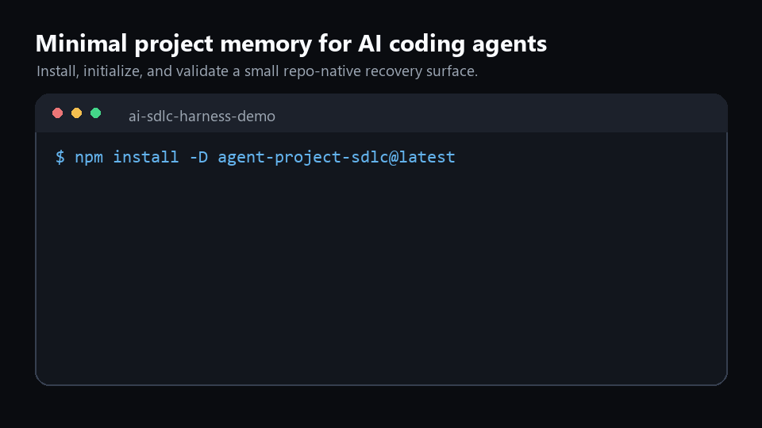

# Launch Demo Packet

This is the recording packet for issue #5. It prepares a real terminal transcript against the public npm package so the final video/GIF can be recorded without improvising.

Current status:

- The public package is `project-tiny-context-harness@0.2.39`.
- The repo and npm metadata pass `node tools/launch_readiness_check.mjs --strict-external`.
- Repo-hosted demo media exists under `docs/launch/assets/`: `demo-terminal.gif`, two Product Hunt gallery PNGs and a 240x240 thumbnail.
- No external video has been uploaded yet.

## Capture Command

Run this from the repository root:

```sh
npm run launch:demo -- --out-dir tmp/sdlc/launch-demo/latest
```

The command creates a disposable demo repository, installs `project-tiny-context-harness@latest`, runs `sdlc-harness init`, validates the generated Context, runs `doctor`, and writes:

- `tmp/sdlc/launch-demo/latest/transcript.md`
- `tmp/sdlc/launch-demo/latest/summary.json`
- `tmp/sdlc/launch-demo/latest/project-tiny-context-harness-demo/`

## Recording Beats

Keep the recording under 90 seconds.

| Beat | Terminal action | Narration |
|---|---|---|
| Problem | Show an empty temp repo. | "Agents are strong in one thread. New chats often lose repo-specific intent." |
| Install | `npm install --save-dev project-tiny-context-harness@latest` | "This installs minimal repo-native project memory, not a task manager." |
| Init | `npx --no-install sdlc-harness init` | "It creates AGENTS.md and project_context files a fresh agent should read first." |
| Surface | Show `AGENTS.md` and `project_context/`. | "The durable facts are project goal, boundaries and validation paths." |
| Gate | `npx --no-install sdlc-harness validate-context` | "This validates recovery facts. It does not replace tests or review." |
| Recovery | Show the prompt below. | "A good first answer summarizes intent before proposing code." |
| Ask | Show README or pinned issue #4. | "Try it where agent handoffs currently drift, and tell me what facts are missing." |

## Fresh-Agent Prompt

```text
Read AGENTS.md and project_context/**, then summarize the project goal, non-goals, architecture boundaries and validation commands before proposing any code change.
```

## Fresh-Agent Recovery Check

The recording should show the agent answer before any code request. A usable answer mentions:

- Project goal from `project_context/global.md`.
- Non-goals / boundaries, especially that Harness does not replace tests, CI or review.
- Architecture boundary from `project_context/architecture.md`.
- Validation entry point: `npx --no-install sdlc-harness validate-context` or `make validate-context`.
- No unrelated web browsing or invention of benchmark claims.

If the agent skips these facts, stop and improve the generated Context or README before posting the demo.

## Transcript Excerpt For Posts

```text
$ npm install --save-dev project-tiny-context-harness@latest

$ npx --no-install sdlc-harness init
created AGENTS.md
created project_context/context.toml
created project_context/global.md
created project_context/architecture.md
created project_context/areas/main.md
created project_context/areas/main/verification.md
sync changed=15 skipped=0 blocked=0
init complete

$ npx --no-install sdlc-harness validate-context
loaded project_context/context.toml with 1 area(s) and 0 context node(s)
Minimal Context validation passed
```

## Demo Media

Use the GIF in the README and launch posts where animated media is supported:



Use these assets for Product Hunt draft prep:

- [Product Hunt gallery 1](assets/product-hunt-gallery-1.png)
- [Product Hunt gallery 2](assets/product-hunt-gallery-2.png)
- [Product Hunt thumbnail](assets/product-hunt-thumbnail.png)

The older still placeholder remains available at [assets/demo-terminal.svg](assets/demo-terminal.svg).

## Post-Recording Checklist

- Use the repo-hosted GIF for README and Show HN if an external video is not ready.
- Upload an external video only if it adds clarity beyond the GIF and gallery images.
- Link the recording from the Show HN body only if it is short and directly demonstrates the package.
- Comment on #5 with the final URL.
- Keep benchmark and award claims out of the demo.
