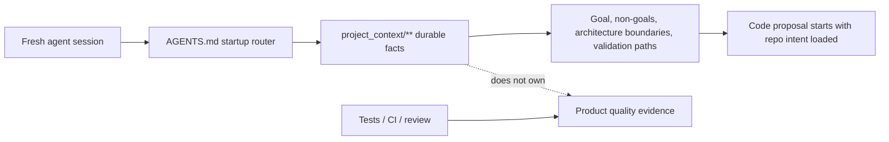

# Project Tiny Context Harness

[](https://www.npmjs.com/package/project-tiny-context-harness)
[](https://github.com/Seven128/project-tiny-context-harness/actions/workflows/package.yml)
[](https://securityscorecards.dev/viewer/?uri=github.com/Seven128/project-tiny-context-harness)
[](LICENSE)
[](https://codespaces.new/Seven128/project-tiny-context-harness)

Translations: [Chinese (Simplified)](https://github.com/Seven128/project-tiny-context-harness/blob/main/README.zh-CN.md)

`project-tiny-context-harness` ships the `sdlc-harness` CLI for Project Tiny Context Harness: repo-native project memory for AI coding agents.

The default is **Minimal Context Harness**. It maintains a compact `project_context/**` fact source, a short `AGENTS.md` startup router, role Skills and a `validate-context` gate so fresh agents can recover project intent, constraints, verification entry points and next safe actions quickly.

It does not default to lifecycle phases, plan tasks, stage skills, stage documents or phase gates. Harness maintains context quality; your project tests, CI, review process and human acceptance remain responsible for product quality.

Use it when coding agents repeatedly lose project intent across new chats, handoffs, RFC/debug turns or tool changes. The intended tradeoff is: keep durable intent and recovery paths; leave execution evidence to code, tests and review.

Think of it as durable project memory behind `AGENTS.md`, not another agent, process framework or task manager.

Best for:

- repos where coding agents keep rediscovering project intent
- teams using multiple agents or frequent fresh chats
- maintainers who want durable context without a full planning ceremony

Not for:

- replacing tests, review, CI or issue trackers
- autonomous SDLC execution
- codebase semantic indexing or external docs retrieval

Concrete shift:

```text
Before: ask a fresh agent to read the repo and tell you what matters.
After: ask it to read AGENTS.md and project_context/** first, then summarize goal, non-goals, architecture boundaries and validation paths before proposing code.
```

What gets added:




The demo shows the core loop: initialize `AGENTS.md` and `project_context/**`, run `validate-context`, then ask a fresh agent to recover intent before proposing code. Use the npm install path below, or inspect the no-install previews first.

No-install preview:

- Read the [fresh-agent recovery walkthrough](https://github.com/Seven128/project-tiny-context-harness/blob/main/docs/examples/fresh-agent-recovery.md).
- Inspect the [Minimal Context sample guide](https://github.com/Seven128/project-tiny-context-harness/blob/main/docs/examples/minimal-context-sample.md).
- Browse a tiny generated sample repository at [examples/minimal-context-sample/](https://github.com/Seven128/project-tiny-context-harness/tree/main/examples/minimal-context-sample).

## Why It Exists

Coding agents can move quickly inside one thread and still drift when a new chat, model, tool, reviewer or debugging session loses the project-specific facts that were never encoded anywhere stable.

Minimal Context Harness creates a small, explicit recovery path: project goal, boundaries, architecture context, validation entry points and durable task conclusions. It is designed to sit beside specs, tests, issues, docs and code intelligence tools instead of replacing them.

The core bet is: **keep the memory, drop the ceremony**. Earlier stage-based workflows pushed ordinary software work through explicit phase artifacts and gates. Modern coding agents already internalize much of the understand, design, implement, test and repair loop, so Project Tiny Context Harness keeps the high-density repo context that survives fresh chats without making every task follow SDLC-stage choreography.

## Positioning

| Adjacent tool type | Use it for | Harness stance |
|---|---|---|
| Spec-first kits | Turning feature ideas into structured specs and plans. | Complementary; Harness keeps durable project facts, not a required spec chain. |
| BMAD-style workflows and full SDLC processes | Coordinated role/process ceremonies on high-risk work. | Lighter default; no phase gates or work-product trees. |
| Task Master-style planners | Backlog decomposition and task execution state. | Complementary; Harness does not own task state. |
| Context7/Serena-style retrieval or code-intelligence tools | Pulling external docs, symbols or repository facts on demand. | Complementary; Harness stores local repo truth. |
| IDE or agent memory | Tool-specific continuity inside one product surface. | Portable fallback; plain files any agent can read. |

## Try It In 60 Seconds

```sh
mkdir project-tiny-context-harness-demo
cd project-tiny-context-harness-demo
git init
npm init -y
npm install -D project-tiny-context-harness@latest
npx --yes --package project-tiny-context-harness@latest sdlc-harness init
make validate-context
```

Then open `AGENTS.md`, `project_context/global.md` and `project_context/architecture.md`. Those files are the small recovery surface a fresh agent should read before changing the project.

Source checkout preview:

Browser preview:

```text
Open https://codespaces.new/Seven128/project-tiny-context-harness
```

When the Codespace finishes `npm ci`, run:

```sh
npm run smoke:quickstart
npm run preview:pack
```

Local preview:

```sh
git clone https://github.com/Seven128/project-tiny-context-harness.git
cd project-tiny-context-harness
npm ci
npm run smoke:quickstart
npm run preview:pack
cd /path/to/your/test-repo
npm install -D /path/to/project-tiny-context-harness/tmp/sdlc/source-preview/package/project-tiny-context-harness-0.2.51.tgz
npx --no-install sdlc-harness init --adopt
make validate-context
```

Use this tarball path only for source-preview testing, private review or package development. For normal installs, use `project-tiny-context-harness@latest` from npm.

If the source preview path fails, open a [Source preview report](https://github.com/Seven128/project-tiny-context-harness/issues/new?template=source_preview_report.yml) with the command, environment and shortest useful output.

Expected result:

```text
AGENTS.md
project_context/
  context.toml
  global.md
  architecture.md
  areas/main.md
  areas/main/verification.md
```

Fresh-agent test prompt:

```text
Read AGENTS.md and project_context/** first. Summarize the project goal, non-goals, architecture boundaries, validation entry points and next safe action before proposing code changes.
```

If the agent can answer that without rediscovering the repo from scratch, the Harness is doing its job.

A useful first answer should recover the project goal, non-goals, architecture boundaries, validation entry points and next safe action. It should not invent benchmark results or claim tests passed.

Feedback from real repositories is especially useful right now. If you try the Harness, open an [adoption report](https://github.com/Seven128/project-tiny-context-harness/issues/new?template=adoption_report.yml) with what your agent was forgetting, what Minimal Context made easier and what recovery facts were still missing.

Early feedback and starter issues:

- If the README, sample repo or generated Context leaves a fresh-agent recovery fact unclear, open a [Context recovery gap](https://github.com/Seven128/project-tiny-context-harness/issues/new?template=context_gap.yml).
- Share what worked or failed in the pinned [adoption reports issue](https://github.com/Seven128/project-tiny-context-harness/issues/4).
- Pick a starter issue: [demo](https://github.com/Seven128/project-tiny-context-harness/issues/5), [sample walkthrough](https://github.com/Seven128/project-tiny-context-harness/issues/6), [benchmark rerun](https://github.com/Seven128/project-tiny-context-harness/issues/7) or [launch FAQ](https://github.com/Seven128/project-tiny-context-harness/issues/8).
- Keep claims narrow: recovery evidence is useful; benchmark speedup claims need fresh Minimal Context benchmark runs.

For current priorities and non-goals, see the [roadmap](https://github.com/Seven128/project-tiny-context-harness/blob/main/docs/roadmap.md).

For benchmark boundaries, read [Benchmarking And Evidence](https://github.com/Seven128/project-tiny-context-harness/blob/main/docs/benchmarking.md).

For contribution, support, security, conduct and governance, see [CONTRIBUTING.md](https://github.com/Seven128/project-tiny-context-harness/blob/main/CONTRIBUTING.md), [SUPPORT.md](https://github.com/Seven128/project-tiny-context-harness/blob/main/SUPPORT.md), [SECURITY.md](https://github.com/Seven128/project-tiny-context-harness/blob/main/SECURITY.md), [CODE_OF_CONDUCT.md](https://github.com/Seven128/project-tiny-context-harness/blob/main/CODE_OF_CONDUCT.md) and [GOVERNANCE.md](https://github.com/Seven128/project-tiny-context-harness/blob/main/GOVERNANCE.md).

For concrete examples, read the [fresh-agent recovery walkthrough](https://github.com/Seven128/project-tiny-context-harness/blob/main/docs/examples/fresh-agent-recovery.md), the [Minimal Context sample guide](https://github.com/Seven128/project-tiny-context-harness/blob/main/docs/examples/minimal-context-sample.md) and the [browseable sample repository](https://github.com/Seven128/project-tiny-context-harness/tree/main/examples/minimal-context-sample).

For the longer technical argument, read [Fresh coding-agent sessions need project memory, not more ceremony](https://github.com/Seven128/project-tiny-context-harness/blob/main/docs/articles/fresh-agent-project-memory.md).

For adjacent-tool fit, read the [comparison guide](https://github.com/Seven128/project-tiny-context-harness/blob/main/docs/comparison.md).

For existing repositories, read the [adoption guide](https://github.com/Seven128/project-tiny-context-harness/blob/main/docs/adopt-existing-repo.md). For Codex, Claude Code, Cursor, Gemini CLI, OpenCode and other tool-specific setup notes, see [agent surface recipes](https://github.com/Seven128/project-tiny-context-harness/blob/main/docs/agent-surface-recipes.md).

For common launch and adoption questions, see the [FAQ](https://github.com/Seven128/project-tiny-context-harness/blob/main/docs/faq.md).

## Install

```sh
npm install -D project-tiny-context-harness@latest
npx --yes --package project-tiny-context-harness@latest sdlc-harness init
```

For existing projects:

```sh
npx --yes --package project-tiny-context-harness@latest sdlc-harness init --adopt
```

`init` creates `project_context/context.toml`, `project_context/global.md`, `project_context/architecture.md`, `project_context/areas/main.md`, `project_context/areas/main/verification.md`, agent guidance, Context authoring Skills, a full-project export Skill, managed templates/tools, a Makefile include and `.github/workflows/harness.yml`. The generated workflow runs only the selected Harness gate, `validate-context` or `validate-harness`; maintainer-only package tests and source-drift checks are intentionally kept out of consumer projects. It does not create stage work-product trees, lifecycle state or stage skills by default.

## FAQ

**Why not just write a better README?**

README is for humans and broad orientation. Minimal Context is a smaller machine-readable recovery path for fresh agents: durable intent, non-goals, boundaries, validation commands and context drift notes.

**Is this only for Codex?**

No. The generated files are plain repository assets. Codex, Claude Code, Cursor, Gemini CLI, Cline, Roo or a human reviewer can read the same facts.

The support assets can live in a tool-specific harness folder such as `.codex`, `.claude`, `.cursor`, `.cline`, `.roo`, `.gemini` or a custom folder; the durable recovery contract stays in root `AGENTS.md` and `project_context/**`. See [agent surface recipes](https://github.com/Seven128/project-tiny-context-harness/blob/main/docs/agent-surface-recipes.md).

**Is this an English-only or Chinese-only tool?**

Neither. Public docs, npm copy and launch posts are English-first so new visitors can evaluate the project quickly. Generated Skills may include multilingual trigger examples, and export defaults may use local-language filenames; those are compatibility details, not a Chinese-only product boundary.

**Does `validate-context` prove the project works?**

No. It checks that recovery facts exist and avoids fake test-result claims. Product quality still belongs to tests, CI, review and human acceptance.

**Will this create documentation burden?**

It should stay smaller than a full process. Ordinary bug fixes and local refactors do not update Context unless they produce durable product, architecture, API, state or validation facts.

## CLI Entry Safety

The canonical npm package is `project-tiny-context-harness`; `sdlc-harness` is the bin name. Prefer package-qualified `npx` commands for ad hoc use because bare `npx sdlc-harness` can resolve an older package name or a stale local install. After `init`, the managed Makefile wrapper uses the canonical latest CLI by default and can be overridden with `SDLC_HARNESS=...` when a project intentionally pins a local package.

Use `npx --no-install sdlc-harness ...` only when you explicitly want the already installed local package, such as release smoke tests against a packed tarball.

## Capabilities

| Capability | Entry Point | Description |
|---|---|---|
| Project initialization | `npx --yes --package project-tiny-context-harness@latest sdlc-harness init` | Creates `project_context/context.toml`, `project_context/global.md`, `project_context/architecture.md`, `project_context/areas/main.md`, `project_context/areas/main/verification.md`, `AGENTS.md`, minimal managed assets and a Makefile include. |
| Existing project adoption | `npx --yes --package project-tiny-context-harness@latest sdlc-harness init --adopt` | Adds Minimal Context Harness non-destructively to an existing repository. |
| Configurable Harness root | `--harness-folder`, `package.json#sdlcHarness.harnessFolderName`, `sdlc-harness.config.json` | Supports Codex `.codex`, Claude `.claude`, Cursor `.cursor`, Cline `.cline`, Roo `.roo`, Gemini `.gemini` or a custom folder. |
| Product planning Skill | `<harnessRoot>/skills/context_product_plan/SKILL.md` | Handles explicit product-planning requests and writes durable product conclusions to `project_context/**`. |
| UI/UX design Skill | `<harnessRoot>/skills/context_uiux_design/SKILL.md` | Handles explicit UI/UX design requests, writes screen/interaction conclusions to `project_context/**`, updates root `DESIGN.md` visual tokens with Google `@google/design.md`, and includes compact visual-quality calibration for product/page positioning, user needs, information density, brand/product UI and common AI-design anti-patterns. |
| Development engineer Skill | `<harnessRoot>/skills/context_development_engineer/SKILL.md` | Handles explicit development-engineering requests and writes durable engineering conclusions to `project_context/**`. |
| Full project context export Skill | `<harnessRoot>/skills/context_full_project_export/SKILL.md` | Handles explicit full-project or code-level export requests and uses `export-context --all`, `--full` or `--code` to create temporary artifacts under `tmp/sdlc/context-exports/**`. |
| Project-local Skills | `<harnessRoot>/skills/<role>/SKILL.md` | Optional local product/design/development Skills created by the project, such as `product_plan`, `uiux_design` or `development_engineer`. They supersede package-managed default Skills when more specific, are not overwritten by `sync`, and should keep front matter trigger keywords aligned with the project `AGENTS.md` role-trigger rule. |
| Managed file sync | `make sdlc-sync` or `npx --yes --package project-tiny-context-harness@latest sdlc-harness sync` | Refreshes package-managed guidance, default Skills, Makefile include, context templates, tools and workflow YAML. It does not run migrations or perform semantic Context generation; when migration work is pending it refuses to write and tells you to run `upgrade`. |
| Upgrade | `make sdlc-upgrade` or `npx --yes --package project-tiny-context-harness@latest sdlc-harness upgrade` | Default command after updating the npm package. Builds an upgrade plan, applies `safe_pending` migrations, runs `sync` and `doctor`, and exits non-zero when manual or blocked follow-up remains. |
| Upgrade check | `npx --yes --package project-tiny-context-harness@latest sdlc-harness upgrade --check [--json]` | Checks the upgrade plan without writing files. Reports `safe_pending`, `manual_required` and `blocked`; exits non-zero when any work remains. |
| Combined project export | `npx --yes --package project-tiny-context-harness@latest sdlc-harness export-context --all [--check]` | Creates both default temporary exports under `tmp/sdlc/context-exports/**`. |
| Project Context export | `npx --yes --package project-tiny-context-harness@latest sdlc-harness export-context --full [--output tmp/sdlc/context-exports/name.md] [--check]` | Creates a temporary Context summary artifact. It is not Context and must not be registered in `project_context/context.toml`. |
| Code implementation export | `npx --yes --package project-tiny-context-harness@latest sdlc-harness export-context --code [--output tmp/sdlc/context-exports/name.md] [--check]` | Creates a temporary single-file code implementation artifact. It is not Context and must not be registered in `project_context/context.toml`. |
| Context validation | `npx --yes --package project-tiny-context-harness@latest sdlc-harness validate-context`, `make validate-context` | Checks required project recovery fields, Context graph metadata, declared paths/roles and fake test-execution claims. |
| Diagnostics | `make sdlc-doctor` or `npx --yes --package project-tiny-context-harness@latest sdlc-harness doctor` | Reports Harness root, package version, schema version and required Minimal Context paths. |
| Package source checks | `sdlc-harness package sync-source`, `sdlc-harness package check-source` | Maintainer-only commands for keeping package canonical assets aligned with the source workspace. |

For product, UI/UX and engineering tasks that touch design intent, API/Schema, state/runtime behavior, architecture boundaries or verification design, the default Skills compile a short current-task contract before implementation. The contract starts with `Context Delta: none|required`; `required` preserves context-first behavior, while `none` means the task can proceed against existing Context. For module design work, the development engineer Skill also compiles `Applicable Module Design`: the relevant principles, minimal design logic and durable rationale that control the current implementation or verification choice. The task contract and Contract Conformance are handoff evidence, not new PRD, tech-plan, validator or gate surfaces.

Multilingual trigger phrases and local-language export filenames are compatibility details. Public README, npm and launch copy stay English-first; literal non-English examples are documented only where they explain generated Skill matching or default export filenames.

For complex task-contract work, agents may use `plan.md` or an equivalent temporary plan surface as scratch space for `Context Delta`, `Task Contract`, implementation steps and Conformance notes. It is execution cache only: durable facts must be extracted into `project_context/**` or `DESIGN.md`, and temporary plans are not Context, not registered in `context.toml` and not default project assets.

For Web pages, frontend layout, UI/UX, product module boundaries or decisions about where information belongs, agents should run a lightweight page product-positioning check before deciding whether the change is context-first. The check asks what judgment the user needs to make on the page, what information/actions/feedback the product must provide, what should not be persistent, what belongs in downstream consumption, ops, detail or another page, and whether layout and information density match the page task. If ownership is unclear, inspect the relevant pages and Context first. The check is input to change classification: it does not by itself require a Context update, new document chain or validator gate.

The expected Context Priority Ladder is: read Context first, run the page product-positioning check when applicable, classify durable-fact impact or use `Context Delta` inside task-contract scenarios, choose context-first or code-first, then perform Contract Conformance when applicable and Context drift check before handoff. This is prompt-level guidance, not an edit-order validator.

Managed `AGENTS.md` guidance is intentionally a startup router, not a full manual. It should contain fact-source entry points, hard boundaries, key triggers and shortest validation commands; package consumers default long design reasoning to Context unless they already have a local spec/design convention. The source repository keeps stable Harness workflow rationale in `PROJECT_SPEC.md`. Role procedures belong in Skills and human usage guidance in README. The recommended 40-70 line range is a soft budget, not a validator gate.

## Minimal Context Contract

`project_context/global.md` should contain:

- project goal
- non-goals / boundaries
- background
- design rationale
- architecture context link
- product / delivery brief
- UX / screen brief
- short verification context pointers
- current state
- next safe action
- context index

`project_context/architecture.md` should contain restrained architecture facts:

- system boundary
- component map
- data / control flow
- design rationale
- constraints and tradeoffs
- verification implications
- open risks

`project_context/context.toml` is the Schema v4 Context graph manifest. `init` creates a default `main` product/domain area for ordinary projects and registers `project_context/areas/main/verification.md` as its default `verification` role Context. `upgrade` creates a conservative baseline manifest for existing projects by registering current `project_context/areas/**/*.md` files as areas, except obvious `verification.md` and `deployment.md` role files. Larger projects can add `[[areas]]` and `[[context]]` entries with role, trigger/read policy, default children and monorepo boundary metadata such as `forbidden_runtime_dependencies`.

`project_context/areas/<unit>.md` should contain product/domain ownership context by default. Complex projects can freely nest context nodes under `areas/`, such as `areas/<area>/README.md`, `areas/<area>/contracts/*.md`, `areas/<area>/foundation/*.md`, `areas/<area>/verification.md`, `areas/<area>/deployment.md` or other durable context files:

- responsibility
- user / system contract
- core data / API / state
- module design capsule when stable principles, design logic or rationale should affect future work
- key constraints
- code entry points
- related role context pointers
- open risks

A module design capsule should stay small and decision-shaped: `Principles` are stable execution constraints, `Design Logic` is the minimum choose/reject/degrade/compose logic, and `Design Rationale` keeps only reasons that change later implementation or verification decisions. Current thresholds, commands and probe parameters belong in the relevant contract or verification Context as execution instances, not as permanent principles.

Other context files under `project_context/**` can declare `context_role` in front matter or receive a role from `context.toml`. Roles are semantic labels for agent reading and authoring behavior; `validate-context` checks graph structure, paths and field shapes instead of enforcing a writing template for every role. Supported roles are `global`, `architecture`, `area`, `domain`, `subdomain`, `contract`, `foundation`, `verification`, `deployment`, `archive`, `implementation-index` and `decision-rationale`.

When authoring, migrating or cleaning up `project_context/areas/**`, run a soft role placement scan before registering every Markdown file as an `[[areas]]` entry. Keep `area` / `domain` for product ownership, use `subdomain` only for a smaller owned product context, move interface semantics into `contract`, stable theory or vocabulary into `foundation`, repeatable test/deploy execution paths into `verification` / `deployment`, code maps into `implementation-index`, design reasons into `decision-rationale`, and non-default historical or external material into `archive`. This is prompt-level guidance, not a validator gate.

Automatic migration moves legacy `project_context/modules/**/*.md` files into `project_context/areas/**/*.md`, creates a usable graph baseline and does not infer deep semantic roles. If an existing deep area file is really a foundation, contract, archive or implementation index, a later agent should update `context.toml` explicitly. Boundary rules are metadata only; Harness does not scan source imports or build a runtime dependency graph.

## Temporary Project Exports

`export-context --all` creates both temporary Markdown artifacts for copying into an external tool, archiving an ad hoc discussion or handing context to a one-off collaborator:

```sh
npx --yes --package project-tiny-context-harness@latest sdlc-harness export-context --all
npx --yes --package project-tiny-context-harness@latest sdlc-harness export-context --all --check
```

This generates both default artifacts with the same timestamp: `tmp/sdlc/context-exports/full-project-context-<timestamp>.md` and `tmp/sdlc/context-exports/code-level-implementation-<timestamp>/code-level-implementation.md`. `--all` does not accept `--output`; use `--full` or `--code` for custom single-artifact paths.

`export-context --full` creates only the temporary Markdown Context bundle:

```sh
npx --yes --package project-tiny-context-harness@latest sdlc-harness export-context --full
npx --yes --package project-tiny-context-harness@latest sdlc-harness export-context --full --output tmp/sdlc/context-exports/my-export.md
npx --yes --package project-tiny-context-harness@latest sdlc-harness export-context --full --check
```

The default output is `tmp/sdlc/context-exports/full-project-context-<timestamp>.md`. The file title is `# Full Project Context Export`. `--check` reports the planned output path, source count, source file list and warnings without writing a file. The artifact header always says `Export artifact. Do not reference from project_context/context.toml.`

The exporter includes Context files, key README / AGENTS / DESIGN documents, managed Skill guidance, Makefile verification-entry summaries, a directory tree summary and Context code-entry indexes. It excludes `.env*`, secret/token/cookie-oriented files, raw captures, licensed payload dumps, `node_modules`, build output, caches, coverage, test reports and existing export artifacts; obvious sensitive assignment values are redacted and reported as warnings.

`export-context --code` creates one temporary Markdown file for handing the current implementation state to an external model:

```sh
npx --yes --package project-tiny-context-harness@latest sdlc-harness export-context --code
npx --yes --package project-tiny-context-harness@latest sdlc-harness export-context --code --output tmp/sdlc/context-exports/my-code-export.md
npx --yes --package project-tiny-context-harness@latest sdlc-harness export-context --code --check
```

The default output is `tmp/sdlc/context-exports/code-level-implementation-<timestamp>/code-level-implementation.md`. The file title is `# Code-Level Implementation Export`. It scans main source and engineering configuration files, adds each file path, type, line count, character count, SHA256, a heuristic one-sentence summary and a fenced redacted code block. It does not split output into multiple Markdown files.

Both export modes refuse `project_context/**` and non-temporary output paths. `validate-context` also rejects obvious export artifact names such as `code-level-implementation`, `full-project-context`, legacy Chinese export names, `project-overview`, `context-bundle`, `context-summary` or `context-export` if they are registered in `project_context/context.toml`.

The Context should be dense, durable and short. Former ADR content belongs in `Design Rationale` when it still affects future changes. Implementation details that are obvious from code should stay in code and tests; only non-obvious constraints belong in Context.

Verification and deployment role Context are allowed only when a test, smoke, CI, deployment, bootstrap or runtime path has durable recovery value. Record minimal preparation, the shortest command/path, expected stage or signal, acceptable warnings and dead ends already ruled out. Verification paths are reusable execution instances, not independent definitions of capability, metric or acceptance targets; first use the owning module's design Context to decide what claim should be proven, then choose the command or probe. Do not record one-off logs, full output, temporary JSON, CI artifacts, release ledgers, reports, secrets, tokens, cookies, device ids or raw payloads. Put execution details in the owning area's `verification` or `deployment` role Context; use project-level references only for truly cross-domain paths.

`project_context/**` is authoritative for intended responsibility, ownership, product intent, architecture boundaries, integration direction, allowed or forbidden dependencies and verification/deployment entry paths. Source code is authoritative for current implementation state. If code shape, keyword search results or nearby implementations disagree with Context, agents should call out implementation drift, missing work or stale Context instead of overriding Context-declared ownership or intent.

Before the first code edit, agents should classify the change instead of relying on a fixed timer. Long-term fact changes include product ownership or plans, module responsibilities, information architecture, API / Schema, state-machine or scheduler semantics, cross-area boundaries and verification/deployment entry paths. If a task hits one of these categories, Context-first is the default path and the first update should be the relevant `project_context/**` entry with enough durable context to guide implementation, without a fixed line-count limit:

```text
context -> implementation -> verification -> context drift check
```

Code-first is a controlled exception for ordinary bug fixes, local styling changes, local implementation-drift repairs, test fixes and exploratory spikes; those should not update Context unless they produce a durable fact. Once code discovery produces one, the agent should update Context before final alignment or handoff:

```text
implementation discovery -> context update if long-term fact changed -> implementation alignment -> verification
```

This ordering is guidance, not a new validator gate. `validate-context` checks recoverability and fake verification claims; it does not infer whether Context or code was edited first. Automation may warn about possible context-first drift, but should not block work. Handoffs should report only a lightweight status such as `Context: updated ...` or `Context: no durable fact change`.

The product planning, UI/UX and development engineer Skills are Context authoring helpers. They may shape product plans, screen flows, design handoff, implementation plans or technical decisions, but they do not create a default PRD/UIUX/tech-plan document chain. Their descriptions intentionally avoid broad generic single-word triggers such as product, design or development in any language. For visual systems, `init` creates root `DESIGN.md` as the durable source for colors, typography, spacing, shapes and component tokens; `upgrade` creates it for existing Harness projects when missing. The generated file starts as a neutral starter baseline with visual tokens, background/color logic, typography, spacing, component states and do/don't guidance; user-authored design rules take precedence once present. Validate it with `npx @google/design.md lint DESIGN.md`. The product/design Skills keep compact calibration for product/page positioning, user needs, information density, content/action placement, true empty/error/loading states, layout stability, register choice, design-system continuity and common AI-design anti-patterns.

Harness installs Impeccable as a default package dependency. For design drafts, redesigns, visual polish, frontend redesign/styling or existing-UI review work, agents should run Impeccable by default when there is a scan target such as UI source, page files, build output or a local/remote URL:

```bash
npx impeccable detect src/
```

Impeccable is a default design-review step when a scan target exists, but it is not a `validate-context` gate. If there is no suitable target or the command cannot run, the agent should say why and continue. Its findings are design-review signals, not a replacement for screenshots, project tests or human review.

Project-specific Skill rules can be added as separate project-local Skills. Do not edit package-managed `context_*` Skills directly; `sync` overwrites them:

```sh
mkdir -p <harnessRoot>/skills/uiux_design
$EDITOR <harnessRoot>/skills/uiux_design/SKILL.md
```

When a project-local Skill and a package-managed default Skill both apply, agents should use the more specific project-local Skill first. The local Skill should keep durable conclusions in `project_context/**` and `DESIGN.md`. Its front matter `description` should stay aligned with the matching default `context_*` Skill and the project `AGENTS.md` role-trigger rule; update both the local Skill and agent guidance when adding or narrowing product/design/development trigger terms. `sync` does not merge Skill overrides and does not overwrite separate project-local Skills. Existing `<harnessRoot>/pjsdlc_managed/override_skills/*.md` files should be migrated into standalone project-local Skills before running `sync`.

## Sync And Upgrade Boundary

`sync` is intentionally narrow. It refreshes managed files and never generates project semantics. `sync` does not run migrations; if it detects `safe_pending`, `manual_required` or `blocked` migration work, it refuses to write and points the user to `upgrade`.

After updating the package, run `sdlc-harness upgrade`. Use `sync` only when release notes say the update is `sync-only`.

`upgrade` first builds an upgrade plan, applies only `safe_pending` migrations, then runs `sync` and `doctor`. If `manual_required` or `blocked` items remain, the command exits non-zero and prints follow-up. `upgrade --check` performs the same planning step without writing files; `upgrade --check --json` is intended for release checks and CI.

Release update modes:

| Update mode | What to run | Meaning |
|---|---|---|
| `sync-only` | `sdlc-harness sync` | The release changes only package-managed assets. No migrations are required. |
| `upgrade-required` | `sdlc-harness upgrade` | The release includes safe mechanical migrations and managed asset refresh. |
| `manual-required` | `sdlc-harness upgrade`, then manual follow-up | The release includes items that cannot be mechanically changed without user intent. |

Migration statuses:

| Status | Meaning |
|---|---|
| `safe_pending` | A known Harness schema, config or path convention can be migrated mechanically. |
| `manual_required` | The path is in migration scope, but the Harness cannot prove the right semantic role or user intent. |
| `blocked` | A target conflict or overwrite risk prevents a safe write. |

Examples:

- `project_context/modules/main.md` -> `project_context/areas/main.md` is safe when the target does not already exist.
- Missing `project_context/context.toml` can receive a conservative baseline manifest.
- `project_context/areas/main/verification.md` can be registered as `verification` by path convention.
- `project_context/areas/payment/api.md` without a manifest role is `manual_required`; the Harness does not guess whether it is an area, contract, foundation or implementation index.
- If the target already exists, the migration is `blocked` and no file is overwritten.

The former migration command has been removed because existing users have completed that migration path.

## Common Commands

```sh
npx --yes --package project-tiny-context-harness@latest sdlc-harness init
npx --yes --package project-tiny-context-harness@latest sdlc-harness init --adopt
npx --yes --package project-tiny-context-harness@latest sdlc-harness export-context --all
npx --yes --package project-tiny-context-harness@latest sdlc-harness export-context --full
npx --yes --package project-tiny-context-harness@latest sdlc-harness export-context --code
make sdlc-sync
make sdlc-upgrade
npx --yes --package project-tiny-context-harness@latest sdlc-harness upgrade --check
npx --yes --package project-tiny-context-harness@latest sdlc-harness upgrade --check --json
npx --yes --package project-tiny-context-harness@latest sdlc-harness validate-context
npx --yes --package project-tiny-context-harness@latest sdlc-harness doctor
make sdlc-doctor
make validate-context
make validate-harness
```

`make validate-harness` is a compatibility alias for `validate-context` in vNext projects.

## Current Boundary

The former stage-based workflow is no longer shipped as a runnable default, compatibility layer or migration command.

The package direction is now smaller: keep the minimum durable facts that help agents recover context and continue safely.
