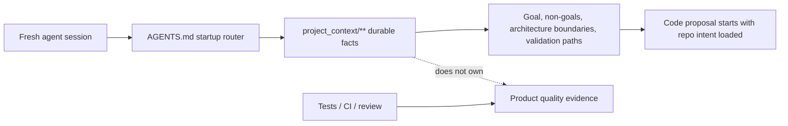

# Project Tiny Context Harness

[](https://www.npmjs.com/package/project-tiny-context-harness)
[](https://github.com/Seven128/project-tiny-context-harness/actions/workflows/package.yml)
[](https://securityscorecards.dev/viewer/?uri=github.com/Seven128/project-tiny-context-harness)
[](LICENSE)
[](https://codespaces.new/Seven128/project-tiny-context-harness)

Translations: [Chinese (Simplified)](https://github.com/Seven128/project-tiny-context-harness/blob/main/README.zh-CN.md)

`project-tiny-context-harness` ships the `ty-context` CLI for Project Tiny Context Harness: repo-native project memory for AI coding agents and a repo-native context contract.

The default is **Minimal Context Harness**. It maintains a compact `project_context/**` fact source, a short `AGENTS.md` startup router, role Skills, priority guidance for Context/code/evidence, and a `validate-context` gate so fresh agents can recover project intent, constraints, verification entry points and next safe actions quickly.

It does not default to lifecycle phases, plan tasks, stage skills, stage documents or phase gates. Harness maintains context quality; your project tests, CI, review process and human acceptance remain responsible for product quality.

Use it when coding agents repeatedly lose project intent across new chats, handoffs, RFC/debug turns or tool changes. The intended tradeoff is: keep durable intent and recovery paths; leave execution evidence to code, tests and review.

Think of it as durable project memory behind `AGENTS.md`, plus priority rules for Context/code/evidence, not another agent, process framework or task manager.

Best for:

- repos where coding agents keep rediscovering project intent
- teams using multiple agents or frequent fresh chats
- maintainers who want durable context without a full planning ceremony

Not for:

- replacing tests, review, CI or issue trackers
- autonomous Tiny Context execution
- codebase semantic indexing or external docs retrieval

Concrete shift:

```text
Before: ask a fresh agent to read the repo and tell you what matters.
After: ask it to read AGENTS.md and project_context/** first, then summarize goal, non-goals, architecture boundaries and validation paths before proposing code.
```

What gets added:




The demo shows the core loop: initialize `AGENTS.md` and `project_context/**`, run `validate-context`, then ask a fresh agent to recover intent before proposing code. Use the npm install path below, or inspect the no-install previews first.

No-install preview:

- Read the [fresh-agent recovery walkthrough](https://github.com/Seven128/project-tiny-context-harness/blob/main/docs/examples/fresh-agent-recovery.md).
- Inspect the [Minimal Context sample guide](https://github.com/Seven128/project-tiny-context-harness/blob/main/docs/examples/minimal-context-sample.md).
- Browse a tiny generated sample repository at [examples/minimal-context-sample/](https://github.com/Seven128/project-tiny-context-harness/tree/main/examples/minimal-context-sample).

## Why It Exists

Coding agents can move quickly inside one thread and still drift when a new chat, model, tool, reviewer or debugging session loses the project-specific facts that were never encoded anywhere stable.

Minimal Context Harness creates a small, explicit recovery path: project goal, boundaries, architecture context, validation entry points and durable task conclusions. It is designed to sit beside specs, tests, issues, docs and code intelligence tools instead of replacing them.

The concrete failure mode is not only missing file search. In an ABCD module chain where A/B/C are upstream of downstream D, a D feature can expose a missing capability. Without Context, an agent may change upstream A/B to make D pass because current code permits it. Minimal Context adds a repo-owned intent layer: it records whether downstream D may change upstream A/B, whether the gap belongs in C's contract, or whether the task needs a `Context Delta` before implementation continues. Code shows what is possible; it cannot decide whether that is allowed project intent.

Tiny Context has two core layers. Minimal Context is the durable fact layer: it says what project facts live in `project_context/**` or `DESIGN.md`. The workflow contract is the agent behavior layer: it says to read Context first, let foundation/contract/rationale/architecture Context interpret current-code convenience, decide `Context Delta`, compile a Task Contract, use `plan.md` when complex work needs a visible execution surface, implement against those constraints and finish with Contract Conformance plus Context drift check.

The core bet is: **keep the memory, drop the ceremony**. Earlier stage-based workflows pushed ordinary software work through explicit phase artifacts and gates. Modern coding agents already internalize much of the understand, design, implement, test and repair loop, so Project Tiny Context Harness keeps the high-density repo context that survives fresh chats without making every task follow Tiny Context-stage choreography.

## Current Best Practice

For short tasks, use the workflow contract and Context layer directly:

```text
workflow contract + project_context/** -> implementation -> verification -> drift check
```

For long-running tasks, externalize the target first. Use explicit Skill invocation instead of broad keyword triggering:

```text
Web GPT or another external planning model produces the long-task source inputs
-> /normal-long-task produces the full checklist and optional generic target-mode prompt
-> /composite-long-task-workflow consumes Product / Architecture Source + Technical Realization Plan + Acceptance Checklist when Superpowers-backed execution is needed
-> Superpowers derives concrete implementation slices
-> execution maintains task-state.json, append-only events.ndjson and generated derived views
-> each slice follows the workflow contract + project_context/**
```

For ordinary target-mode preparation, a two-document upstream input remains enough: a `Development Plan` for execution direction and plan traceability, and an `Acceptance and Tests` packet for acceptance authority. Source Pack exports are temporary upload material for external planning, not durable Context.

The ordinary long-task path uses `/normal-long-task`. It is the non-Superpowers acceptance pass: it can generate or reuse the full acceptance checklist and can produce a generic target-mode prompt.

The Composite Long-Task Workflow path uses `/composite-long-task-workflow` when three inputs already exist: `Product / Architecture Source`, `Technical Realization Plan` and `Acceptance Checklist`. The product/architecture source preserves original intent and scope; the technical realization plan is the execution blueprint and plan-conformance source; the checklist is the acceptance authority. The Skill does not perform complexity routing: invocation means Superpowers-backed composite execution was already selected. Two-document compatibility is allowed only when the first document clearly contains both product/architecture source and technical realization plan sections. If only a product/architecture source and checklist exist, the Skill stops with a Missing Fields Report for a missing `Technical Realization Plan` instead of generating one. The technical realization plan must already satisfy the required Superpowers-ready Markdown implementation plan fields. When it does, the Skill freezes the package-managed workflow into `workflow-protocol.md`, writes task-local `execution-binding.md`, and renders `goal-objective.txt` as a thin Codex Goal objective instead of packing the full workflow into goal text. This is intentional: the Goal objective stays small enough to preserve the persistent completion contract, while the complete executable workflow lives in the protocol snapshot and the task-specific binding. The expected runtime effect is explicit fusion rather than agent improvisation: Tiny Context Workflow Contract first, then three-input authority, state compilation, Superpowers implementation slices, canonical evidence/state updates, generated views, slice/epoch gates and final-gate completion. The workflow is Tiny Context's composite adapter layer, aligned to the official Superpowers skills while remaining a Tiny Context-owned adapter rather than an upstream-owned schema; it is not the Tiny Context Workflow Contract itself, not a business fact source, not a generic prompt generator and not a Superpowers fork. It may wrap Superpowers with Tiny Context authority, conformance and acceptance gates, but it must not redefine or fork Superpowers execution mechanics. It requires parent-level `Product Context Delta` and `Technical Context Delta` checks before implementation and uses a canonical state kernel under `tmp/ty-context/plan-acceptance/<plan-slug>/`: `task-state.json` is the only execution state source, `events.ndjson` is append-only and `derived/**` contains generated local audit, plan-conformance matrix, final acceptance verdict, progress ledger, evidence index, context alignment, final summary and final card views. Complete acceptance rows are externally reviewable evidence claims derived from `task-state.evidence[]`: the checklist supplies the proof chain, fresh reviewable evidence must satisfy every required layer, and machine-verifiable layers such as UI/browser/runtime/API/data/integration/test require passed assertion results, zero command/assertion exit codes, target AC/layer coverage, passed positive and negative assertions and no negative evidence contradiction. Screenshot-only proof, component screenshots, viewmodels, diagnostic pages, API-only proof for a UI Path AC, final cards, matrix/verdict rows, validator passes and prose summaries are invalid as completion proof for those layers. Material drift, missing layers, failed/stale assertion reports, failed negative evidence scans or unapproved sibling substitution prevent `complete`. Goal-mode wording separates `audit_task_complete`, `acceptance_target_status`, computed `product_goal_complete` and resolver-owned `completion_output_status`: implementation / execution goals complete only when `ty-context composite-long-task final-gate` computes `product_goal_complete=true` and `completion_output_status=accept`; read-only audit goals may end at `audit_task_complete`, but a non-accepted verdict says `Audit workflow completed; acceptance target not complete.` and does not use unqualified `Goal achieved` or `update_goal(status="complete")` as acceptance of the user target. Non-accepting final-gate output also carries `blocker_triage` category and next action; transient bookkeeping or regenerable generated-output mismatch can self-recover once, while real evidence, environment, contract and harness-drift blockers remain explicit.

Strict completion is current-attempt-only and runs through one Trusted Evidence Kernel shared by final gate, `validate-superpowers-state`, state-backed `validate-plan-acceptance` and derived completion views, then through one completion-output resolver. `compile` derives required command specs from each machine-blocking AC's `assertion_command`, `assertion_artifacts`, proof layers, required tests, positive/negative assertions, invalid completion signals and expected final evidence; `start-attempt --mode product_task|harness_task` records the current execution identity; `run-assertion` records assertion command runs; `record-evidence` registers artifacts as canonical EvidenceRecordV2; and `final-gate` recomputes from current records. EvidenceRecordV2 must carry attempt/source/product/plan/checklist hashes, git head, worktree fingerprint, command spec/run ids, command line and exit code, artifact path/SHA/mtime, target AC ids, target PI ids, target proof layers, assertion status/exit code, positive assertions, negative assertions, invalid completion signals, negative evidence scan and required test ids. Legacy v1 evidence, historical `events.ndjson` complete events, stale `derived/**` views, matrix/verdict/evidence-index/final-summary rows, validator passes, final cards, auditor prose, AC summary-only proof, unregistered temporary JSON and hand-written status files cannot complete machine-blocking ACs or authorize generated final-answer `accept`. Newer failed command runs, Playwright/JUnit/test result failures, owner DOM forbidden states, source/worktree drift, task-state false/partial status and derived/state mismatches invalidate older passed evidence for the same AC/layer.

The final-gate order is fixed inside the kernel and output resolver: load the three inputs, recompute source hashes, load task state, snapshot previous final/gates/meta transient bookkeeping as audit-only, resolve the current attempt, load required command specs, load command-run records, load registered EvidenceRecords, discard stale evidence, scan unregistered assertion JSON, scan contradictions, run AC-010 bootstrap prevention, run under-specified AC checks, run Harness Drift Lock, run protected baseline guard, validate scope conflicts, recompute every AC, recompute every PI, recompute `acceptance_target_status`, recompute `product_goal_complete`, build current candidate state, resolve candidate `completion_output_status`, regenerate current `derived/**`, scan generated output in current-candidate mode, classify `blocker_triage`, self-recover once when allowed and append an event. A machine-blocking AC with missing assertion command/artifacts/assertions/invalid signals, UI proof without browser/e2e/smoke/trace evidence, generated-only final evidence, manual-only test cases or no possible `assertion_result` is `under_specified`; its PI is blocked and `product_goal_complete=false`. AC-010/final-gate summary evidence cannot bootstrap other ACs: if a summary AC passes while another required AC is missing, failed or stale, the summary AC is invalidated with `final_gate_cannot_bootstrap_from_summary_only`.

Harness Drift Lock separates product proof from harness proof. A `product_task` that changes Playwright specs, tests, assertion generators, AC010 helpers, evidence writers, final-gate, validator, derive, task-state reducer, composite workflow Skill/protocol or related Makefile/package test targets is blocked with `harness_drift_detected`, `acceptance_target_status=blocked`, `product_goal_complete=false` and the message "本轮修改了验收工具链或测试本身，不能用被修改后的验收证明同一轮产品完成。请拆成独立 harness_task。" A `harness_task` may change harness files only with adversarial fixtures whose expected final-gate outcomes include stale evidence, historical complete, derived contradiction, AC010 summary-only, target mismatch, API-only-for-UI, negative evidence after pass, source hash mismatch, dirty worktree mismatch, missing assertion_result, test weakening, scope leakage, missing UI/browser owner-surface proof, missing negative semantic proof and a happy path; it proves the harness, not product completion. `protected-harness-baseline.json` protects the final gate, validator, derive, evidence registration, assertion schema, fixture expectations, workflow protocol, Skill markdown and test runner scripts; product tasks changing that baseline are blocked, and harness tasks need a baseline reason plus fixture verification. HFC-003 is the durable false-completion regression suite: 35 committed mini workdirs plus one runner cover the Trusted Evidence Kernel, completion-output resolver, generated-output scanner, selected CLI smoke paths and one happy path, and are package release blockers for harness changes.

The three inputs also carry capability-first delivery boundaries. Product / Architecture Source declares `delivery_scope`, `full_population_required`, samples that validate the claim, samples that do not validate it and out-of-scope backlog. Each Technical Realization Plan item declares delivery scope, capability target, representative samples, full-population boundary and non-required population. Each Acceptance Checklist item declares acceptance scope, what it validates and does not validate, sample boundary and full-population requirement. `scope_conflict_requires_decision` blocks completion when source, plan and checklist disagree between system capability build, representative sample validation and full-population operation. Sample evidence or framework-only implementation cannot prove all-provider, all-interface, all-platform or full-population completion unless the AC explicitly allows it; when full population is not explicitly required, generated views report it as `not_in_scope`.

`ty-context composite-long-task compile` uses a strict heading-based grammar for that packet. Product / Architecture Source is one document-level object with fixed fields. Technical Realization Plan items are definitions only when written as Markdown headings such as `## PI-001: ...`; Acceptance Checklist items are definitions only when written as headings such as `## AC-001: ...`. Fields inside those sections must use fixed `key: value`, indented-list or `key: |` syntax. Plain prose, tables, mapping previews and ordinary lists that mention `PI-001` or `AC-001` are references, not definitions; old list-style definitions such as `- PI-001: ...` followed by delivery fields now fail at compile time with file and line guidance.

Strict V2 packets also require canonical Product / PI / AC field groups. Product Source carries Scope Fit and owner-boundary fields such as `scope_fit_decision`, `selected_scope_fit_slice`, `owner_boundary`, `primary_capability_path`, `non_completing_outcomes` and `assertion_policy`; PI items carry owner, trigger, state-transition, observable-result and assertion-support fields; ACs carry `assertion_command`, `assertion_artifacts`, `positive_assertions`, `negative_assertions`, `machine_blocking`, `invalid_completion_signals` and `assertion_result_required`. Unknown, duplicate, table or missing canonical fields fail compile. Canonical proof layers are `code`, `api_schema`, `worker_runtime`, `data_artifact`, `integration`, `ui_browser`, `security_redaction`, `all_provider_all_runner`, `cleanup_stale_scan` and `test`; aliases such as `runtime`, `browser`, `api`, `data` and `security` compile to the canonical names, and `code` cannot complete a machine-backed AC by itself. The generated evidence index is available as both `derived/evidence-index.md` and `derived/evidence-index.json`.

For non-trivial Superpowers-backed slices, the workflow protocol requires a structured `slice-delta.json`. The executor applies it with `ty-context composite-long-task apply-slice-delta <workdir> <slice-delta.json>`, then runs `ty-context composite-long-task derive` and `ty-context composite-long-task slice-gate`. Each delta records touched plan items/ACs, code changes, closed and remaining proof layers, blockers, cleanup assertions, `progress_value` and canonical evidence records with `proves`, `does_not_prove`, freshness, redaction, reviewability, command exit code when applicable, assertion result and negative evidence scan. Default slice guidance is to group 2-4 strongly related missing layers that share an AC, runtime scenario, proof environment or verification path, while single-gap slices are reserved for blockers, contradictions or small metadata cleanup. The protocol also asks executors to classify missing layers, reuse DB/API/Browser environments only with unique proof prefixes and cleanup assertions, and run a stale/overclaim scan after deriving artifacts.

The generated Superpowers prompt uses Slice Gate / Epoch Gate / Final Gate cadence instead of running a full final gate after every slice. Progress Accounting tracks AC acceptance completion, engineering implementation progress, runtime/proof progress, system capability progress, representative sample progress, real object coverage, full population operation progress, artifact budget, proof-layer milestone status and workflow overhead in state and generated `derived/progress-ledger.*`. Workflow overhead backpressure asks executors to batch shared provider/browser/runtime/security epoch proof environments, prune stale artifacts and choose the Next 3-5 high-value clusters that close the most blocking AC/proof-layer gaps.

The recommended Superpowers layer is the specific [obra/Superpowers](https://github.com/obra/superpowers) plugin/workflow, not a generic planning substitute. After `/composite-long-task-workflow` accepts the input packet, prefer `superpowers:subagent-driven-development` when subagents are available and `superpowers:executing-plans` otherwise. Behavior changes should use `superpowers:test-driven-development`; behavior proof still enters the Trusted Evidence Kernel through current-attempt command runs and EvidenceRecordV2 entries. Superpowers verification, state validators, plan-acceptance validators, auditor checks and generated views remain useful execution checks, but they cannot override Tiny Context gates or become product proof: passing Superpowers review, validators or final-summary prose does not by itself prove plan conformance or checklist acceptance.

Hallucination guard: do not register `workflow-protocol.md` in `project_context/context.toml`, treat it as business Context, let `derived/**` rewrite Product / Plan / Checklist, use local audit or Superpowers review as quality proof, use screenshots/final cards/matrix/verdict/validator pass/prose as machine-verifiable proof, use sample evidence as full-population proof, claim full alignment while Source-to-Context Coverage or Context-to-Implementation Binding has unresolved required gaps, handwrite `product_goal_complete`, or complete an implementation Goal before final-gate passes.

The reason is drift control. The workflow contract plus Context layer is intentionally a soft constraint. It works well for short tasks, and Context can still capture the expected facts for long tasks, but long execution makes the Context-to-code step drift as the context window grows, work is handed off, subagents split scope or validation loops multiply. The extra Tiny Context gates exist because Superpowers alone can still drift under long-running execution pressure: it strengthens execution discipline, but it does not by itself preserve source authority, prevent scope shrinkage, prove full conformance to the Technical Realization Plan or enforce AC-by-AC evidence against the Acceptance Checklist. A product/architecture source, technical realization plan, acceptance checklist, explicit long-task Skill invocation, target-mode prompt, canonical task state, generated derived views and optional Superpowers execution layer make implementation conformance and completion evidence recoverable without restoring a phase-gated workflow.

For high-risk product, architecture, technical-plan or acceptance-plan inputs, the workflow contract should be made visible in `plan.md` or an equivalent temporary plan surface before implementation. That plan surface separates Source-to-Context Coverage from Context-to-Implementation Binding. Source-to-Context maps each durable source constraint to an existing Context hit, a required Context update, a task-local-only decision, an explicit out-of-scope decision, a user decision or an under-scoped gap. Context-to-Implementation then maps Context facts to implementation obligations, expected surfaces, implemented paths, forbidden shortcuts and verification paths. `validate-plan-contract` can check the temporary plan for internal consistency, referenced path existence and declared binding consistency; it still does not prove product quality.

Small code tasks should not use that full plan surface. A small code task is a local implementation task where existing Context is sufficient and the change does not alter durable product, architecture, API/schema/data, runtime/state/recovery, verification/deployment, security/redaction or surface-ownership facts. This is semantic, not line-count based: a one-line schema change can be high risk, while a broad mechanical cleanup can remain small.

## Positioning

| Adjacent tool type | Use it for | Harness stance |
|---|---|---|
| Spec-first kits | Turning feature ideas into structured specs and plans. | Complementary; Harness keeps durable repo facts and module boundary intent beyond one feature spec. |
| BMAD-style workflows and full Tiny Context processes | Coordinated role/process ceremonies on high-risk work. | Lighter default; no phase gates or work-product trees. |
| Superpowers-style execution | Turning approved requirements into plans, subagent execution, TDD, review and finish discipline. | Complementary; use it to execute while Tiny Context owns durable repo intent and acceptance priority. |
| Task Master-style planners | Backlog decomposition and task execution state. | Complementary; Harness does not own task state. |
| Context7/Serena-style retrieval or code-intelligence tools | Pulling external docs, symbols or repository facts on demand. | Complementary; they do not answer whether downstream D may change upstream A/B. Harness stores that local repo truth. |
| IDE or agent memory | Tool-specific continuity inside one product surface. | Portable fallback; plain files any agent can read. |

## Try It In 60 Seconds

```sh
mkdir project-tiny-context-harness-demo
cd project-tiny-context-harness-demo
git init
npm init -y
npm install -D project-tiny-context-harness@latest
npx --yes --package project-tiny-context-harness@latest ty-context init
make validate-context
```

Then open `AGENTS.md`, `project_context/global.md` and `project_context/architecture.md`. Those files are the small recovery surface a fresh agent should read before changing the project.

Source checkout preview:

Browser preview:

```text
Open https://codespaces.new/Seven128/project-tiny-context-harness
```

When the Codespace finishes `npm ci`, run:

```sh
npm run smoke:quickstart
npm run preview:pack
```

Local preview:

```sh
git clone https://github.com/Seven128/project-tiny-context-harness.git
cd project-tiny-context-harness
npm ci
npm run smoke:quickstart
npm run preview:pack
cd /path/to/your/test-repo
npm install -D /path/to/project-tiny-context-harness/tmp/ty-context/source-preview/package/project-tiny-context-harness-0.2.85.tgz
npx --no-install ty-context init --adopt
make validate-context
```

Use this tarball path only for source-preview testing, private review or package development. For normal installs, use `project-tiny-context-harness@latest` from npm.

If the source preview path fails, open a [Source preview report](https://github.com/Seven128/project-tiny-context-harness/issues/new?template=source_preview_report.yml) with the command, environment and shortest useful output.

Expected result:

```text
AGENTS.md
project_context/
  context.toml
  global.md
  architecture.md
  areas/main.md
  areas/main/verification.md
```

Fresh-agent test prompt:

```text
Read AGENTS.md and project_context/** first. Summarize the project goal, non-goals, architecture boundaries, validation entry points and next safe action before proposing code changes.
```

If the agent can answer that without rediscovering the repo from scratch, the Harness is doing its job.

A useful first answer should recover the project goal, non-goals, architecture boundaries, validation entry points and next safe action. It should not invent benchmark results or claim tests passed.

Feedback from real repositories is especially useful right now. If you try the Harness, open an [adoption report](https://github.com/Seven128/project-tiny-context-harness/issues/new?template=adoption_report.yml) with what your agent was forgetting, what Minimal Context made easier and what recovery facts were still missing.

Early feedback and starter issues:

- If the README, sample repo or generated Context leaves a fresh-agent recovery fact unclear, open a [Context recovery gap](https://github.com/Seven128/project-tiny-context-harness/issues/new?template=context_gap.yml).
- Share what worked or failed in the pinned [adoption reports issue](https://github.com/Seven128/project-tiny-context-harness/issues/4).
- Pick a starter issue: [demo](https://github.com/Seven128/project-tiny-context-harness/issues/5), [sample walkthrough](https://github.com/Seven128/project-tiny-context-harness/issues/6), [benchmark rerun](https://github.com/Seven128/project-tiny-context-harness/issues/7) or [launch FAQ](https://github.com/Seven128/project-tiny-context-harness/issues/8).
- Keep claims narrow: recovery evidence is useful; benchmark speedup claims need fresh Minimal Context benchmark runs.

For current priorities and non-goals, see the [roadmap](https://github.com/Seven128/project-tiny-context-harness/blob/main/docs/roadmap.md).

For benchmark boundaries, read [Benchmarking And Evidence](https://github.com/Seven128/project-tiny-context-harness/blob/main/docs/benchmarking.md).

For contribution, support, security, conduct and governance, see [CONTRIBUTING.md](https://github.com/Seven128/project-tiny-context-harness/blob/main/CONTRIBUTING.md), [SUPPORT.md](https://github.com/Seven128/project-tiny-context-harness/blob/main/SUPPORT.md), [SECURITY.md](https://github.com/Seven128/project-tiny-context-harness/blob/main/SECURITY.md), [CODE_OF_CONDUCT.md](https://github.com/Seven128/project-tiny-context-harness/blob/main/CODE_OF_CONDUCT.md) and [GOVERNANCE.md](https://github.com/Seven128/project-tiny-context-harness/blob/main/GOVERNANCE.md).

For concrete examples, read the [fresh-agent recovery walkthrough](https://github.com/Seven128/project-tiny-context-harness/blob/main/docs/examples/fresh-agent-recovery.md), the [Minimal Context sample guide](https://github.com/Seven128/project-tiny-context-harness/blob/main/docs/examples/minimal-context-sample.md) and the [browseable sample repository](https://github.com/Seven128/project-tiny-context-harness/tree/main/examples/minimal-context-sample).

For the longer technical argument, read [Fresh coding-agent sessions need project memory, not more ceremony](https://github.com/Seven128/project-tiny-context-harness/blob/main/docs/articles/fresh-agent-project-memory.md).

For adjacent-tool fit, read the [comparison guide](https://github.com/Seven128/project-tiny-context-harness/blob/main/docs/comparison.md).

For existing repositories, read the [adoption guide](https://github.com/Seven128/project-tiny-context-harness/blob/main/docs/adopt-existing-repo.md). For Codex, Claude Code, Cursor, Gemini CLI, OpenCode and other tool-specific setup notes, see [agent surface recipes](https://github.com/Seven128/project-tiny-context-harness/blob/main/docs/agent-surface-recipes.md).

For common launch and adoption questions, see the [FAQ](https://github.com/Seven128/project-tiny-context-harness/blob/main/docs/faq.md).

## Install

```sh
npm install -D project-tiny-context-harness@latest
npx --yes --package project-tiny-context-harness@latest ty-context init
```

For existing projects:

```sh
npx --yes --package project-tiny-context-harness@latest ty-context init --adopt
```

`init` creates `project_context/context.toml`, `project_context/global.md`, `project_context/architecture.md`, `project_context/areas/main.md`, `project_context/areas/main/verification.md`, agent guidance, Context authoring Skills, a Product Surface Contract Skill, a full-project export Skill, a Harness upgrade Skill, the `/normal-long-task` and `/composite-long-task-workflow` Skills, managed templates/tools, a Makefile include and `.github/workflows/harness.yml`. The generated workflow runs only the selected Harness gate: `validate-context`, `validate-code-modularity` or the composite `validate-harness`; `validate-plan-contract` and `validate-plan-acceptance` are explicit commands for complex plan surfaces and long-task artifacts, not default workflow gates. Maintainer-only package tests and source-drift checks are intentionally kept out of consumer projects. It does not create business Product Surface Contract files, stage work-product trees, lifecycle state or stage skills by default.

## FAQ

**Why not just write a better README?**

README is for humans and broad orientation. Minimal Context is a smaller machine-readable recovery path for fresh agents: durable intent, non-goals, boundaries, validation commands and context drift notes.

**Is this only for Codex?**

No. The generated files are plain repository assets. Codex, Claude Code, Cursor, Gemini CLI, Cline, Roo or a human reviewer can read the same facts.

The support assets can live in a tool-specific harness folder such as `.codex`, `.claude`, `.cursor`, `.cline`, `.roo`, `.gemini` or a custom folder; the durable recovery contract stays in root `AGENTS.md` and `project_context/**`. See [agent surface recipes](https://github.com/Seven128/project-tiny-context-harness/blob/main/docs/agent-surface-recipes.md).

**Is this an English-only or Chinese-only tool?**

Neither. Public docs, npm copy, launch posts, CLI help/errors, generated Skill activation and default artifact names must be fully usable in English. Generated Skills may include multilingual trigger examples, but those examples are additive compatibility; every supported non-English trigger needs an equivalent narrow English trigger.

**Does `validate-context` prove the project works?**

No. It checks that recovery facts exist and avoids fake test-result claims. Product quality still belongs to tests, CI, review and human acceptance.

**Will this create documentation burden?**

It should stay smaller than a full process. Ordinary bug fixes and local refactors do not update Context unless they produce durable product, architecture, API, state or validation facts.

## CLI Entry Safety

The canonical npm package is `project-tiny-context-harness`; `ty-context` is the bin name. Prefer package-qualified `npx` commands for ad hoc use because bare `npx ty-context` can resolve an older package name or a stale local install. After `init`, the managed Makefile wrapper uses the canonical latest CLI by default and can be overridden with `TY_CONTEXT=...` when a project intentionally pins a local package.

Use `npx --no-install ty-context ...` only when you explicitly want the already installed local package, such as release smoke tests against a packed tarball.

## Capabilities

| Capability | Entry Point | Description |
|---|---|---|
| Project initialization | `npx --yes --package project-tiny-context-harness@latest ty-context init` | Creates `project_context/context.toml`, `project_context/global.md`, `project_context/architecture.md`, `project_context/areas/main.md`, `project_context/areas/main/verification.md`, `AGENTS.md`, minimal managed assets and a Makefile include. |
| Existing project adoption | `npx --yes --package project-tiny-context-harness@latest ty-context init --adopt` | Adds Minimal Context Harness non-destructively to an existing repository. |
| Configurable Harness root | `--harness-folder`, `package.json#tyContext.harnessFolderName`, `ty-context.config.json` | Supports Codex `.codex`, Claude `.claude`, Cursor `.cursor`, Cline `.cline`, Roo `.roo`, Gemini `.gemini` or a custom folder. |
| Product planning Skill | `<harnessRoot>/skills/context_product_plan/SKILL.md` | Handles explicit product-planning requests and writes durable product conclusions to `project_context/**`. |
| UI/UX design Skill | `<harnessRoot>/skills/context_uiux_design/SKILL.md` | Handles explicit UI/UX design requests, writes screen/interaction conclusions to `project_context/**`, updates root `DESIGN.md` visual tokens with Google `@google/design.md`, and includes compact visual-quality calibration for product/page positioning, user needs, information density, brand/product UI and common AI-design anti-patterns. |
| Development engineer Skill | `<harnessRoot>/skills/context_development_engineer/SKILL.md` | Handles explicit development-engineering requests and writes durable engineering conclusions to `project_context/**`. |
| Product Surface Contract Skill | `<harnessRoot>/skills/context_surface_contract/SKILL.md` | Handles explicit Product Surface Contract, Screen Contract, surface responsibility and main/drilldown ownership work; it compiles project-owned surface contracts into `project_context/**` without adding a new context role or gate. |
| Full project context export Skill | `<harnessRoot>/skills/context_full_project_export/SKILL.md` | Handles explicit full-project, project-overall, Source Pack or code-level export requests and uses `export-context --source-pack`, `--code-index`, `--task-context`, `--all`, `--full` or `--code` to create temporary artifacts under `tmp/ty-context/context-exports/**`. |
| Harness upgrade Skill | `<harnessRoot>/skills/context_harness_upgrade/SKILL.md` | Handles explicit Tiny Context / Project Tiny Context Harness upgrade requests such as “upgrade Tiny Context” and “use the Tiny Context upgrade skill to upgrade this project”; it runs the canonical `upgrade` path, handles only migration-scoped `manual_required` / `blocked` follow-up, then runs diagnostics. |
| Ordinary long-task Skill | `<harnessRoot>/skills/normal-long-task/SKILL.md` | Invoke as `/normal-long-task` to turn a referenced plan, RFC, implementation proposal or two-document upstream input into a falsifiable acceptance checklist and optional generic paste-ready goal/target-mode prompt under `tmp/ty-context/plan-acceptance/**`; if the plan already contains an explicit concrete checklist, the Skill reuses it verbatim in the separate full-checklist file; compact summaries are only navigation/priority, but the Skill does not execute the plan or prove completion. |
| Composite long-task workflow Skill | `<harnessRoot>/skills/composite-long-task-workflow/SKILL.md` | Invoke as `/composite-long-task-workflow` when Product / Architecture Source, Technical Realization Plan and Acceptance Checklist exist and Superpowers-backed execution is needed. It freezes `workflow-protocol.md`, writes `execution-binding.md`, renders `goal-objective.txt`, binds official workflow skill names, capability-first delivery scope fields, plan-conformance matrix, final acceptance verdict, assertion-backed machine-verifiable evidence discipline and negative evidence scan, and stops when required input fields are missing. It does not generate the technical plan, checklist or execute the plan. |
| Project-local Skills | `<harnessRoot>/skills/<role>/SKILL.md` | Optional local product/design/development Skills created by the project, such as `product_plan`, `uiux_design` or `development_engineer`. They supersede package-managed default Skills when more specific, are not overwritten by `sync`, and should keep front matter trigger keywords aligned with the project `AGENTS.md` role-trigger rule. |
| Managed file sync | `make ty-context-sync` or `npx --yes --package project-tiny-context-harness@latest ty-context sync` | Refreshes package-managed guidance, default Skills, Makefile include, context templates, tools and workflow YAML. It does not run migrations or perform semantic Context generation; it may block only direct asset-refresh safety issues such as invalid managed blocks or deprecated managed Skill overrides. |
| Upgrade | `make ty-context-upgrade` or `npx --yes --package project-tiny-context-harness@latest ty-context upgrade` | Use for releases marked `upgrade-required` or `manual-required`. Builds an upgrade plan, stops before writes when `blocked` items exist, otherwise applies `safe_pending` migrations, runs `sync` and `doctor`, and exits non-zero when manual follow-up or diagnostics remain. |
| Upgrade check | `npx --yes --package project-tiny-context-harness@latest ty-context upgrade --check [--json]` | Checks the upgrade plan without writing files. Reports `safe_pending`, `manual_required` and `blocked`; exits non-zero when any work remains. |
| Source Pack export | `npx --yes --package project-tiny-context-harness@latest ty-context export-context --source-pack [--check]` | Creates a bounded Source Pack under `tmp/ty-context/context-exports/latest/` with upload-ready Context, code index and optional bundles, removing old timestamped rounds. |
| Code index export | `npx --yes --package project-tiny-context-harness@latest ty-context export-context --code-index [--check]` | Creates a temporary implementation navigation index and manifest without complete source bodies. |
| Task context export | `npx --yes --package project-tiny-context-harness@latest ty-context export-context --task-context <name> [--profile <id>] [--check]` | Creates a bounded focused task handoff pack from profile or explicit include selectors. |
| Combined project export | `npx --yes --package project-tiny-context-harness@latest ty-context export-context --all [--check]` | Creates both default temporary exports under `tmp/ty-context/context-exports/**`. |
| Project Context export | `npx --yes --package project-tiny-context-harness@latest ty-context export-context --full [--output tmp/ty-context/context-exports/name.md] [--check]` | Creates a temporary Context summary artifact. It is not Context and must not be registered in `project_context/context.toml`. |
| Code implementation export | `npx --yes --package project-tiny-context-harness@latest ty-context export-context --code [--output tmp/ty-context/context-exports/name.md] [--check]` | Creates a temporary single-file code implementation artifact. It is not Context and must not be registered in `project_context/context.toml`. |
| Modularity check | `npx --yes --package project-tiny-context-harness@latest ty-context check-modularity --touched [--limit 300] [--fail-on-warning]` | Reports selected handwritten source files over the physical line-count limit; `--file <path>` and `--base <ref>` select explicit files or branch changes, and config waivers are reported distinctly. |
| Code modularity validation | `make validate-code-modularity` | Hard gate for touched handwritten source modularity; CI can set `TY_CONTEXT_MODULARITY_BASE=<ref>` to audit PR/base changes. |
| Harness validation | `make validate-harness` | Composite gate for `validate-context` and `validate-code-modularity`. |
| Context validation | `npx --yes --package project-tiny-context-harness@latest ty-context validate-context`, `make validate-context` | Checks required project recovery fields, Context graph metadata, declared paths/roles and fake test-execution claims. |
| Plan contract validation | `npx --yes --package project-tiny-context-harness@latest ty-context validate-plan-contract <plan.md\|dir>` | Checks Source-to-Context Coverage and Context-to-Implementation Binding for structural consistency, referenced path existence and weak-proof complete/bound contradictions. |
| Superpowers state validation | `npx --yes --package project-tiny-context-harness@latest ty-context validate-superpowers-state <dir>` | Checks canonical Superpowers-backed `task-state.json`, source hashes, graph references, delivery scope fields/conflicts, evidence/proof-layer consistency, assertion-backed machine-verifiable evidence, negative evidence contradictions, stale evidence, sibling substitution, auditor blockers, derived drift and final completion rules. |
| Plan acceptance validation | `npx --yes --package project-tiny-context-harness@latest ty-context validate-plan-acceptance <dir>` | Checks legacy matrix/verdict artifacts when no state exists; when `task-state.json` exists, validates state-backed derived artifacts. It rejects contradictory complete claims, dangling evidence references, weak-proof complete rows, missing proof layers, missing/failed assertion-backed evidence for machine-verifiable layers, negative evidence contradictions, material/critical drift, unapproved sibling substitution, blocking auditor findings, raw secrets/tokens/cookies, generated active-count drift, missing plan/AC cross-references and declared surface/architecture binding gaps. `errors` block; `warnings` / `hygiene` report cleanup. |
| Composite long-task state helpers | `npx --yes --package project-tiny-context-harness@latest ty-context composite-long-task <subcommand>` | Explicit `/composite-long-task-workflow` state helper for `init`, `compile`, `start-attempt`, `run-assertion`, `record-evidence`, `apply-slice-delta`, `derive`, `slice-gate`, `epoch-gate`, `final-gate`, `next-slices` and `render-goal` under `tmp/ty-context/plan-acceptance/**`. |
| Diagnostics | `make ty-context-doctor` or `npx --yes --package project-tiny-context-harness@latest ty-context doctor` | Reports Harness root, package version, schema version and required Minimal Context paths. |
| Package source checks | `ty-context package sync-source`, `ty-context package check-source` | Maintainer-only commands for keeping package canonical assets aligned with the source workspace. |

For high-risk product, UI/UX and engineering tasks that affect durable architecture or module ownership, API/Schema/data contracts, state/runtime behavior, dependency direction, verification/deployment semantics or design-rationale tradeoffs, the default Skills compile a short current-task contract before implementation. The contract starts with `Context Delta: none|required`; `required` preserves context-first behavior, while `none` means the task can proceed against existing Context. When an input is a product/architecture source or technical implementation plan, the same judgment is refined into `Product Context Delta: none|required` and `Technical Context Delta: none|required`; either `required` means overall `Context Delta: required`. Product Context Delta covers product logic, flows, surface responsibility, information architecture, status meaning, operation boundaries and acceptance semantics. Technical Context Delta covers API/schema/data/event contracts, module ownership, dependency direction, worker/runtime/state semantics, verification/deployment paths and durable technical tradeoffs. For external product/architecture/technical/acceptance sources, `plan.md` or an equivalent temporary plan surface should also include Source-to-Context Coverage with `covered`, `new_context_required`, `context_updated`, `task_local_only`, `out_of_scope_explicit`, `needs_user_decision` or `under_scoped` status. For high-risk implementation work, the same plan surface should include Context-to-Implementation Binding with `bound`, `partial`, `missing`, `blocked`, `out_of_scope_explicit`, `needs_user_decision` or `contradicted_by_current_state` status. It can name `Architecture Context Hit` and `Decision Rationale Hit: existing|required|none` so agents explicitly check the controlling Context and rationale state. When module design principles are relevant, the same contract still uses `Applicable Module Design` for the principles, design logic and rationale controlling the current choice. For engineering, RFC and implementation work, the existing Task Contract still includes `Modularity Check: none|required|exception` so oversized touched files trigger split-or-exception reasoning without becoming an architecture gate. Ordinary bug fixes, local styling, small refactors, package/release chores, test repairs and spikes are not forced into architecture/rationale ceremony unless they produce durable facts. The task contract, Source-to-Context Coverage, Context-to-Implementation Binding and Contract Conformance are handoff or temporary execution evidence, not new PRD, tech-plan, ADR or implementation-document surfaces.

Technical architecture support is a Minimal Context capability: use restrained `architecture.md`, area Module Design Capsules and existing `contract` / `decision-rationale` roles when durable architecture or rationale matters. Do not invent rationale; store stable reasons, rejected alternatives or tradeoffs only in the smallest durable Context surface when they will affect future implementation or verification choices.

For long-running plans, RFCs or implementation proposals, invoke `/normal-long-task` to turn a plan plus relevant Context into a falsifiable acceptance checklist and an optional generic paste-ready goal/target-mode prompt. It also supports a two-document upstream input from Web GPT or another external planner: `Development Plan` for execution direction and `Acceptance and Tests` for target-mode acceptance input. If the plan already contains an explicit concrete acceptance checklist, the Skill copies that checklist verbatim into a separate full-checklist file instead of generating a competing checklist. The two-document packet path is strict mode: when required fields cannot be fully parsed from both documents, the Skill preserves the inputs, reports the missing fields, and stops without generating a checklist or goal/target-mode prompt. It is one pre-execution acceptance pass, not a task planner or workflow engine: it stores temporary inputs under `tmp/ty-context/plan-acceptance/**`, asks for confirmation when durable assumptions are unclear, and leaves execution evidence to the future executor, tests, CI, review or human acceptance. The generated prompt may require a local audit under the same temporary directory so future sessions can recover acceptance progress; that audit is not Context, not a quality proof and not a replacement for the project's Tiny Context workflow contract. When the prompt references a full checklist, that checklist is the acceptance authority; compact prompt text is only navigation, priority and recovery guidance.

When the next step explicitly needs Superpowers-backed long-task execution, invoke `/composite-long-task-workflow` on the Product / Architecture Source, Technical Realization Plan and Acceptance Checklist. It emits `workflow-protocol.md`, `execution-binding.md` and `goal-objective.txt` so the future executor sees which inputs feed Context Delta assessment, `superpowers:subagent-driven-development`, `superpowers:executing-plans`, TDD, `superpowers:verification-before-completion`, canonical `task-state.json`, append-only `events.ndjson`, generated `derived/**` views, proof-chain evidence and optional auditor review. This is Tiny Context's composite adapter layer for Superpowers-backed workflows, aligned to the official Superpowers skills while remaining a Tiny Context-owned adapter rather than an upstream-owned schema. It may wrap Superpowers with authority, conformance and acceptance gates, but it must not redefine, duplicate or fork Superpowers execution mechanics; if a future Tiny Context-added step would conflict with, duplicate or override a Superpowers responsibility, stop and surface the boundary conflict instead of silently merging workflows. It cannot replace `/normal-long-task` for ordinary checklist preparation, does not route complexity, and does not derive a technical plan from a product plan; the Technical Realization Plan must already be a Superpowers-ready Markdown implementation plan or the Skill stops before rendering entry artifacts. A two-document packet is accepted only when the first document explicitly contains both product/architecture source and technical realization plan sections. Product / Architecture Source, Technical Realization Plan and Acceptance Checklist remain the upstream authorities, while state/derived views/validator/auditor artifacts cannot rewrite them. Capability-first delivery scope stays inside those same three inputs: source, plan items and ACs must explicitly distinguish reusable system capability build, representative sample validation, full population operation and out-of-scope backlog; `scope_conflict_requires_decision` blocks completion, and sample/framework evidence cannot prove full population unless the AC says so. The generated Goal objective also disambiguates `audit_task_complete`, `acceptance_target_status` and computed `product_goal_complete`; implementation / execution goals finish only when `product_goal_complete=true`, while a read-only audit goal can end at `audit_task_complete` only with a non-accepted verdict reported as `Audit workflow completed; acceptance target not complete.`, not as `Goal achieved`.

For Product Surface work, `context_surface_contract` turns broad product/page/UI principles into project-owned surface responsibilities. A Product Surface can be a Web page, mobile screen, desktop window, game UI/HUD/menu, CLI/TUI output, extension UI or embedded/device interface. Cross-surface contracts use the existing `contract` role; area-owned screen facts stay in `area` or `subdomain`; repeatable validation paths use `verification`. The Harness does not add a new surface-specific role or create business surface contracts during `init` or `upgrade`. Product Surface Context authoring is not a default product-quality validator; plan validators only check declared temporary surface bindings for structural consistency. Projects that want mandatory task blocks should add a separate project-local Skill, while `product-surface-contract.md` is only a compact managed template for optional Context authoring.

To create Product Surface Context in a user project, use the Skill through an agent because the package cannot safely infer business-specific screen duties from code alone. For a new project, `init` installs the Skill, template and routing guidance; as the project grows, ask the agent to run Product Surface Audit / Compile when a durable surface appears or when a product/UI/engineering task changes main/drilldown ownership. For an existing project, first run `ty-context upgrade`; then ask the agent to backfill the current surface responsibilities, review the proposed contract, and only then apply it to `project_context/**`:

```text
Use context_surface_contract in Audit + Compile mode for this repo. Inspect current user-facing routes, screens, panels, CLI/TUI outputs and relevant Context. Propose Product Surface Contract Context using existing roles only. Do not edit product code.
```

After review, apply the approved contract:

```text
Apply the approved Product Surface Contract to project_context/**, update project_context/context.toml if a new contract file is needed, keep roles to contract/area/subdomain/verification, and run make validate-context.
```

`ty-context check-modularity` supports that field by auditing selected handwritten source files for physical line-count risk. It is warning-only by default as a report command, while `validate-code-modularity` and `validate-harness` run it as a hard gate. The gate is not `validate-context`: `validate-context` remains pure Context recoverability. When `policy` is `scoped_waivers`, over-limit exceptions must be backed by `<harnessRoot>/config.yaml` `modularity.waivers` entries with `path`, narrow `category`, `reason` and `future_split_boundary`; handoff prose alone is not a machine waiver.

### Modularity Policy

Newly generated Harness configs default to `strict_except_generated`, which enforces the touched/PR handwritten source limit without legacy waivers:

```yaml
modularity:
  limit: 300
  policy: strict_except_generated
```

Generated and non-source files are still auto-skipped when they match existing lock/build/dist/path exclusions or generated-file headers such as `@generated` / `Code generated ... DO NOT EDIT`. `strict_except_generated` does not allow `modularity.waivers`; any configured waiver fails the modularity gate.

Use `scoped_waivers` when a small number of legacy exceptions must be explicit and time-bounded:

```yaml
modularity:
  limit: 300
  policy: scoped_waivers
  waivers:
    - path: src/legacy/big-file.ts
      category: legacy_migration
      reason: "Existing legacy module exceeds the hard source size bound."
      future_split_boundary: "Extract provider adapters and retry policy."
```

Omitting `policy` behaves the same as `scoped_waivers` for compatibility with existing projects. Allowed waiver categories are `generated`, `third_party_reference`, `legacy_migration`, `aggregate_styles` and `fixture_snapshot`.

Multilingual trigger phrases are compatibility details. Public README, npm and launch copy stay English-first, and public/package-managed surfaces must remain English-complete; literal non-English examples are documented only where they explain generated Skill matching and must not be the sole activation path.

The Harness upgrade Skill exists so consumer agents have a short, repeatable upgrade procedure for existing projects. It treats `upgrade` as the default after package updates and for explicit upgrade requests; `sync-only` only allows a direct managed-asset refresh shortcut when that is what the user asked for. Manual handling stays limited to the migration scope reported by the CLI instead of guessing project semantics.

For complex task-contract work, agents use `plan.md` or an equivalent temporary plan surface as scratch space for Source-to-Context Coverage, Context-to-Implementation Binding, `Context Delta`, `Task Contract`, implementation steps and Conformance notes. It is execution cache only: durable facts must be extracted into `project_context/**` or `DESIGN.md`, and temporary plans are not Context, not registered in `context.toml` and not default project assets. Small code tasks must not create `plan.md`, full trace tables, Source-to-Context Coverage or Context-to-Implementation Binding unless they discover durable Context changes, receive an external source packet or expand into high-risk/multi-surface work. If coverage still contains unresolved `new_context_required`, `needs_user_decision` or `under_scoped` rows, the implementation cannot be described as fully aligned to the source. If binding still contains `partial`, `missing`, `blocked`, `needs_user_decision` or `contradicted_by_current_state` rows, the implementation cannot be described as fully aligned to Context. Use `ty-context validate-plan-contract <plan.md|dir>` when that artifact should be machine-checked for self-consistency and referenced path existence.

For Product Surface work, frontend layout, UI/UX, product module boundaries or decisions about where information belongs, agents should run a lightweight product/page positioning check before deciding whether the change is context-first. The check asks what judgment the user needs to make on the surface, what information/actions/feedback the product must provide, what should not be persistent, what belongs on the main surface versus drilldown, operations, diagnostics, evidence or detail, and whether layout and information density match the surface task. If ownership is unclear, inspect the relevant surfaces and Context first, and use `context_surface_contract` for a focused audit. The check is input to change classification: it does not by itself require a Context update, new role, new document chain or validator gate.

The expected Context Priority Ladder is: read Context first, run the product/page positioning or Surface Contract check when applicable, classify durable-fact impact or use `Context Delta` inside task-contract scenarios, choose context-first or code-first, then perform Contract Conformance when applicable and Context drift check before handoff. This is prompt-level guidance, not an edit-order validator.

Managed `AGENTS.md` guidance is intentionally a startup router, not a full manual. It should contain fact-source entry points, hard boundaries, key triggers and shortest validation commands; package consumers default long design reasoning to Context unless they already have a local spec/design convention. The source repository keeps stable Harness workflow rationale in `PROJECT_SPEC.md`. Role procedures belong in Skills and human usage guidance in README. The recommended 40-70 line range is a soft budget, not a validator gate.

## Minimal Context Contract

`project_context/global.md` should contain:

- project goal
- non-goals / boundaries
- background
- project-wide design rationale, including rejected alternatives and tradeoffs that still matter
- architecture context link
- product / delivery brief
- UX / screen brief
- short verification context pointers
- current state
- next safe action
- context index

`project_context/architecture.md` should contain restrained architecture facts:

- system boundary
- component map
- data / control flow
- architecture-level design rationale, rejected alternatives and tradeoffs
- constraints and tradeoffs
- verification implications
- open risks

`project_context/context.toml` is the Schema v4 Context graph manifest. `init` creates a default `main` product/domain area for ordinary projects and registers `project_context/areas/main/verification.md` as its default `verification` role Context. `upgrade` creates a conservative baseline manifest for existing projects by registering current `project_context/areas/**/*.md` files as areas, except obvious `verification.md` and `deployment.md` role files. Larger projects can add `[[areas]]` and `[[context]]` entries with role, trigger/read policy, default children and monorepo boundary metadata such as `forbidden_runtime_dependencies`.

`project_context/areas/<unit>.md` should contain product/domain ownership context by default. Complex projects can freely nest context nodes under `areas/`, such as `areas/<area>/README.md`, `areas/<area>/contracts/*.md`, `areas/<area>/foundation/*.md`, `areas/<area>/verification.md`, `areas/<area>/deployment.md` or other durable context files:

- responsibility
- user / system contract
- core data / API / state
- module design capsule when stable principles, design logic or rationale should affect future work
- key constraints
- code entry points
- related role context pointers
- open risks

A module design capsule should stay small and decision-shaped: `Principles` are stable execution constraints, `Design Logic` is the minimum choose/reject/degrade/compose logic, and `Design Rationale` keeps only reasons, rejected alternatives and tradeoffs that change later implementation or verification decisions. Current thresholds, commands and probe parameters belong in the relevant contract or verification Context as execution instances, not as permanent principles.

Use the smallest durable rationale surface: project-wide tradeoffs in `global.md#Design Rationale`, architecture choices in `architecture.md#Design Rationale`, module reasons in an area Module Design Capsule, cross-domain interface rationale in `contract` role Context, larger cross-cutting reasons in `decision-rationale`, and visual identity or token rationale in `DESIGN.md`. Do not record implementation summaries, PR notes, command output, test-passed claims, screenshot review notes, debug history, agent reasoning or rationale inferred only from current code shape.

Other context files under `project_context/**` can declare `context_role` in front matter or receive a role from `context.toml`. Roles are semantic labels for agent reading and authoring behavior; `validate-context` checks graph structure, paths and field shapes instead of enforcing a writing template for every role. Supported roles are `global`, `architecture`, `area`, `domain`, `subdomain`, `contract`, `foundation`, `verification`, `deployment`, `archive`, `implementation-index` and `decision-rationale`.

Product Surface Contracts use these existing roles. Use `contract` for cross-surface or cross-area files such as `project_context/areas/product-surface-contracts.md`; use `area` or `subdomain` for owned screen contracts inside one domain; use `verification` for repeatable UI/app/CLI surface checks. Do not add roles such as `surface-contract`, `product-surface`, `web-contract`, `app-contract` or `game-surface`.

`init` gives new projects the Product Surface Contract capability, not a pre-filled business contract. The first durable contract is created when a user or agent explicitly audits/compiles a surface responsibility and writes the approved facts into `project_context/**`. Existing projects receive the same Skill and template after `upgrade`, but `upgrade` intentionally does not inspect current screens or guess their responsibilities; treat Product Surface Context backfill as an explicit follow-up task.

When authoring, migrating or cleaning up `project_context/areas/**`, run a soft role placement scan before registering every Markdown file as an `[[areas]]` entry. Keep `area` / `domain` for product ownership, use `subdomain` only for a smaller owned product context, move interface semantics into `contract`, stable theory or vocabulary into `foundation`, repeatable test/deploy execution paths into `verification` / `deployment`, code maps into `implementation-index`, design reasons into `decision-rationale`, and non-default historical or external material into `archive`. This is prompt-level guidance, not a validator gate.

Automatic migration moves legacy `project_context/modules/**/*.md` files into `project_context/areas/**/*.md`, creates a usable graph baseline and does not infer deep semantic roles. If an existing deep area file is really a foundation, contract, archive or implementation index, a later agent should update `context.toml` explicitly. Boundary rules are metadata only; Harness does not scan source imports or build a runtime dependency graph.

## Temporary Project Exports

`export-context --source-pack` is the recommended external LLM / Web GPT planning path:

```sh
npx --yes --package project-tiny-context-harness@latest ty-context export-context --source-pack
npx --yes --package project-tiny-context-harness@latest ty-context export-context --source-pack --check
```

It writes `tmp/ty-context/context-exports/latest/` as ordinary files/directories and removes old timestamped export rounds. A standard Source Pack is capped at 5 files: `source-pack-manifest.json`, `full-project-context.md`, `code-index.md`, and at most `code-bundle-core.md` plus `code-bundle-extended.md`; small projects may omit bundles. The `source-pack-v1` manifest uses repo-relative artifact paths and hashes, aggregates warnings and omitted files, and recommends upload sets for daily planning, cross-module review and full fallback.

`export-context --code-index` creates the navigation index and manifest without complete source bodies:

```sh
npx --yes --package project-tiny-context-harness@latest ty-context export-context --code-index
```

`code-index.md` includes export metadata, repository shape, Context area mapping, entry/API/UI/CLI-worker/test/oversized indexes and a Source File Index with path, type, lines, characters, SHA256, deterministic summary, bundle and tags.

`export-context --task-context <name>` creates a focused handoff pack, also capped at 5 files:

```sh
npx --yes --package project-tiny-context-harness@latest ty-context export-context --task-context apex-trend-map --profile apex-trend-map
npx --yes --package project-tiny-context-harness@latest ty-context export-context --task-context demo --include-context project_context/areas/main.md --include-code 'src/demo/**'
```

Profiles live in `<harnessRoot>/config.yaml` under `source_packs`; they are export selectors only, not durable facts, and their `verification` entries are listed without being executed. Source Pack modes keep secret redaction enabled across indexes, bundles, task contexts and manifests. `--redaction-strict` exits non-zero if redaction was required, `--max-pack-files` defaults to 5 and cannot exceed 5, and `--prune <count>` is accepted for older scripts while latest-only retention is applied by default.

Legacy exports remain for compatibility and full fallback.

`export-context --all` creates both temporary Markdown artifacts for copying into an external tool, archiving an ad hoc discussion or handing context to a one-off collaborator:

```sh
npx --yes --package project-tiny-context-harness@latest ty-context export-context --all
npx --yes --package project-tiny-context-harness@latest ty-context export-context --all --check
```

This generates both default artifacts with the same timestamp: `tmp/ty-context/context-exports/full-project-context-<timestamp>.md` and `tmp/ty-context/context-exports/code-level-implementation-<timestamp>/code-level-implementation.md`. `--all` does not accept `--output`; use `--full` or `--code` for custom single-artifact paths.

`export-context --full` creates only the temporary Markdown Context bundle:

```sh
npx --yes --package project-tiny-context-harness@latest ty-context export-context --full
npx --yes --package project-tiny-context-harness@latest ty-context export-context --full --output tmp/ty-context/context-exports/my-export.md
npx --yes --package project-tiny-context-harness@latest ty-context export-context --full --check
```

The default output is `tmp/ty-context/context-exports/full-project-context-<timestamp>.md`. The file title is `# Full Project Context Export`. `--check` reports the planned output path, source count, source file list and warnings without writing a file. The artifact header always says `Export artifact. Do not reference from project_context/context.toml.`

The exporter includes Context files, key README / AGENTS / DESIGN documents, managed Skill guidance, Makefile verification-entry summaries, a directory tree summary and Context code-entry indexes. It excludes `.env*`, secret/token/cookie-oriented files, raw captures, licensed payload dumps, `node_modules`, build output, caches, coverage, test reports and existing export artifacts; obvious sensitive assignment values are redacted and reported as warnings.

`export-context --code` creates one temporary Markdown file for handing the current implementation state to an external model:

```sh
npx --yes --package project-tiny-context-harness@latest ty-context export-context --code
npx --yes --package project-tiny-context-harness@latest ty-context export-context --code --output tmp/ty-context/context-exports/my-code-export.md
npx --yes --package project-tiny-context-harness@latest ty-context export-context --code --check
```

The default output is `tmp/ty-context/context-exports/code-level-implementation-<timestamp>/code-level-implementation.md`. The file title is `# Code-Level Implementation Export`. It scans main source and engineering configuration files, adds each file path, type, line count, character count, SHA256, a heuristic one-sentence summary and a fenced redacted code block. It does not split output into multiple Markdown files.

All export modes refuse `project_context/**` and non-temporary output paths. `validate-context` also rejects obvious export artifact names such as `code-level-implementation`, `full-project-context`, legacy Chinese export names, `project-overview`, `context-bundle`, `context-summary` or `context-export` if they are registered in `project_context/context.toml`.

The Context should be dense, durable and short. Former ADR content belongs in `Design Rationale` when it still affects future changes. Implementation details that are obvious from code should stay in code and tests; only non-obvious constraints belong in Context.

Verification and deployment role Context are allowed only when a test, smoke, CI, deployment, bootstrap or runtime path has durable recovery value. Record minimal preparation, the shortest command/path, expected stage or signal, acceptable warnings and dead ends already ruled out. Verification paths are reusable execution instances, not independent definitions of capability, metric or acceptance targets; first use the owning module's design Context to decide what claim should be proven, then choose the command or probe. Do not record one-off logs, full output, temporary JSON, CI artifacts, release ledgers, reports, secrets, tokens, cookies, device ids or raw payloads. Put execution details in the owning area's `verification` or `deployment` role Context; use project-level references only for truly cross-domain paths.

`project_context/**` is authoritative for intended responsibility, ownership, product intent, architecture boundaries, integration direction, allowed or forbidden dependencies and verification/deployment entry paths. Source code is authoritative for current implementation state. If code shape, keyword search results or nearby implementations disagree with Context, agents should call out implementation drift, missing work or stale Context instead of overriding Context-declared ownership or intent.

Before the first code edit, agents should classify the change instead of relying on a fixed timer. Long-term fact changes include product ownership or plans, module responsibilities, information architecture, API / Schema, state-machine or scheduler semantics, cross-area boundaries and verification/deployment entry paths. If a task hits one of these categories, Context-first is the default path and the first update should be the relevant `project_context/**` entry with enough durable context to guide implementation, without a fixed line-count limit:

```text
context -> implementation -> verification -> context drift check
```

Code-first is a controlled exception for ordinary bug fixes, local styling changes, local implementation-drift repairs, test fixes and exploratory spikes; those should not update Context unless they produce a durable fact. Once code discovery produces one, the agent should update Context before final alignment or handoff:

```text
implementation discovery -> context update if long-term fact changed -> implementation alignment -> verification
```

This ordering is guidance, not a new validator gate. `validate-context` checks recoverability and fake verification claims; it does not infer whether Context or code was edited first. Automation may warn about possible context-first drift, but should not block work. Handoffs should report only a lightweight status such as `Context: updated ...` or `Context: no durable fact change`.

The product planning, UI/UX and development engineer Skills are Context authoring helpers. They may shape product plans, screen flows, design handoff, implementation plans or technical decisions, but they do not create a default PRD/UIUX/tech-plan document chain. Their descriptions intentionally avoid broad generic single-word triggers such as product, design or development in any language. For visual systems, `init` creates root `DESIGN.md` as the durable source for colors, typography, spacing, shapes and component tokens; `upgrade` creates it for existing Harness projects when missing. The generated file starts as a neutral starter baseline with visual tokens, background/color logic, typography, spacing, component states and do/don't guidance; user-authored design rules take precedence once present. Validate it with `npx @google/design.md lint DESIGN.md`. The product/design Skills keep compact calibration for product/page positioning, user needs, information density, content/action placement, true empty/error/loading states, layout stability, register choice, design-system continuity and common AI-design anti-patterns.

Harness installs Impeccable as a default package dependency. For design drafts, redesigns, visual polish, frontend redesign/styling or existing-UI review work, agents should run Impeccable by default when there is a scan target such as UI source, page files, build output or a local/remote URL:

```bash
npx impeccable detect src/
```

Impeccable is a default design-review step when a scan target exists, but it is not a `validate-context` gate. If there is no suitable target or the command cannot run, the agent should say why and continue. Its findings are design-review signals, not a replacement for screenshots, project tests or human review.

Project-specific Skill rules can be added as separate project-local Skills. Do not edit package-managed `context_*` Skills directly; `sync` overwrites them:

```sh
mkdir -p <harnessRoot>/skills/uiux_design
$EDITOR <harnessRoot>/skills/uiux_design/SKILL.md
```

When a project-local Skill and a package-managed default Skill both apply, agents should use the more specific project-local Skill first. The local Skill should keep durable conclusions in `project_context/**` and `DESIGN.md`. Its front matter `description` should stay aligned with the matching default `context_*` Skill and the project `AGENTS.md` role-trigger rule; update both the local Skill and agent guidance when adding or narrowing product/design/development trigger terms. `sync` does not merge Skill overrides and does not overwrite separate project-local Skills. Existing `<harnessRoot>/ty-context-managed/override_skills/*.md` files should be migrated into standalone project-local Skills before running `sync`.

Do not customize the package-managed Surface Contract, Harness upgrade, `/normal-long-task` or `/composite-long-task-workflow` Skills directly. Project-specific surface responsibilities, upgrade facts and acceptance semantics belong in `project_context/**`; recurring project-local procedures belong in separate project-local Skills.

## Sync And Upgrade Boundary

`sync` is intentionally narrow. It refreshes managed files and never generates project semantics. `sync` does not run migrations or call the full migration registry; it may refuse writes only for direct asset-refresh safety blockers such as unsupported schema, invalid managed blocks or deprecated managed Skill overrides.

After updating the package, run `ty-context upgrade`. It is the default update entry because it checks local migration state, applies safe migrations when needed, refreshes managed assets and runs diagnostics. For releases marked `sync-only`, direct `sync` is an allowed shortcut only when you explicitly want managed-asset refresh without the upgrade diagnostics.

`upgrade` first builds an upgrade plan. If `blocked` items exist, it prints the plan, runs diagnostics and exits non-zero before migrations or internal `sync`. Without blockers, it applies only `safe_pending` migrations, then runs `sync` and `doctor`. If `manual_required` follow-up or diagnostics remain, the command exits non-zero and prints follow-up. `upgrade --check` performs the same planning step without writing files; `upgrade --check --json` is intended for release checks and CI.

Release update modes:

| Update mode | What to run | Meaning |
|---|---|---|
| `sync-only` | Default: `ty-context upgrade`; shortcut: `ty-context sync` | The release changes only package-managed assets. No new migrations are expected. |
| `upgrade-required` | `ty-context upgrade` | The release includes safe mechanical migrations and managed asset refresh. |
| `manual-required` | `ty-context upgrade`, then manual follow-up | The release includes items that cannot be mechanically changed without user intent. |

Migration statuses:

| Status | Meaning |
|---|---|
| `safe_pending` | A known Harness schema, config or path convention can be migrated mechanically. |
| `manual_required` | The path is in migration scope, but the Harness cannot prove the right semantic role or user intent. |
| `blocked` | A target conflict or overwrite risk prevents a safe write. Blocked items stop upgrade writes until resolved. |

Examples:

- `project_context/modules/main.md` -> `project_context/areas/main.md` is safe when the target does not already exist.
- Missing `project_context/context.toml` can receive a conservative baseline manifest.
- `project_context/areas/main/verification.md` can be registered as `verification` by path convention.
- `project_context/areas/payment/api.md` without a manifest role is `manual_required`; the Harness does not guess whether it is an area, contract, foundation or implementation index.
- If the target already exists, the migration is `blocked`; `upgrade` stops before migrations or `sync`, and no file is overwritten.
- Projects installed before the rename from `sdlc-harness` may contain `package.json#sdlcHarness`, `sdlc-harness.config.json`, `<harnessRoot>/pjsdlc_managed/**`, `sdlc-harness.mk` or `pjsdlc:sdlc-harness` managed markers. `upgrade --check --json` reports these under `legacy-sdlc-harness-rename`; safe cases copy canonical `tyContext` / `ty-context.config.json` and refresh managed paths, while root conflicts, old override skills, unknown old managed content and target conflicts are `manual_required` or `blocked`.

The former migration command has been removed because existing users have completed that migration path.

## Common Commands

```sh
npx --yes --package project-tiny-context-harness@latest ty-context init
npx --yes --package project-tiny-context-harness@latest ty-context init --adopt
npx --yes --package project-tiny-context-harness@latest ty-context export-context --all
npx --yes --package project-tiny-context-harness@latest ty-context export-context --full
npx --yes --package project-tiny-context-harness@latest ty-context export-context --code
make ty-context-check-modularity
npx --yes --package project-tiny-context-harness@latest ty-context check-modularity --touched
make ty-context-sync
make ty-context-upgrade
npx --yes --package project-tiny-context-harness@latest ty-context upgrade --check
npx --yes --package project-tiny-context-harness@latest ty-context upgrade --check --json
npx --yes --package project-tiny-context-harness@latest ty-context validate-context
npx --yes --package project-tiny-context-harness@latest ty-context validate-plan-contract plan.md
npx --yes --package project-tiny-context-harness@latest ty-context validate-plan-acceptance tmp/ty-context/plan-acceptance/<slug>
npx --yes --package project-tiny-context-harness@latest ty-context doctor
make ty-context-doctor
make validate-context
make validate-code-modularity
make validate-harness
```

`make validate-harness` runs `validate-context` and the hard touched-source modularity gate.

## Current Boundary

The former stage-based workflow is no longer shipped as a runnable default, compatibility layer or migration command.

The package direction is now smaller: keep the minimum durable facts that help agents recover context and continue safely.
