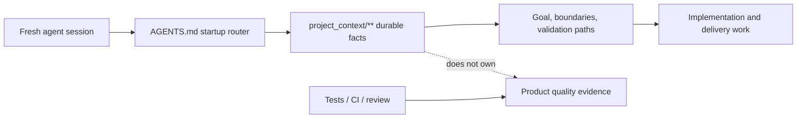

# Project Tiny Context Harness

[](https://www.npmjs.com/package/project-tiny-context-harness)
[](https://github.com/Seven128/project-tiny-context-harness/actions/workflows/package.yml)
[](https://securityscorecards.dev/viewer/?uri=github.com/Seven128/project-tiny-context-harness)
[](https://github.com/Seven128/project-tiny-context-harness/blob/main/LICENSE)
[](https://codespaces.new/Seven128/project-tiny-context-harness)

Translations: [Chinese (Simplified)](https://github.com/Seven128/project-tiny-context-harness/blob/main/README.zh-CN.md)

Project Tiny Context Harness is repo-native project memory for AI coding agents, plus a narrow delivery harness for trustworthy long-task completion. The product principle is: keep the memory, drop the ceremony. It adds durable project memory behind `AGENTS.md` without becoming an agent scheduler or Git orchestrator.

Public launch surfaces are English-first; localized documents are secondary entry points.

Best for:

- repositories where coding agents repeatedly rediscover project intent;
- teams using multiple agents or frequent fresh chats;
- maintainers who want durable Context and explicit long-task evidence.

Not for:

- replacing project tests, review, CI or human acceptance;
- autonomous Tiny Context execution;
- codebase semantic indexing or external docs retrieval.

Concrete shift:

```text
Before: ask a fresh agent to read the repo and tell you what matters.
After: ask it to read AGENTS.md and project_context/** first, then summarize goal, non-goals, architecture boundaries and validation paths before proposing code.
```

What gets added:




The demo shows the core loop: initialize `AGENTS.md` and `project_context/**`, run `validate-context`, then ask a fresh agent to recover intent before proposing code. Use the npm install path below, or inspect the no-install previews first.

Install:

```sh
npm install -D project-tiny-context-harness@latest
npx --yes --package project-tiny-context-harness@latest ty-context init
```

No-install preview:

- Read the [fresh-agent recovery walkthrough](https://github.com/Seven128/project-tiny-context-harness/blob/main/docs/examples/fresh-agent-recovery.md).
- Inspect the [Minimal Context sample guide](https://github.com/Seven128/project-tiny-context-harness/blob/main/docs/examples/minimal-context-sample.md).
- Browse the tiny generated repository at [examples/minimal-context-sample/](https://github.com/Seven128/project-tiny-context-harness/tree/main/examples/minimal-context-sample).

## Why It Exists

`project_context/**` preserves small durable facts across sessions. The default workflow reads graph-relevant Context, supplements that route with one bounded Context search before `Context Delta`, and uses the platform's internal plan. For explicit long work, `long-task-delivery-v2` adds one complete Contract authority, compiled Source/REQ/CTRL/OBL/AC coverage, a one-time user model choice after Authority Lock, scoped progress and a source-recompiled Live Final Gate.

Minimal Context preserves durable facts, the Workflow Contract governs ordinary work, and the Long-Task Workflow adds explicit machine completion authority.

Tiny Context does not invoke or switch models, create agents, branches or worktrees, merge, push, create PRs, deploy, or replace project tests and human acceptance.

## Install And Initialize

```powershell
npx --yes project-tiny-context-harness ty-context init
# Existing repository:
npx --yes project-tiny-context-harness ty-context init --adopt

npx --yes project-tiny-context-harness ty-context validate-context
npx --yes project-tiny-context-harness ty-context doctor
```

Default profiles are `core-portable` and `workflow-default`; the base managed set includes explicitly invoked `/design-system-authoring` and `/design-resource-authoring`. Explicitly enable long-task support:

```powershell
ty-context enable long-task
```

Enabling Long-Task additionally installs `/long-task-workflow`, the retired `/source-plan-authoring` compatibility pointer and the completion Hook. Disable only those Long-Task-owned surfaces with `ty-context disable long-task`; both base design Skills remain. Tiny Context does not install Open Design or another design-generation runtime.

## Recommended Usage

- **Long delivery:** initial product intent or detailed external/Web GPT proposal → explicitly run `/design-system-authoring` if project Design Authority is absent → `/design-resource-authoring` selects resources, reconciles accepted decisions once and emits a validated `design-resource-handoff-v1` for implementation → pass the revised proposal plus selected immutable resources and the validated handoff to `/long-task-workflow`; those inputs enter one Source-bound Contract Draft loop immediately in the same Goal.
- **Non-long delivery:** use the same path, then give the revised proposal plus selected immutable resources and the validated handoff directly to the current native Goal under the default Workflow Contract.

The design-system Skill is normally used at cold start but never auto-runs. Only style-bearing resource work is gated; low-fidelity structure, IA/flow and semantics-only state studies remain available. A legacy Source Plan remains ordinary input, not a recommended intermediate service.

## Positioning

| Adjacent tool type | Use it for | Harness stance |
|---|---|---|
| Spec-first kits | Turning a feature idea into structured specs and plans. | Complementary; Harness keeps durable repo facts beyond one feature spec. |
| BMAD-style workflows and full Tiny Context processes | Role/process ceremony for selected work. | Lighter default; ordinary work stays Context-first. |
| Task Master-style planners | Backlog decomposition and task state. | Complementary; Harness does not own backlog state. |
| Context7/Serena-style retrieval | External docs, symbols or repository retrieval. | Complementary; Harness owns local intended boundaries. |

## Try It In 60 Seconds

```sh
mkdir project-tiny-context-harness-demo
cd project-tiny-context-harness-demo
git init
npm init -y
npm install -D project-tiny-context-harness@latest
npx --yes --package project-tiny-context-harness@latest ty-context init
make validate-context
```

Expected result:

```text
AGENTS.md
project_context/
  context.toml
  global.md
  architecture.md
  areas/main.md
  areas/main/verification.md
```

Fresh-agent test prompt:

```text
Read AGENTS.md and project_context/** first. Summarize the project goal, non-goals, architecture boundaries, validation entry points and next safe action before proposing code changes.
```

### Source checkout preview:

Open <https://codespaces.new/Seven128/project-tiny-context-harness>, or run locally:

```sh
git clone https://github.com/Seven128/project-tiny-context-harness.git
cd project-tiny-context-harness
npm ci
npm run smoke:quickstart
npm run preview:pack
cd /path/to/your/test-repo
npm install -D /path/to/project-tiny-context-harness/tmp/ty-context/source-preview/package/project-tiny-context-harness-0.7.9.tgz
npx --no-install ty-context init --adopt
make validate-context
```

Use this tarball path for source-preview testing, private review or package development. For normal installs, use `project-tiny-context-harness@latest` from npm. If it fails, open a [Source preview report](https://github.com/Seven128/project-tiny-context-harness/issues/new?template=source_preview_report.yml).

## Minimal Context And Default Workflow

The default read path is `project_context/global.md`, `project_context/architecture.md`, `project_context/context.toml`, the default area root, then minimum graph-relevant role Context.

Only near-universal recovery facts should use `read_policy = "default"`; specialized detail should be task-triggered `on-demand`. `ty-context doctor` reports the deterministic default Context footprint, soft-budget overages, byte-identical default files and `DESIGN.md` authority status as advisory maintenance signals, not a new gate.

### Bounded Context discovery

Before deciding `Context Delta`, the Agent combines two low-state routes:

1. collect area, role, trigger and graph candidates from `context.toml`;
2. run one bounded text search over `project_context/**` with a small set of high-signal task terms, including explicit area/module names and relevant API/schema/state/security/verification/deployment language;
3. merge the candidates and read only semantically relevant files.

The bounded search supplements rather than replaces Agent semantic judgment. It creates no vector or persistent index, cache, registry, search state or second authority. It can still miss unrelated synonyms or indirect dependencies, so every implementation delivery still performs Architecture Deliberation and final Conformance.

Ordinary tasks:

1. resolve minimum relevant Context through manifest routing plus bounded Context search;
2. surface one concise, repository-bound Architecture Deliberation;
3. decide `Context Delta: none|required` and update durable facts before code when required;
4. use the platform's internal plan;
5. implement and run project-owned verification;
6. perform Contract Conformance, including Architecture Conformance on the current candidate;
7. perform the separate Context drift check and hand off.

The default workflow has no required plan artifact, matrix, verdict, evidence ledger, persistent retrieval index or second plan. Duration, file count and complexity never auto-enable long-task state.

Plan Validator commands no longer exist; existing plan, matrix or verdict files remain ordinary user files.

### Architecture And Modularity Guidance

Technical architecture support is a shared Workflow obligation. Every implementation delivery visibly completes `Architecture Deliberation` before its first implementation edit. Risk changes depth, not occurrence. A small change names the concrete owner/current extension point, confirms durable boundaries remain unchanged and explains why it adds or worsens no debt. Material work additionally covers the unique source of truth, dependency and interface/state/lifecycle boundaries, failure/recovery/compatibility, selected and rejected alternatives, one plausible future change and its extension point, touched technical debt, forbidden shortcuts and project-owned executable checks. `Architecture Context Hit`, `Decision Rationale Hit: existing|required|none` and `Modularity Check: none|required|exception` remain internal routing questions; no Task Contract or fixed `plan.md` is required.

After implementation and project verification, `Architecture Conformance` checks the current candidate for scope/path escape, owner or dependency-direction violations, service/facade bypass, duplicate authority or a second source of truth, undeclared API/schema/state/persistence change, missing architecture checks and new or worsened debt. A changed candidate invalidates the result. Default work embeds this closure in Contract Conformance; Long-Task work encodes material invariants with existing obligations/constraints/forbidden shortcuts, owners/paths/Bindings and executable Checks and lets Final Gate be the sole closure owner. The two closures never both run for one candidate.

Contract Conformance asks whether current Source and Context reached implementation and verification; the separately named Context drift check asks whether implementation or a new decision made durable Context stale. New or worsened debt blocks handoff unless the project has an explicit bounded exception with owner, rationale, tracking and a removal condition. Unrelated legacy debt does not automatically expand task scope, but debt touched, relied on or worsened by the change cannot remain hidden.

The visible checkpoint proves that architecture consideration occurred; it does not expose private chain-of-thought, guarantee the best design or anticipate every unknowable future request. Store stable reasons, rejected alternatives or tradeoffs only in the smallest durable Context surface. Harness routes repository-native checks rather than becoming a language-generic architecture analyzer or adding architecture artifact/state. Modularity diagnostics identify the highest-risk function and line.

`ty-context check-modularity` audits selected handwritten source. `validate-code-modularity` and `validate-harness` enforce it separately from `validate-context`.

#### Modularity Policy

Newly generated Harness configs default to `strict_except_generated`. Generated/build files remain excluded; `strict_except_generated` rejects configured `modularity.waivers`. Projects with bounded legacy exceptions may opt into `scoped_waivers`, whose entries require `path`, `category`, `owner`, `introduced_at`, `reason`, `tracking_issue` and `expiry_condition`.

### Product Surface Contract

`context_surface_contract` compiles durable screen/page/CLI responsibility using existing `contract`, area/subdomain and verification roles. `product-surface-contract.md` owns cross-surface/main-versus-drilldown responsibility; optional on-demand `screen-contract.md` goes deeper for one screen's entry/exit/shared state, information hierarchy, semantic regions, navigation/variants, material controls and target/verification references. This workflow must not add a new Context role or claim product-quality proof, and local style fixes do not require a Screen Contract.

For material UI, **UI Authority Closure** reconciles each stable surface/control/target key as covered by existing Context, requiring a Context update, task-local, explicitly out of scope or genuinely decision-required. Product Surface Context owns cross-surface responsibility, Screen/interaction Context owns durable hierarchy and behavior, `DESIGN.md` owns visual-system/reference semantics, authored targets own concrete declared composition and the Delivery Contract only binds/proves this delivery. Conflicts fail closed; current code, timestamps, YAML or implementation screenshots do not silently win.

### Visual Delivery Guidance

A design-specific purpose of the Long-Task Workflow is that Agent implementation, acceptance and testing fully conform to every material UI/UX fact selected design resources explicitly express within their declared scope and conditions. Open Design HTML, images and prototypes remain the primary visual resources, while `design-resource-authoring` adds a structured textual semantic handoff as part of the selected implementation resource set. This makes the facts traceable into Contract requirements and project checks; information absent from the resources must be refined, decided or blocking rather than guessed.

The default Workflow performs UI Authority Closure and a conditional Design Authority Check before a material product, design, implementation or acceptance decision. It traverses affected stable keys from the owning Surface/Screen/Control Context through `DESIGN.md`, then actively opens every selected `exact-target` or `constraint`; a reference-index mention alone is not consumption. Each adopted record includes a readable immutable locator/digest, declared coverage and editable upstream owner/locator/update route. Missing, unreadable, stale or conflicting resources fail closed for the affected claim. If only editing is unavailable, the immutable target may still guide implementation, but a requested resource change remains a manual/external boundary. Updates create a new immutable version instead of overwriting the adopted baseline. An unconfigured starter, candidate, style-only prose or inspiration does not authorize invented production layout, and a configured project visual system does not claim every page is implementation-ready. Explicit project design-system initialization/adoption routes to `/design-system-authoring`; explicit standalone resource generation routes to `/design-resource-authoring`, which commissions external Open Design capabilities without adopting authority. The consuming workflow and `context_uiux_design` still own UI Authority Closure and later durable repairs outside design-system cold-start/adoption. Ordinary implementation with sufficient authority, local style fixes and throwaway prototypes remain lightweight.

For a selected implementation handoff, both development paths first run `ty-context design-resource preflight <handoff.md>`. One marked project-native Markdown Source closes every in-scope subject across surface/flow, visual/content, component/control, state/interaction, motion, adaptation/input, accessibility and assets, with immutable evidence, Source-item and verification-method bindings. Missing dimensions, unsupported evidence, unresolved meaning or stale digests fail closed. Exploration remains schema-free. Preflight proves semantic-input completeness and resource integrity only; each workflow must still open the resources and prove the production implementation on the real entry.

For material work, `context_uiux_design` keeps a task-local risk-proportional Visual Coverage Set; durable interaction facts remain in `project_context/**`, durable visual semantics and the design-reference index remain in `DESIGN.md`, and versioned targets stay at project-native paths as ordinary Context-reachable Source. Existing owners connect each stable key to its immutable identity, coverage and editable upstream/update route without copying binary resources into Context or adding a provider/asset registry. `context_development_engineer` traces every selected target/condition through stable surface/control keys to the production route/component owner, cold-start real-user journey and rendered/interactive checks. It inspects the first runnable production slice through the real entry before broad rollout and reports only combinations actually checked. Resource hashes, manifests and counts prove integrity only; an implementation screenshot cannot become its own target or implementation-conformance proof.

An explicit Long-Task resolves missing/conflicting UI authority before Compile, then preserves every applicable Control field through the existing projection: surface, region/location, type/label, user task, visibility/availability, trigger/input/validation/default, interaction/navigation, loading/empty/success/failure/recovery/permission/feedback and accessibility. Each non-empty field is an independent Source-backed Control Claim and protected product semantic; omitted fields create no Claim. Aggregated Product `surface_bindings` connect every Control to an owner surface, required product target, existing Technical route/component Bindings and a root-entry success journey. Selected exact/constraint targets bind frozen inputs and declared conditions to current actual/comparison artifacts through typed `design_conformance`; every declared blocker resolves to target-local machine proof or a target-blocking external confirmation. A blocker cannot be dismissed in-band: scope removal requires revised Source/Contract authority. Existing Claim, Assertion, Check, Stage, Binding, revision and Final Gate mechanisms remain the only lifecycle.

Combined design-and-implementation work may author candidates in ordinary Outcomes/Stages, but a candidate or planned target cannot authorize fidelity implementation. Selection must become real marked Context-reachable Source plus the owning Context/`DESIGN.md` reference and, after Authority Lock, an adopted Authority Revision. Browser visual ACs use `ui_browser`; a browser proxy, detached route or deep link cannot prove a native/root journey that can fail independently. Resource integrity and `visual_render` cannot satisfy selected-target implementation conformance. Frozen baselines are verifier inputs, generated actual renders/diffs are current artifacts, and subjective approval remains external. No `uiux_delivery` block, visual Claim type, resource registry, risk level, lifecycle state, Gate, required design directory, per-Control screenshot matrix or universal pixel threshold is added.

`ty-context doctor` keeps its compatible `missing | unconfigured | configured` project-level status and adds advisory Design Authority Index, token-source and classified-reference signals. It explicitly does not infer surface implementation readiness; that requires the owning Screen/Control meaning, selected target/constraints and project-owned verification.

### Explicit Design System Authoring

Use `/design-system-authoring` only on an explicit request to initialize, generate, select, adopt, replace or repair the project design system/style. It discovers live Open Design MCP resources/tools and feature-detects lifecycle methods; because Open Design 0.15.1 exposes design systems as MCP resources but no creation tool, the documented compatibility path uses the same installed daemon's official generation/revision/accept API. Candidates require explicit human or explicitly delegated selection before adoption into canonical project `DESIGN.md`, one authored token source/direction and only owning Context. Adopted targets record immutable identity/digest plus editable upstream owner/locator/update route; updates create a new immutable version instead of replacing the baseline. Provider ID/revision/digest and `get_project.designSystemId` are synchronization provenance, not another authority.

### Optional Design Resource Authoring

Use `/design-resource-authoring` only for an explicit request to generate, iterate or prepare standalone design resources, prepare resources for a named development scope, or use Open Design. It accepts raw notes or an initial proposal, product/technical plans, a visual brief, screenshots, existing resources or a legacy Source Plan. A standalone Source Plan is neither prerequisite nor recommended middle stage.

The Skill makes the explicit output or development content its hard ceiling; a local slice includes only necessary surrounding context. For an implementation handoff it accounts for material UI/UX meaning through relevant surfaces/flows/regions/components/controls and applicable visual/content, state, interaction/feedback/motion, responsive/platform/input, accessibility and asset conditions, then subtracts only explicit selected-source coverage. It discovers current Open Design capabilities and assigns every considered resource a reasoned `selected`, `optional`, `not-needed`, `unavailable` or `decision-required` disposition.

High-fidelity/branded output, visual direction, typography/color/density, component visual treatment and production-style prototypes are style-bearing. If Design Authority is unconfigured or lacks one authored token source/direction, the Skill stops before project/run creation and tells the user to explicitly invoke `/design-system-authoring`; it never auto-initializes. Low-fidelity structure, IA/flow and semantics-only state studies remain non-fidelity. Style-bearing Open Design projects pass the adopted ID through `create_project.designSystem` and verify `get_project.designSystemId`.

It commissions only the smallest sufficient set through structured MCP with bounded fallback. Repeated controls may map to one component family, one inspectable artifact may cover several needs and only unique/complex uncovered controls need dedicated studies. Static/default views do not imply unseen behavior. No prototype, low/high-fidelity pair, component board, Figma handoff, one-file-per-control rule, artifact count or directory is mandatory, and Tiny Context copies no provider prompt/template or catalogue. Designs carry user-visible interaction semantics, not sole ownership of business/data/permission/algorithmic rules.

Exploration returns a visible scoped candidate after minimal sanity review and requires no handoff schema. After explicit or delegated final selection for implementation, the Skill performs one consolidated idempotent proposal reconciliation and writes one provider-neutral marked Markdown Source containing exactly one strict `design-resource-handoff-v1` block. It records scope/provenance, immutable resource paths/digests and editable upstreams, conditions, grouped subjects, selected targets, addressable evidence, complete eight-dimension coverage, Source-item/verification-method bindings and acceptance blockers. It runs shared preflight and cannot call unresolved, unsupported or stale input ready. There is no fixed directory, provider pack or one-file-per-control rule. The adapter is ordinary Source, not Design Authority or acceptance, and the Skill never edits a Source Plan, Context, `DESIGN.md`, production code or a Delivery Contract.

Actual generation remains with configured Open Design/Product Design, Figma, image-generation, prototype or human systems. Their outputs enter the default Workflow or Long-Task as ordinary external Source. Candidates and inspiration authorize no fidelity. An adopted exact target/constraint becomes Context-reachable Source: owning Context/`DESIGN.md` maps its stable key to declared conditions, a stable immutable identity/digest and an editable upstream owner/locator/update route. `context_uiux_design` performs downstream UI Authority Closure; implementation renders and diffs remain evidence rather than self-authorizing targets.

Maintainers may set `TY_CONTEXT_OPEN_DESIGN_MCP_COMMAND` plus optional `TY_CONTEXT_OPEN_DESIGN_MCP_ARGS_JSON` and run `npm run smoke:open-design` for an opt-in, read-only discovery smoke. Normal tests use a local mock MCP and do not depend on Open Design or nondeterministic output.

### Retired Source Plan Compatibility

`/source-plan-authoring` is retained only as a compatibility pointer. `/long-task-workflow` opens the non-authoritative Contract Draft immediately and converges mixed-input inventory/synthesis, stable-key/control-level meaning, preference/research/delegation traceability, Source markers/provenance, acceptance/risk completeness and Contract mapping in one loop. Existing Source Plans remain ordinary Source; no standalone or internal Source-authoring stage, handoff, schema, gate, state or second plan is created.

## Single-Goal Rolling Delivery

The explicit Long-Task Workflow uses one platform-native Goal, one user-selected repository/workspace, one complete `long-task-delivery-v2` Contract and one Final Gate. Outcomes are independently decidable acceptance units; Delivery Set orchestration and top-level Contract splitting inside one selected delivery are retired.

Raw/revised proposals, selected design resources and mixed attachments enter one Source-bound Contract Draft loop immediately. Complete input coverage, stable keys, control-level meaning, acceptance/risk, direct/derived/delegated/evidence-backed provenance, Source markers and Contract mapping converge together. Unknown decision-changing preferences still trigger one targeted clarification before Preflight/Compile can succeed; defensible recommendations are written into real Source rather than hidden in YAML, while high-risk actions remain external confirmations. Legacy Source Plan structure never blocks authoring.

Before the first successful formal Compile, `delivery-contract.yaml` is one non-authoritative Contract Draft. `/long-task-workflow` opens it at entry and revises the same Draft across Source refinement, repository/Context reads, mapping and Preflight repairs; a complete Contract need not fit one response. Source completeness is a convergence condition for Preflight/Compile, not a prior phase. There is no standalone Contract Draft Skill or Authoring State.

The Long-Task Skill keeps objective/boundary/activity routing in its main file and loads one-level Source-bound Draft/Contract-mapping, evidence-design and authority-lifecycle references as applicable. Draft input repair and Contract mapping are concurrent activities, not serial phases. This is instruction packaging only, not a second authority. It performs the shared Architecture Deliberation during Draft authoring. Declared architecture invariants use existing obligations/constraints/forbidden shortcuts, owner/path/Binding boundaries and project-owned executable Checks; a functional AC cannot substitute for an independently failing architecture claim. Final Gate is the sole Long-Task Architecture Conformance carrier.

A Draft Outcome is simply an Outcome before Authority Lock. Outcomes decompose independently observable, decidable and target-verifiable results to improve dependency-ready implementation, targeted verification, failure localization, resume and stale-result invalidation. `depends_on` means acceptance readiness and the Rolling Frontier is temporary; an Outcome is not a Worker, scheduler task, queue or parallel unit. Outcome decomposes execution and diagnosis, not completion authority, so one complete current-snapshot Final Gate remains mandatory.

When a declared result can pass on a proxy surface while failing in its target runtime, the earliest owning Outcome declares a project-owned Check that exercises the target during the current Check execution. A tracked report, screenshot, binary, log or historical run cannot be the sole runtime proof. Author each Check's `input_paths`/Bindings as its smallest sound invalidation envelope and keep every Counterfactual carrier traceable from the declared target root. Run that Check at the first useful runnable boundary; later `progress_stale` only reports that prior evidence no longer covers current inputs. Coalesce related edits, use the cheapest reliable feedback, and refresh before dependent reliance or Final Gate. `verify --explain` previews bounded declared runner invocations without execution or Progress writes, but cannot predict duration or runner-internal subprocesses. This adds no generic reachability claim, second executing diagnose mode, scheduler, trigger queue, `platform_impact` flags, completion state or per-edit rebuild rule; runtime-specific readiness/build/process behavior stays in the project runner, and Final Gate remains authoritative.

### One-time execution-model choice

The first successful Compile creates Authority Lock and returns:

```json
{
  "execution_model_checkpoint": {
    "required": true,
    "phase": "post_authority_lock_pre_implementation",
    "options": ["continue_current_model", "switch_model_then_resume"],
    "turn_boundary": "end_current_turn",
    "explicit_task_specific_choice_required": true,
    "generic_continue_satisfies": false
  }
}
```

This is a terminal-turn boundary. Unless a prior user message explicitly states this task's current-model or switch-and-resume strategy, the Agent performs no product implementation, file edit, build or test after that result, ends the turn and asks for the choice. Generic continue/resume/finish/continue-goal language does not satisfy it. Later Compile revisions return `{ "required": false }` and do not repeat it.

Harness cannot switch the host-selected model. It creates no checkpoint file, acknowledgement state, model route, model-tier scheduler or automatic model switch. The choice is a one-time execution-cost affordance enabled by locked Authority and Final Gate protection; it is not acceptance evidence.

Post-lock revisions separate authority change from user decision while retaining exact identity, old-Authority continuity, compare-and-swap adoption, evidence invalidation and the complete Final Gate. Formally monotonic strengthening; raw Source/Context snapshot changes with unchanged locked Claims/targets/proof obligations; operational Runner/input/environment repair; repository-bound scope expansion; risk strengthening; and equivalent Counterfactual coverage with the same carrier, mutation and Check and no lost Claim/assertion-failure coverage auto-adopt. Product/Source Claim/target/external-confirmation changes, lost scenario/Claim/Evidence Capability/failure interception, forbidden or owner-Context removal, runner type/effect changes, verifier-kernel changes and unknown reasons are preview-only and require the exact revision identity; risk downgrade is rejected. `diagnose-revision` remains side-effect-free and can exercise eligible scope candidates, so withdrawn/replaced candidates coalesce in the same `delivery-contract.yaml` and never ask. The final pending decision begins with a plain-language Authority Revision introduction and separates `user_decision_reasons` from mechanically bounded changes. Present it first. An explicit current-task instruction that exactly covers every listed decision reason may be mechanically relayed without a second question; generic continue, blanket approval, recommendation or Agent inference does not count. Exact identity, previous-Authority continuity, evidence invalidation and the complete Final Gate apply to every adoption, which reports `delivery_completed_by_this_event: false`, returns to rolling implementation or repair and never means delivery completion.

```text
ty-context long-task init <workdir>
ty-context long-task preflight <workdir>
ty-context long-task compile <workdir>
ty-context long-task compile <workdir> --revise
ty-context long-task diagnose-revision <workdir> [--outcome <key>] [--check <key>]
ty-context long-task approve-authority-revision <workdir> --revision <sha>
ty-context long-task explain <workdir>
ty-context long-task verify <workdir> [--outcome <key>] [--check <key>] [--explain]
ty-context long-task status <workdir>
ty-context long-task resume <workdir>
ty-context long-task doctor <workdir>
ty-context long-task final-gate <workdir>
ty-context long-task stop-check <workdir> [--message <text>]
ty-context long-task close <workdir>
ty-context long-task abandon <workdir> [--force-corrupt-state]
```

Compact authoring omits only deterministic defaults and normalizes identically to the expanded form. `preflight` is a read-only aggregated Source/REQ/CTRL/OBL/AC and repository check. Before first Authority Lock, Preflight and direct Compile both classify every HEAD-relative changed path as protected, expected change, allowed support, forbidden or unclassified; forbidden and unclassified paths block, so Compile cannot bypass Preflight. During first enable, only exact current package-asset files for configured managed destinations plus exact config/hook files are temporarily protected; managed directory roots and broad `.codex/**` are never exempt. Compile then generates Global plus Outcome Result/Requirement/Control-field/Non-completing/Technical Claims, rejects uncovered Claims and makes the first successful formal Compile the Authority Lock. Every Compile result includes a lifecycle event, `delivery_completed_by_this_event: false`, `native_goal_effect: none` and a next action. The first Compile result emits `execution_model_checkpoint.required: true` plus its terminal-turn/explicit-choice contract; later Compile revisions emit `required: false`. Every later authority change still compares with active authority regardless of progress, Receipt/cache deletion or implementation restoration. Source/Context/Product/Acceptance/Global/verifier content, resolved runners and verification inputs are frozen in the common-dir Active Authority V3 record.

`diagnose-revision` performs a side-effect-free candidate Compile and only exercises existing active Check identities whose runner/verifier authority is unchanged. Its output explicitly denies acceptance, Progress and pending-state writes. `compile --revise` auto-adopts mechanically bounded revisions; for a user-decision revision it emits `authority_revision_pending`, the exact decision id, deterministic material summary, `user_decision_reasons` and the self-contained human `decision_brief` before failing closed. Approving a different or stale id is rejected. Adoption emits `authority_revision_adopted` and returns to rolling execution rather than completion.

Targeted verify rechecks active task/revision/compiled/worktree identity and applies the same workspace categories against the immutable baseline before writing scoped Progress. `verify --explain` groups selected Main Raw Executions, lists applicable Counterfactual calls and declared retry bounds, but runs nothing and writes no Progress. Counterfactual Findings first enter the owning Check Result, invalidate an otherwise passed Check, clear Claim Proofs and remain visible in status/resume; Global Checks reuse the same Progress type without a Global Outcome state. Final Gate repeats the identity check after all Checks; Stop/close clear only the accepted identity through CAS. Commit, migration, clear and abandon share one active-state lock. `abandon --force-corrupt-state` is reserved for corrupt continuity or stale lock cleanup and preserves Contract, Source, Context and Git content.

`status` and read-only `resume` report the current fresh Final Receipt as `final_workflow_status` (or `null` after drift) plus the active Contract's complete `external_confirmations`. `progress_passing` is targeted repair evidence rather than “Outcome complete”; `progress_stale` is a freshness fact rather than a current pass or immediate rerun command, and `final_workflow_status: null` means unfinished. Every accepted Stop emits one non-blocking terminal-scope `systemMessage`; external-pending results also name every confirmation. Final/Stop/close report `acceptance_scope: declared_machine_authority` and `native_goal_effect: none`; close also reports `closed_scope: machine_authority`. Before platform-native Goal completion, the Agent performs a veto-only Goal/user-to-Source conformance review that cannot create proof. `status: closed` means only that machine Authority was cleared, not that the native Goal or external delivery completed.

New authoring uses inline Outcomes. Existing `outcome_files` remains physical compatibility only and creates no semantic or completion boundary. A Long Task requires real Source, and every declared Source file contains at least one Material Item; background-only references remain outside Source Authority. Every Material Source Item is wrapped in the original Markdown with a non-rendering, uniquely keyed `ty-source-item:start/end` marker; `control` is a first-class kind, marker keys and `source_claim` keys are set-equal, and statements are text-exact after limited whitespace normalization. Every non-decision Source item owns one same-kind, same-text canonical target and duplicate ownership fails. Outcome Source Acceptance maps to criterion-identical `<outcome>.<check>.<assertion>` with an independently Source-backed non-Result Claim; Global Source Acceptance maps to criterion-identical `GLOBAL.<check>.<assertion>`, proves no Outcome Claim and needs an independently Source-backed Global Claim. Typed dispositions keep Requirements, Controls, Acceptance, Results, Fact/Affected-Outcome Risk, Non-goals, External Confirmations and Decisions distinct; `out_of_scope` is retired. Ordinary prose remains valid after marker-only enumeration.

After Authority Lock, semantic/Product Claim/Acceptance/verifier-kernel changes and proof weakening require an exact user decision. Mechanically bounded implementation repairs and raw snapshot changes that preserve locked meaning auto-revise but still invalidate affected evidence. Pure package root/version relocation auto-revises; schema/hook byte changes do not. Contract and Check execution field policies prevent new fields from bypassing authority or raw-execution identity. Every path-bearing field uses one canonical grammar: Windows separators and one leading `./` normalize, while internal `.`/`..`, controls, absolute/drive/UNC paths and unsupported glob syntax fail closed.

Supported runners: `package_script`, `project_binary`, `node_oracle`, `playwright_test`.

Supported proof surfaces: `ui_browser`, `runtime_behavior`, `api_contract`, `data_state`, `security_boundary`, `population_coverage`, `implementation_structure`.

After a blocker-driven semantic or proof revision, only affected weak-observability or high-risk behavioral Claims receive a causal-boundary review. Evidence must reach the furthest independently failing declared boundary; when carrier existence can diverge from the claimed capability, use a capability-disrupting Counterfactual. This adds no product taxonomy, universal runtime suite, mutation type or persistent review state.

## Risk And Evidence

L0 local work stays on the default workflow. L1 standard long work uses the Delivery Contract. L2 strict is the minimum for public API/schema, persistent data, migration, security/permission boundaries, irreversible effects, full-population operations, or a critical path with weak observability. Strict proof binds to the affected Outcome; multi-repository delivery is rejected.

Users may raise risk to strict. Explicit `standard` below the computed floor fails. Strict negative, counterfactual, population, security, environment and rollback/recovery proof is compiler-enforced as applicable. Scope escape returns a `scope_escape` Finding for revision and recompilation in the same Goal.

Agent prose, a command exit code, handwritten state, historical targeted passes and missing/weak proof cannot create accepted. Evidence adapters derive from runner kind: only `playwright_json_v1` from `playwright_test` may prove `ui_browser`; other runners produce `structured_json_v2`. Every Outcome has a non-Result atomic Claim and all required surfaces must be non-empty, unique and covered. Across every Check sharing one Raw Execution identity, a Claim-bearing Observation is unique to one Assertion. Playwright Claim evidence is only `playwright.case.<ac>.passed equals true`; `[ac:<key>]` binds one declared AC per Test, ordinary tags are ignored, and missing/skipped/flaky/unexpected/timed-out/interrupted/multi-AC/duplicate-per-project evidence fails closed while distinct projects aggregate all-of. Structured Counterfactuals require exit zero; weak Playwright Counterfactuals may accept exit one only when every unexpected Test Instance is exactly a designated executed AC and no root/unbound/extra/timeout/interruption/flaky or other Evidence failure exists. Ordinary Playwright Baselines still require exit zero, and report/instance diagnostic observations cannot prove Claims. Each Claim-bearing structured Check needs same-Check, Claim-related Counterfactual sensitivity; unrelated Artifacts/Checks do not count, Population exempts only its same-Check Claims except under weak observability, and Result sensitivity needs a related non-Result root. Claim/Population proofs are emitted only for a fully passed Check. Findings and Explain trace Source, canonical target, Claim, AC/criterion, required surfaces, Check, adapter, Observation and owner paths.

## Upgrade And Compatibility

```powershell
ty-context upgrade
ty-context sync
```

Version 0.6.0 retires V1 and the repo-local Hook. Development-period V2 Active Authority, Progress and Receipts are not migrated; doctor reports `manual_required`, and the operator upgrades the Contract before forming a new Authority Lock. Invalid JSON, marker/record mismatch or stale lock is never guessed from damaged record paths; doctor reports the explicit contained cleanup command `ty-context long-task abandon <workdir> --force-corrupt-state`.

Version 0.6.0 keeps the `long-task-delivery-v2` name and physical `outcome_files` parser form while defining the first public V2 semantics; development-period Drafts receive explicit migration diagnostics. Its former optional Source Plan helper and the additive execution-model checkpoint added no Schema, CLI, Preflight, Validator, Receipt, Authority or persisted model-routing state. Current releases send inputs directly into the Source-bound Contract Draft loop and keep the old entry only as a pointer. Preflight and direct Compile share one activation-safety validator.

After updating the package, run `ty-context upgrade`. Use `ty-context upgrade --check` first when you need a read-only plan.

Release metadata declares one update mode: `sync-only`, `upgrade-required` or `manual-required`. Upgrade plans report steps as `safe_pending`, `manual_required` or `blocked`. A `sync-only` release may use `sync`; `sync` does not run migrations. An `upgrade-required` release must run upgrade, while `manual-required` includes an explicit operator step.

## Verification

```powershell
npm run format:check
npm run typecheck --workspace project-tiny-context-harness
npm run build --workspace project-tiny-context-harness
npm run test:affected:list
npm run test:affected
npm run test:long-task:trust
npm run test:long-task-performance --workspace project-tiny-context-harness
npm test
npm run smoke:quickstart
npm run preview:pack
npm run launch:check
node packages/ty-context/dist/cli.js package check-source
make validate-harness
```

`test:affected` is the edit/fix loop. In inferred local discovery it reports and omits only untracked `.work_products/**`; tracked and explicit paths still route fail safe. `test:long-task:trust` is the frozen-candidate high-impact boundary gate used by pull-request CI. Reviewed Trust/focused/hotspot budgets prevent silent feedback-tier growth, while complete discovery remains exhaustive. `npm test` is the complete release regression retained on `main` and publish; do not rerun it after every small repair. Controlled Ubuntu CI uses generous per-suite catastrophic time ceilings, but local timing stays diagnostic. Explicit delivery-contract and complete Long-Task gates remain available as package workspace scripts.

The modularity gate is `ty-context check-modularity`. Scoped waivers require `owner`, `introduced_at`, `reason`, `tracking_issue` and `expiry_condition`.

The synchronized local preview tarball is named `project-tiny-context-harness-0.7.9.tgz`.

## Community And Further Reading

Feedback from real repositories is especially useful. Open an [adoption report](https://github.com/Seven128/project-tiny-context-harness/issues/new?template=adoption_report.yml) with the recovery problem and what remained unclear.

Early feedback and starter issues:

- Report a [Context recovery gap](https://github.com/Seven128/project-tiny-context-harness/issues/new?template=context_gap.yml) through `context_gap.yml`.
- Share results in the pinned [adoption reports issue](https://github.com/Seven128/project-tiny-context-harness/issues/4).
- Pick a starter issue: [demo](https://github.com/Seven128/project-tiny-context-harness/issues/5), [sample walkthrough](https://github.com/Seven128/project-tiny-context-harness/issues/6), [benchmark rerun](https://github.com/Seven128/project-tiny-context-harness/issues/7) or [launch FAQ](https://github.com/Seven128/project-tiny-context-harness/issues/8).
- Keep claims narrow: recovery evidence is useful; benchmark speedup claims need fresh Minimal Context benchmark runs.

Read the [roadmap](https://github.com/Seven128/project-tiny-context-harness/blob/main/docs/roadmap.md), [Benchmarking And Evidence](https://github.com/Seven128/project-tiny-context-harness/blob/main/docs/benchmarking.md), [comparison guide](https://github.com/Seven128/project-tiny-context-harness/blob/main/docs/comparison.md), [adoption guide](https://github.com/Seven128/project-tiny-context-harness/blob/main/docs/adopt-existing-repo.md), [agent surface recipes](https://github.com/Seven128/project-tiny-context-harness/blob/main/docs/agent-surface-recipes.md) and [FAQ](https://github.com/Seven128/project-tiny-context-harness/blob/main/docs/faq.md).

For concrete examples, see the [fresh-agent recovery walkthrough](https://github.com/Seven128/project-tiny-context-harness/blob/main/docs/examples/fresh-agent-recovery.md), [Minimal Context sample guide](https://github.com/Seven128/project-tiny-context-harness/blob/main/docs/examples/minimal-context-sample.md) and [browseable sample repository](https://github.com/Seven128/project-tiny-context-harness/tree/main/examples/minimal-context-sample). The longer argument is [Fresh coding-agent sessions need project memory, not more ceremony](https://github.com/Seven128/project-tiny-context-harness/blob/main/docs/articles/fresh-agent-project-memory.md).

## Honest Limits

Tiny Context does not create or restore a platform Goal, prove that every requirement was declared, guarantee bounded keyword search finds every synonym or indirect dependency, switch the host-selected model, provide core parallel mutation, observe platform tokens/model calls, or own Git/PR/CI/deployment/human product confirmation. The installed package verifier and Git metadata are trusted; external platforms own network isolation, and deliberate same-user/admin tampering remains outside the local threat model.

## License

MIT
