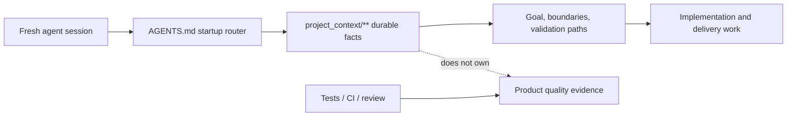

# Project Tiny Context Harness

[](https://www.npmjs.com/package/project-tiny-context-harness)
[](https://github.com/Seven128/project-tiny-context-harness/actions/workflows/package.yml)
[](https://securityscorecards.dev/viewer/?uri=github.com/Seven128/project-tiny-context-harness)
[](https://github.com/Seven128/project-tiny-context-harness/blob/main/LICENSE)
[](https://codespaces.new/Seven128/project-tiny-context-harness)

Translations: [Chinese (Simplified)](https://github.com/Seven128/project-tiny-context-harness/blob/main/README.zh-CN.md)

Project Tiny Context Harness is repo-native project memory for AI coding agents, plus a narrow delivery harness for trustworthy long-task completion. The product principle is: keep the memory, drop the ceremony. It adds durable project memory behind `AGENTS.md` without becoming an agent scheduler or Git orchestrator.

Public launch surfaces are English-first; localized documents are secondary entry points.

Best for:

- repositories where coding agents repeatedly rediscover project intent;
- teams using multiple agents or frequent fresh chats;
- maintainers who want durable Context and explicit long-task evidence.

Not for:

- replacing project tests, review, CI or human acceptance;
- autonomous Tiny Context execution;
- codebase semantic indexing or external docs retrieval.

Concrete shift:

```text
Before: ask a fresh agent to read the repo and tell you what matters.
After: ask it to read AGENTS.md and project_context/** first, then summarize goal, non-goals, architecture boundaries and validation paths before proposing code.
```

What gets added:




The demo shows the core loop: initialize `AGENTS.md` and `project_context/**`, run `validate-context`, then ask a fresh agent to recover intent before proposing code. Use the npm install path below, or inspect the no-install previews first.

Install:

```sh
npm install -D project-tiny-context-harness@latest
npx --yes --package project-tiny-context-harness@latest ty-context init
```

No-install preview:

- Read the [fresh-agent recovery walkthrough](https://github.com/Seven128/project-tiny-context-harness/blob/main/docs/examples/fresh-agent-recovery.md).
- Inspect the [Minimal Context sample guide](https://github.com/Seven128/project-tiny-context-harness/blob/main/docs/examples/minimal-context-sample.md).
- Browse the tiny generated repository at [examples/minimal-context-sample/](https://github.com/Seven128/project-tiny-context-harness/tree/main/examples/minimal-context-sample).

## Why It Exists

`project_context/**` preserves small durable facts across sessions. The default workflow reads only graph-relevant Context and uses the platform's internal plan. For explicit long work, `long-task-delivery-v1` adds one Delivery Contract, targeted repair verification, a same-snapshot Final Gate and Stop freshness.

Minimal Context preserves durable facts, the Workflow Contract governs ordinary work, and the Long-Task Workflow adds explicit machine completion authority.

Tiny Context does not invoke models, create agents, branches or worktrees, merge, push, create PRs, deploy, or replace project tests and human acceptance.

## Install And Initialize

```powershell
npx --yes project-tiny-context-harness ty-context init
# Existing repository:
npx --yes project-tiny-context-harness ty-context init --adopt

npx --yes project-tiny-context-harness ty-context validate-context
npx --yes project-tiny-context-harness ty-context doctor
```

Default profiles are `core-portable` and `workflow-default`. Explicitly enable long-task support:

```powershell
ty-context enable long-task
```

This installs the `/long-task-workflow` Skill and completion Hook. Disable only those package-owned surfaces with `ty-context disable long-task`.

## Positioning

| Adjacent tool type | Use it for | Harness stance |
|---|---|---|
| Spec-first kits | Turning a feature idea into structured specs and plans. | Complementary; Harness keeps durable repo facts beyond one feature spec. |
| BMAD-style workflows and full Tiny Context processes | Role/process ceremony for selected work. | Lighter default; ordinary work stays Context-first. |
| Task Master-style planners | Backlog decomposition and task state. | Complementary; Harness does not own backlog state. |
| Context7/Serena-style retrieval | External docs, symbols or repository retrieval. | Complementary; Harness owns local intended boundaries. |

## Try It In 60 Seconds

```sh
mkdir project-tiny-context-harness-demo
cd project-tiny-context-harness-demo
git init
npm init -y
npm install -D project-tiny-context-harness@latest
npx --yes --package project-tiny-context-harness@latest ty-context init
make validate-context
```

Expected result:

```text
AGENTS.md
project_context/
  context.toml
  global.md
  architecture.md
  areas/main.md
  areas/main/verification.md
```

Fresh-agent test prompt:

```text
Read AGENTS.md and project_context/** first. Summarize the project goal, non-goals, architecture boundaries, validation entry points and next safe action before proposing code changes.
```

### Source checkout preview:

Open <https://codespaces.new/Seven128/project-tiny-context-harness>, or run locally:

```sh
git clone https://github.com/Seven128/project-tiny-context-harness.git
cd project-tiny-context-harness
npm ci
npm run smoke:quickstart
npm run preview:pack
cd /path/to/your/test-repo
npm install -D /path/to/project-tiny-context-harness/tmp/ty-context/source-preview/package/project-tiny-context-harness-0.5.0.tgz
npx --no-install ty-context init --adopt
make validate-context
```

Use this tarball path for source-preview testing, private review or package development. For normal installs, use `project-tiny-context-harness@latest` from npm. If it fails, open a [Source preview report](https://github.com/Seven128/project-tiny-context-harness/issues/new?template=source_preview_report.yml).

## Minimal Context And Default Workflow

The default read path is `project_context/global.md`, `project_context/architecture.md`, `project_context/context.toml`, then minimum graph-relevant role Context. Ordinary tasks decide `Context Delta: none|required`, update durable facts before code when required, implement, verify, perform Contract Conformance and check Context drift.

The default workflow has no required plan artifact, matrix, verdict, evidence ledger or second plan. Duration, file count and complexity never auto-enable long-task state.

Plan Validator commands no longer exist; existing plan, matrix or verdict files remain ordinary user files.

### Architecture And Modularity Guidance

Technical architecture support is a Minimal Context capability. For high-risk work, `Architecture Context Hit`, `Decision Rationale Hit: existing|required|none` and `Modularity Check: none|required|exception` are internal routing questions inside the platform's internal plan. No Task Contract or fixed `plan.md` is required. Do not invent rationale: store stable reasons, rejected alternatives or tradeoffs only in the smallest durable Context surface, and remember that architecture Context does not prove product quality.

`ty-context check-modularity` audits selected handwritten source. `validate-code-modularity` and `validate-harness` enforce it separately from `validate-context`.

#### Modularity Policy

Newly generated Harness configs default to `strict_except_generated`. Generated/build files remain excluded; `strict_except_generated` rejects configured `modularity.waivers`. Projects with bounded legacy exceptions may opt into `scoped_waivers`, whose entries require `path`, `category`, `owner`, `introduced_at`, `reason`, `tracking_issue` and `expiry_condition`.

### Product Surface Contract

`context_surface_contract` compiles durable screen/page/CLI responsibility using the existing `contract`, area/subdomain and verification roles; `product-surface-contract.md` is the package template. Product Surface Contract authoring uses Source-to-Context judgment and Contract Conformance; it must not add a new product-surface Context role or claim product-quality proof.

## Single-Goal Rolling Delivery

The explicit Long-Task Workflow uses one platform-native Goal, one user-selected repository/worktree and one authoritative `delivery-contract.yaml`. Outcome dependencies express acceptance readiness; the current Goal keeps file-level implementation detail in a rolling internal Frontier.

```text
ty-context long-task init <workdir>
ty-context long-task compile <workdir>
ty-context long-task verify <workdir> [--outcome <key>] [--check <key>]
ty-context long-task status <workdir>
ty-context long-task resume <workdir>
ty-context long-task final-gate <workdir>
ty-context long-task stop-check <workdir> [--message <text>]
ty-context long-task close <workdir>
ty-context long-task abandon <workdir>
```

Compile strictly validates schema, keys, dependencies, Context/source/paths/runners/proof and the deterministic risk floor before implementation. It freezes Contract, source, selected Context, runner/oracle, verifier, repository/workdir and baseline workspace identity.

Targeted verify is diagnostic and can never accept. Final Gate reruns every global and Outcome Check on one current snapshot; identical execution identities may be deduplicated only inside that Gate. Stop permits completion only while the accepted Receipt remains fresh against workspace, Contract, source, Context, runner/oracle, verifier and Hook identity. `resume` is read-only, `close` requires fresh acceptance, and `abandon` preserves authored source/Contract files and never touches Git.

Supported runners: `package_script`, `project_binary`, `node_oracle`, `playwright_test`.

Supported proof surfaces: `ui_browser`, `runtime_behavior`, `api_contract`, `data_state`, `security_boundary`, `population_coverage`, `implementation_structure`.

## Risk And Evidence

L0 local work stays on the default workflow. L1 standard long work uses the Delivery Contract. L2 strict is the minimum for public API/schema, persistent data, migration, security/permission boundaries, irreversible effects, full-population operations, multiple repositories, or a critical path with weak observability.

Users may raise risk to strict. Explicit `standard` below the computed floor fails. Strict negative, counterfactual, population, security, environment and rollback/recovery proof is compiler-enforced as applicable. Scope escape returns `scope_or_risk_escalation_required` for revision and recompilation in the same Goal.

Agent prose, a command exit code, handwritten state, historical targeted passes and missing/weak proof cannot create accepted. Final Gate runs only Contract-declared project verification commands. Tiny Context makes no model calls and no model retries.

## Upgrade And Compatibility

```powershell
ty-context upgrade
ty-context sync
```

Version 0.5.0 safely migrates the retired `composite-codex` profile selection to `long-task`, removes package-owned retired assets and preserves user historical files without importing or executing them. The retired `composite-campaign` and `composite-long-task` names are non-executing command tombstones. `/normal-long-task` is a retirement pointer to `/long-task-workflow` and creates no competing artifacts.

After updating the package, run `ty-context upgrade`. Use `ty-context upgrade --check` first when you need a read-only plan.

Release metadata declares one update mode: `sync-only`, `upgrade-required` or `manual-required`. Upgrade plans report steps as `safe_pending`, `manual_required` or `blocked`. A `sync-only` release may use `sync`; `sync` does not run migrations. An `upgrade-required` release must run upgrade, while `manual-required` includes an explicit operator step.

## Verification

```powershell
npm run format:check
npm run typecheck --workspace project-tiny-context-harness
npm run build --workspace project-tiny-context-harness
npm run test:delivery-contract --workspace project-tiny-context-harness
npm run test:long-task-workflow --workspace project-tiny-context-harness
npm test
npm run smoke:quickstart
npm run preview:pack
npm run launch:check
node packages/ty-context/dist/cli.js package check-source
make validate-harness
```

The modularity gate is `ty-context check-modularity`. Scoped waivers require `owner`, `introduced_at`, `reason`, `tracking_issue` and `expiry_condition`.

The synchronized local preview tarball is named `project-tiny-context-harness-0.5.0.tgz`.

## Community And Further Reading

Feedback from real repositories is especially useful. Open an [adoption report](https://github.com/Seven128/project-tiny-context-harness/issues/new?template=adoption_report.yml) with the recovery problem and what remained unclear.

Early feedback and starter issues:

- Report a [Context recovery gap](https://github.com/Seven128/project-tiny-context-harness/issues/new?template=context_gap.yml) through `context_gap.yml`.
- Share results in the pinned [adoption reports issue](https://github.com/Seven128/project-tiny-context-harness/issues/4).
- Pick a starter issue: [demo](https://github.com/Seven128/project-tiny-context-harness/issues/5), [sample walkthrough](https://github.com/Seven128/project-tiny-context-harness/issues/6), [benchmark rerun](https://github.com/Seven128/project-tiny-context-harness/issues/7) or [launch FAQ](https://github.com/Seven128/project-tiny-context-harness/issues/8).
- Keep claims narrow: recovery evidence is useful; benchmark speedup claims need fresh Minimal Context benchmark runs.

Read the [roadmap](https://github.com/Seven128/project-tiny-context-harness/blob/main/docs/roadmap.md), [Benchmarking And Evidence](https://github.com/Seven128/project-tiny-context-harness/blob/main/docs/benchmarking.md), [comparison guide](https://github.com/Seven128/project-tiny-context-harness/blob/main/docs/comparison.md), [adoption guide](https://github.com/Seven128/project-tiny-context-harness/blob/main/docs/adopt-existing-repo.md), [agent surface recipes](https://github.com/Seven128/project-tiny-context-harness/blob/main/docs/agent-surface-recipes.md) and [FAQ](https://github.com/Seven128/project-tiny-context-harness/blob/main/docs/faq.md).

For concrete examples, see the [fresh-agent recovery walkthrough](https://github.com/Seven128/project-tiny-context-harness/blob/main/docs/examples/fresh-agent-recovery.md), [Minimal Context sample guide](https://github.com/Seven128/project-tiny-context-harness/blob/main/docs/examples/minimal-context-sample.md) and [browseable sample repository](https://github.com/Seven128/project-tiny-context-harness/tree/main/examples/minimal-context-sample). The longer argument is [Fresh coding-agent sessions need project memory, not more ceremony](https://github.com/Seven128/project-tiny-context-harness/blob/main/docs/articles/fresh-agent-project-memory.md).

## Honest Limits

Tiny Context does not create or restore a platform Goal, prove that every requirement was declared, provide core parallel mutation, observe platform tokens/model calls, or own Git/PR/CI/deployment/human product confirmation. Runner network policy is not an OS sandbox, and deliberate same-user/admin tampering or system Hook bypass is outside its security boundary.

## License

MIT
