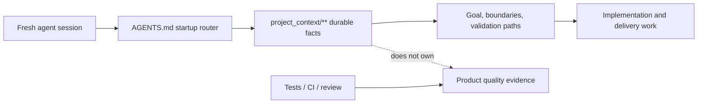

# Project Tiny Context Harness

[](https://www.npmjs.com/package/project-tiny-context-harness)
[](https://github.com/Seven128/project-tiny-context-harness/actions/workflows/package.yml)
[](https://securityscorecards.dev/viewer/?uri=github.com/Seven128/project-tiny-context-harness)
[](https://github.com/Seven128/project-tiny-context-harness/blob/main/LICENSE)
[](https://codespaces.new/Seven128/project-tiny-context-harness)

Translations: [Chinese (Simplified)](https://github.com/Seven128/project-tiny-context-harness/blob/main/README.zh-CN.md)

Project Tiny Context Harness is repo-native project memory for AI coding agents, plus a narrow delivery harness for trustworthy long-task completion. The product principle is: keep the memory, drop the ceremony. It adds durable project memory behind `AGENTS.md` without becoming an agent scheduler or Git orchestrator.

Public launch surfaces are English-first; localized documents are secondary entry points.

Best for:

- repositories where coding agents repeatedly rediscover project intent;
- teams using multiple agents or frequent fresh chats;
- maintainers who want durable Context and explicit long-task evidence.

Not for:

- replacing project tests, review, CI or human acceptance;
- autonomous Tiny Context execution;
- codebase semantic indexing or external docs retrieval.

Concrete shift:

```text
Before: ask a fresh agent to read the repo and tell you what matters.
After: ask it to read AGENTS.md and project_context/** first, then summarize goal, non-goals, architecture boundaries and validation paths before proposing code.
```

What gets added:




The demo shows the core loop: initialize `AGENTS.md` and `project_context/**`, run `validate-context`, then ask a fresh agent to recover intent before proposing code. Use the npm install path below, or inspect the no-install previews first.

Install:

```sh
npm install -D project-tiny-context-harness@latest
npx --yes --package project-tiny-context-harness@latest ty-context init
```

No-install preview:

- Read the [fresh-agent recovery walkthrough](https://github.com/Seven128/project-tiny-context-harness/blob/main/docs/examples/fresh-agent-recovery.md).
- Inspect the [Minimal Context sample guide](https://github.com/Seven128/project-tiny-context-harness/blob/main/docs/examples/minimal-context-sample.md).
- Browse the tiny generated repository at [examples/minimal-context-sample/](https://github.com/Seven128/project-tiny-context-harness/tree/main/examples/minimal-context-sample).

## Why It Exists

`project_context/**` preserves small durable facts across sessions. The default workflow reads graph-relevant Context, supplements that route with one bounded Context search before `Context Delta`, and uses the platform's internal plan. For explicit long work, `long-task-delivery-v2` adds one complete Contract authority, compiled Source/REQ/CTRL/OBL/AC coverage, a one-time user model choice after Authority Lock, scoped progress and a source-recompiled Live Final Gate.

Minimal Context preserves durable facts, the Workflow Contract governs ordinary work, and the Long-Task Workflow adds explicit machine completion authority.

Tiny Context does not invoke or switch models, create agents, branches or worktrees, merge, push, create PRs, deploy, or replace project tests and human acceptance.

## Install And Initialize

```powershell
npx --yes project-tiny-context-harness ty-context init
# Existing repository:
npx --yes project-tiny-context-harness ty-context init --adopt

npx --yes project-tiny-context-harness ty-context validate-context
npx --yes project-tiny-context-harness ty-context doctor
```

Default profiles are `core-portable` and `workflow-default`. Explicitly enable long-task support:

```powershell
ty-context enable long-task
```

This installs `/source-plan-authoring`, `/long-task-workflow` and the completion Hook. Disable only those package-owned surfaces with `ty-context disable long-task`.

## Positioning

| Adjacent tool type | Use it for | Harness stance |
|---|---|---|
| Spec-first kits | Turning a feature idea into structured specs and plans. | Complementary; Harness keeps durable repo facts beyond one feature spec. |
| BMAD-style workflows and full Tiny Context processes | Role/process ceremony for selected work. | Lighter default; ordinary work stays Context-first. |
| Task Master-style planners | Backlog decomposition and task state. | Complementary; Harness does not own backlog state. |
| Context7/Serena-style retrieval | External docs, symbols or repository retrieval. | Complementary; Harness owns local intended boundaries. |

## Try It In 60 Seconds

```sh
mkdir project-tiny-context-harness-demo
cd project-tiny-context-harness-demo
git init
npm init -y
npm install -D project-tiny-context-harness@latest
npx --yes --package project-tiny-context-harness@latest ty-context init
make validate-context
```

Expected result:

```text
AGENTS.md
project_context/
  context.toml
  global.md
  architecture.md
  areas/main.md
  areas/main/verification.md
```

Fresh-agent test prompt:

```text
Read AGENTS.md and project_context/** first. Summarize the project goal, non-goals, architecture boundaries, validation entry points and next safe action before proposing code changes.
```

### Source checkout preview:

Open <https://codespaces.new/Seven128/project-tiny-context-harness>, or run locally:

```sh
git clone https://github.com/Seven128/project-tiny-context-harness.git
cd project-tiny-context-harness
npm ci
npm run smoke:quickstart
npm run preview:pack
cd /path/to/your/test-repo
npm install -D /path/to/project-tiny-context-harness/tmp/ty-context/source-preview/package/project-tiny-context-harness-0.6.0.tgz
npx --no-install ty-context init --adopt
make validate-context
```

Use this tarball path for source-preview testing, private review or package development. For normal installs, use `project-tiny-context-harness@latest` from npm. If it fails, open a [Source preview report](https://github.com/Seven128/project-tiny-context-harness/issues/new?template=source_preview_report.yml).

## Minimal Context And Default Workflow

The default read path is `project_context/global.md`, `project_context/architecture.md`, `project_context/context.toml`, the default area root, then minimum graph-relevant role Context.

Only near-universal recovery facts should use `read_policy = "default"`; specialized detail should be task-triggered `on-demand`. `ty-context doctor` reports the deterministic default Context footprint, soft-budget overages and byte-identical default files as advisory maintenance signals, not a new gate.

### Bounded Context discovery

Before deciding `Context Delta`, the Agent combines two low-state routes:

1. collect area, role, trigger and graph candidates from `context.toml`;
2. run one bounded text search over `project_context/**` with a small set of high-signal task terms, including explicit area/module names and relevant API/schema/state/security/verification/deployment language;
3. merge the candidates and read only semantically relevant files.

The bounded search supplements rather than replaces Agent semantic judgment. It creates no vector or persistent index, cache, registry, search state or second authority. It can still miss unrelated synonyms or indirect dependencies, so high-risk work retains Architecture Context Hit and final Contract Conformance.

Ordinary tasks:

1. resolve minimum relevant Context through manifest routing plus bounded Context search;
2. decide `Context Delta: none|required`;
3. update durable facts before code when required;
4. use the platform's internal plan;
5. implement and run project-owned verification;
6. perform Contract Conformance and Context drift checks.

The default workflow has no required plan artifact, matrix, verdict, evidence ledger, persistent retrieval index or second plan. Duration, file count and complexity never auto-enable long-task state.

Plan Validator commands no longer exist; existing plan, matrix or verdict files remain ordinary user files.

### Architecture And Modularity Guidance

Technical architecture support is a Minimal Context capability. For high-risk work, `Architecture Context Hit`, `Decision Rationale Hit: existing|required|none` and `Modularity Check: none|required|exception` are internal routing questions inside the platform's internal plan. No Task Contract or fixed `plan.md` is required. The risk-triggered gate covers durable module/capability boundaries, public API/schema/data or persistence, source-of-truth/state ownership, dependency direction, cross-area work, migration/security/recovery and reusable abstractions; it resolves owner, unique source of truth, lifecycle/failure/compatibility, forbidden shortcuts and a project-owned executable architecture check. Small fixes do not pay this ceremony.

Do not invent rationale: store stable reasons, rejected alternatives or tradeoffs only in the smallest durable Context surface, and remember that architecture Context does not prove product quality. Harness routes repository-native checks rather than becoming a language-generic architecture analyzer. Modularity diagnostics identify the highest-risk function and line.

`ty-context check-modularity` audits selected handwritten source. `validate-code-modularity` and `validate-harness` enforce it separately from `validate-context`.

#### Modularity Policy

Newly generated Harness configs default to `strict_except_generated`. Generated/build files remain excluded; `strict_except_generated` rejects configured `modularity.waivers`. Projects with bounded legacy exceptions may opt into `scoped_waivers`, whose entries require `path`, `category`, `owner`, `introduced_at`, `reason`, `tracking_issue` and `expiry_condition`.

### Product Surface Contract

`context_surface_contract` compiles durable screen/page/CLI responsibility using the existing `contract`, area/subdomain and verification roles; `product-surface-contract.md` is the package template. Product Surface Contract authoring uses Source-to-Context judgment and Contract Conformance; it must not add a new product-surface Context role or claim product-quality proof.

### Visual Delivery Guidance

For material design-system, redesign, high-fidelity or visual-polish work, `context_uiux_design` keeps a task-local risk-proportional Visual Coverage Set across production surfaces/components, viewports, themes/modes, states, content stress and accessibility/motion conditions. It is internal planning, not a required matrix or authority. Durable surface/interaction facts remain in `project_context/**`; durable visual-system semantics and rationale remain in `DESIGN.md`; the project names one authored exact token source and generation direction. `context_development_engineer` binds that intent to production components/routes and reports only combinations actually rendered and checked.

An explicit Long-Task uses its existing Requirement, Control, Assertion, `ui_browser`, verification-input and `external_confirmation` mechanisms for material visual expectations. Acceptance-affecting screenshot baselines are frozen verifier inputs, generated screenshots/diffs remain review artifacts, and subjective design or new-baseline approval remains external. No visual Schema, risk level, lifecycle state, Gate or required artifact is added.

### Optional Source Plan Authoring

Use `/source-plan-authoring` only for an explicitly requested initial plan, Source Plan, source draft, or an audit/refinement of such a plan for later implementation or Contract authoring. It produces one self-contained Markdown document with preserved direct requirements, traceable necessary derivations, `DEC`/`decision_required` product choices, semantic Outcome boundaries, stable keys/anchors, independently meaningful decided `CTRL` fields, Runtime-exact Fact/Affected-Outcome `RISK` items, distinct `OBL`/`HINT` items and one observable scenario per `AC` with explicit accepted `REQ`/`CTRL`/`OBL` keys. Risk names are the ten Contract facts: use `data_migration`, split critical-path weak observability into `critical_user_path` plus `weak_observability`, and preserve `multi_repository_change` for Compiler rejection.

It does not update Context, bind a repository, generate Delivery Contract YAML, execute implementation, create workflow state or claim completion. `HINT` is not a Material Source Item, and the Skill emits no `ty-source-item` markers. A Source Plan is Source, not a Contract Draft. The structure is optional; ordinary prose remains valid Long-Task Source.

## Single-Goal Rolling Delivery

The explicit Long-Task Workflow uses one platform-native Goal, one user-selected repository/workspace, one complete `long-task-delivery-v2` Contract and one Final Gate. Outcomes are independently decidable acceptance units; Delivery Set orchestration and top-level Contract splitting inside one selected delivery are retired.

Contract authoring preserves stable Source keys/anchors where practical. Meaning-preserving structural decomposition and evidence-backed repository binding may continue, while new product semantics require `decision_required`. Missing recommended Source Plan structure alone never blocks authoring.

Before the first successful formal Compile, `delivery-contract.yaml` is one non-authoritative Contract Draft. `/long-task-workflow` revises the same Draft across repository/Context reads and Preflight repairs; a complete Contract need not fit one response. Integrated authoring keeps repository evidence and findings attached to the same object and avoids a second handoff, plan, authority or Receipt. There is no standalone Contract Draft Skill or Authoring State.

The Long-Task Skill keeps objective/boundary/phase routing in its main file and loads one-level Contract-authoring, evidence-design and authority-lifecycle references only when that phase applies. This is instruction packaging only, not a second authority. Declared architecture invariants use existing obligations/constraints/forbidden shortcuts, owner/path/Binding boundaries and project-owned executable Checks; a functional AC cannot substitute for an independently failing architecture claim.

A Draft Outcome is simply an Outcome before Authority Lock. Outcomes decompose independently observable, decidable and target-verifiable results to improve dependency-ready implementation, targeted verification, failure localization, resume and stale-result invalidation. `depends_on` means acceptance readiness and the Rolling Frontier is temporary; an Outcome is not a Worker, scheduler task, queue or parallel unit. Outcome decomposes execution and diagnosis, not completion authority, so one complete current-snapshot Final Gate remains mandatory.

### One-time execution-model choice

The first successful Compile creates Authority Lock and returns:

```json
{
  "execution_model_checkpoint": {
    "required": true,
    "phase": "post_authority_lock_pre_implementation",
    "options": ["continue_current_model", "switch_model_then_resume"]
  }
}
```

Before product implementation, the Agent asks the user to continue with the current model or switch models and then resume the active Long-Task. A task-specific model choice already stated explicitly satisfies the checkpoint. Later Compile revisions return `{ "required": false }` and do not repeat it.

Harness cannot switch the host-selected model. It creates no checkpoint file, acknowledgement state, model route, model-tier scheduler or automatic model switch. The choice is a one-time execution-cost affordance enabled by locked Authority and Final Gate protection; it is not acceptance evidence.

```text
ty-context long-task init <workdir>
ty-context long-task preflight <workdir>
ty-context long-task compile <workdir>
ty-context long-task compile <workdir> --revise
ty-context long-task approve-authority-revision <workdir> --revision <sha>
ty-context long-task explain <workdir>
ty-context long-task verify <workdir> [--outcome <key>] [--check <key>]
ty-context long-task status <workdir>
ty-context long-task resume <workdir>
ty-context long-task doctor <workdir>
ty-context long-task final-gate <workdir>
ty-context long-task stop-check <workdir> [--message <text>]
ty-context long-task close <workdir>
ty-context long-task abandon <workdir> [--force-corrupt-state]
```

Compact authoring omits only deterministic defaults and normalizes identically to the expanded form. `preflight` is a read-only aggregated Source/REQ/CTRL/OBL/AC and repository check that creates no authority, state, Receipt or runner execution. Compile generates Global plus Outcome Result/Requirement/Control-field/Non-completing/Technical Claims, rejects uncovered Claims and makes the first successful formal Compile the Authority Lock. The first Compile result emits `execution_model_checkpoint.required: true`; later Compile revisions emit `required: false`. Every later authority change still compares with active authority regardless of progress, Receipt/cache deletion or implementation restoration. Source/Context/Product/Acceptance/Global/verifier content, resolved runners and verification inputs are frozen in the common-dir Active Authority V3 record.

Targeted verify rechecks active task/revision/compiled/worktree identity before writing scoped Progress. Counterfactual Findings first enter the owning Check Result, invalidate an otherwise passed Check, clear Claim Proofs and remain visible in status/resume; Global Checks reuse the same Progress type without a Global Outcome state. Final Gate repeats the identity check after all Checks; Stop/close clear only the accepted identity through CAS. Commit, migration, clear and abandon share one active-state lock. `abandon --force-corrupt-state` is reserved for corrupt continuity or stale lock cleanup and preserves Contract, Source, Context and Git content.

`status` and read-only `resume` report the current fresh Final Receipt as `final_workflow_status` (or `null` after drift) plus the active Contract's complete `external_confirmations`. When machine scope passes with external delivery pending, the package-owned Stop Hook allows stopping and emits a non-blocking `systemMessage`; `close` preserves the accepted `workflow_status` and confirmations in its JSON result. `status: closed` means only that machine Authority was cleared, not that external delivery completed.

New authoring uses inline Outcomes. Existing `outcome_files` remains physical compatibility only and creates no semantic or completion boundary. A Long Task requires real Source, and every declared Source file contains at least one Material Item; background-only references remain outside Source Authority. Every Material Source Item is wrapped in the original Markdown with a non-rendering, uniquely keyed `ty-source-item:start/end` marker; `control` is a first-class kind, marker keys and `source_claim` keys are set-equal, and statements are text-exact after limited whitespace normalization. Every non-decision Source item owns one same-kind, same-text canonical target and duplicate ownership fails. Outcome Source Acceptance maps to criterion-identical `<outcome>.<check>.<assertion>` with an independently Source-backed non-Result Claim; Global Source Acceptance maps to criterion-identical `GLOBAL.<check>.<assertion>`, proves no Outcome Claim and needs an independently Source-backed Global Claim. Typed dispositions keep Requirements, Controls, Acceptance, Results, Fact/Affected-Outcome Risk, Non-goals, External Confirmations and Decisions distinct; `out_of_scope` is retired. Ordinary prose remains valid after marker-only enumeration.

After Authority Lock, semantic/Product Claim/Acceptance/verifier-content changes and proof weakening require exact user approval. Pure package root/version relocation auto-revises; schema/hook byte changes do not. Contract and Check execution field policies prevent new fields from bypassing authority or raw-execution identity. Every path-bearing field uses one canonical grammar: Windows separators and one leading `./` normalize, while internal `.`/`..`, controls, absolute/drive/UNC paths and unsupported glob syntax fail closed.

Supported runners: `package_script`, `project_binary`, `node_oracle`, `playwright_test`.

Supported proof surfaces: `ui_browser`, `runtime_behavior`, `api_contract`, `data_state`, `security_boundary`, `population_coverage`, `implementation_structure`.

## Risk And Evidence

L0 local work stays on the default workflow. L1 standard long work uses the Delivery Contract. L2 strict is the minimum for public API/schema, persistent data, migration, security/permission boundaries, irreversible effects, full-population operations, or a critical path with weak observability. Strict proof binds to the affected Outcome; multi-repository delivery is rejected.

Users may raise risk to strict. Explicit `standard` below the computed floor fails. Strict negative, counterfactual, population, security, environment and rollback/recovery proof is compiler-enforced as applicable. Scope escape returns a `scope_escape` Finding for revision and recompilation in the same Goal.

Agent prose, a command exit code, handwritten state, historical targeted passes and missing/weak proof cannot create accepted. Evidence adapters derive from runner kind: only `playwright_json_v1` from `playwright_test` may prove `ui_browser`; other runners produce `structured_json_v2`. Every Outcome has a non-Result atomic Claim and all required surfaces must be non-empty, unique and covered. Across every Check sharing one Raw Execution identity, a Claim-bearing Observation is unique to one Assertion. Playwright Claim evidence is only `playwright.case.<ac>.passed equals true`; `[ac:<key>]` binds one declared AC per Test, ordinary tags are ignored, and missing/skipped/flaky/unexpected/timed-out/interrupted/multi-AC/duplicate-per-project evidence fails closed while distinct projects aggregate all-of. Structured Counterfactuals require exit zero; weak Playwright Counterfactuals may accept exit one only when every unexpected Test Instance is exactly a designated executed AC and no root/unbound/extra/timeout/interruption/flaky or other Evidence failure exists. Ordinary Playwright Baselines still require exit zero, and report/instance diagnostic observations cannot prove Claims. Each Claim-bearing structured Check needs same-Check, Claim-related Counterfactual sensitivity; unrelated Artifacts/Checks do not count, Population exempts only its same-Check Claims except under weak observability, and Result sensitivity needs a related non-Result root. Claim/Population proofs are emitted only for a fully passed Check. Findings and Explain trace Source, canonical target, Claim, AC/criterion, required surfaces, Check, adapter, Observation and owner paths.

## Upgrade And Compatibility

```powershell
ty-context upgrade
ty-context sync
```

Version 0.6.0 retires V1 and the repo-local Hook. Development-period V2 Active Authority, Progress and Receipts are not migrated; doctor reports `manual_required`, and the operator upgrades the Contract before forming a new Authority Lock. Invalid JSON, marker/record mismatch or stale lock is never guessed from damaged record paths; doctor reports the explicit contained cleanup command `ty-context long-task abandon <workdir> --force-corrupt-state`.

Version 0.6.0 keeps the `long-task-delivery-v2` name and physical `outcome_files` parser form while defining the first public V2 semantics; development-period Drafts receive explicit migration diagnostics. Optional Source Plan authoring and the additive execution-model checkpoint add no Schema, CLI, Preflight, Validator, Receipt, Authority or persisted model-routing state. Preflight and direct Compile share one activation-safety validator, so readable `criterion` text and all other completion-safety rules remain mandatory when Preflight is skipped.

After updating the package, run `ty-context upgrade`. Use `ty-context upgrade --check` first when you need a read-only plan.

Release metadata declares one update mode: `sync-only`, `upgrade-required` or `manual-required`. Upgrade plans report steps as `safe_pending`, `manual_required` or `blocked`. A `sync-only` release may use `sync`; `sync` does not run migrations. An `upgrade-required` release must run upgrade, while `manual-required` includes an explicit operator step.

## Verification

```powershell
npm run format:check
npm run typecheck --workspace project-tiny-context-harness
npm run build --workspace project-tiny-context-harness
node --test --test-concurrency=1 tests/ty-context/source-plan-authoring-skill.test.mjs tests/ty-context/sync-init-doctor.test.mjs tests/ty-context/workflow-contract-routing.test.mjs tests/ty-context/long-task-model-choice-checkpoint.test.mjs
npm run test:delivery-contract --workspace project-tiny-context-harness
npm run test:long-task-workflow --workspace project-tiny-context-harness
npm run test:long-task-performance --workspace project-tiny-context-harness
npm test
npm run smoke:quickstart
npm run preview:pack
npm run launch:check
node packages/ty-context/dist/cli.js package check-source
make validate-harness
```

The modularity gate is `ty-context check-modularity`. Scoped waivers require `owner`, `introduced_at`, `reason`, `tracking_issue` and `expiry_condition`.

The synchronized local preview tarball is named `project-tiny-context-harness-0.6.0.tgz`.

## Community And Further Reading

Feedback from real repositories is especially useful. Open an [adoption report](https://github.com/Seven128/project-tiny-context-harness/issues/new?template=adoption_report.yml) with the recovery problem and what remained unclear.

Early feedback and starter issues:

- Report a [Context recovery gap](https://github.com/Seven128/project-tiny-context-harness/issues/new?template=context_gap.yml) through `context_gap.yml`.
- Share results in the pinned [adoption reports issue](https://github.com/Seven128/project-tiny-context-harness/issues/4).
- Pick a starter issue: [demo](https://github.com/Seven128/project-tiny-context-harness/issues/5), [sample walkthrough](https://github.com/Seven128/project-tiny-context-harness/issues/6), [benchmark rerun](https://github.com/Seven128/project-tiny-context-harness/issues/7) or [launch FAQ](https://github.com/Seven128/project-tiny-context-harness/issues/8).
- Keep claims narrow: recovery evidence is useful; benchmark speedup claims need fresh Minimal Context benchmark runs.

Read the [roadmap](https://github.com/Seven128/project-tiny-context-harness/blob/main/docs/roadmap.md), [Benchmarking And Evidence](https://github.com/Seven128/project-tiny-context-harness/blob/main/docs/benchmarking.md), [comparison guide](https://github.com/Seven128/project-tiny-context-harness/blob/main/docs/comparison.md), [adoption guide](https://github.com/Seven128/project-tiny-context-harness/blob/main/docs/adopt-existing-repo.md), [agent surface recipes](https://github.com/Seven128/project-tiny-context-harness/blob/main/docs/agent-surface-recipes.md) and [FAQ](https://github.com/Seven128/project-tiny-context-harness/blob/main/docs/faq.md).

For concrete examples, see the [fresh-agent recovery walkthrough](https://github.com/Seven128/project-tiny-context-harness/blob/main/docs/examples/fresh-agent-recovery.md), [Minimal Context sample guide](https://github.com/Seven128/project-tiny-context-harness/blob/main/docs/examples/minimal-context-sample.md) and [browseable sample repository](https://github.com/Seven128/project-tiny-context-harness/tree/main/examples/minimal-context-sample). The longer argument is [Fresh coding-agent sessions need project memory, not more ceremony](https://github.com/Seven128/project-tiny-context-harness/blob/main/docs/articles/fresh-agent-project-memory.md).

## Honest Limits

Tiny Context does not create or restore a platform Goal, prove that every requirement was declared, guarantee bounded keyword search finds every synonym or indirect dependency, switch the host-selected model, provide core parallel mutation, observe platform tokens/model calls, or own Git/PR/CI/deployment/human product confirmation. The installed package verifier and Git metadata are trusted; external platforms own network isolation, and deliberate same-user/admin tampering remains outside the local threat model.

## License

MIT
